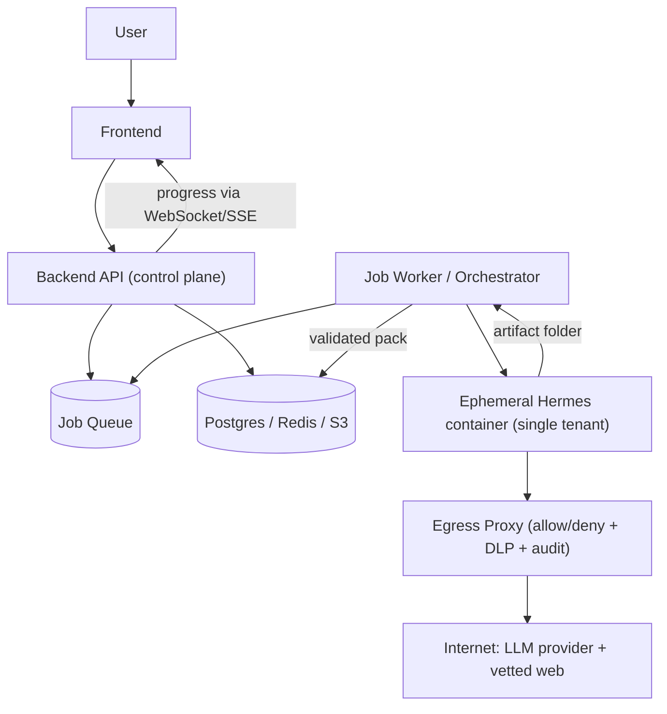
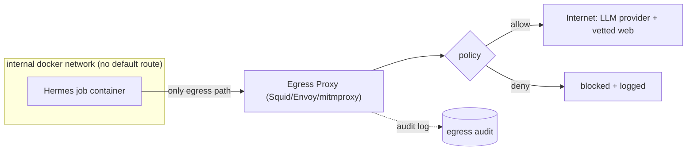

# Secure AI Agent Architecture (v0.3)

**Version:** v0.3
**Status:** Architecture Proposal
**Supersedes framing of:** v0.1 / v0.2 (trust-boundary model kept; execution model corrected)

---

## 1. What changed from v0.2, and why

v0.1/v0.2 got the **control-plane** right: Zero Trust, Backend owns
auth/DB/secrets/business logic, the Agent sits **outside** the trust boundary and
receives only sanitized tasks. All of that stays.

What v0.2 modelled incorrectly is the **agent itself**. It described the agent as
a lightweight, stateless *reasoner* — "send a sanitized task, get a structured
answer back" in one synchronous request. The real Visa Master agent (Hermes) is
the opposite: a **heavy, long-running, stateful, code-executing, web-browsing
autonomous worker**. v0.3 corrects the execution model to match, and adds the
controls that a worker of that kind actually needs.

> **v0.2 principle (kept):** the agent must never *reach in* to DB, secrets, or
> internal services.
> **v0.3 addition:** the agent must also be governed on the way *out* —
> egress, resources, tenancy, and lifecycle — because it browses the web and
> runs code on the user's data.

---

## 2. Corrected mental model: the Agent is a heavy autonomous worker

The agent is **explicitly allowed** to do all of the following — inside its
sandbox:

- **Browse the live web** (search engines, embassy / BLS / government sites).
- **Download files** (official PDFs, forms, checklists).
- **Execute arbitrary code** — Python, shell — and build a **Python venv**
  (the managed document-production runtime: python-docx, pypdf, reportlab, …).
- **Run local tools**: LibreOffice (DOCX→PDF), poppler, zip, image tooling.
- **Run for ~10 minutes per case**, keeping **intermediate state** (a
  "workbench": downloaded sources, manifests, renders, QA artifacts).
- **Run in `--yolo`** (auto-approve every tool call), so it completes a case
  unattended.

These capabilities are the product. We do **not** try to take them away. Instead
we **contain** them: everything above happens inside a disposable, single-tenant,
network-restricted container, and the blast radius is the container — nothing
more.

This is exactly Hermes's own stance: *the OS / container is the security
boundary, not the agent process.* v0.3 makes that boundary real and adds the
missing outbound controls.

---

## 3. Execution model: asynchronous jobs, not synchronous requests

A case takes minutes and involves intake back-and-forth. It cannot ride a single
HTTP request. Every case is a **job**.



- Backend **enqueues** a job (sanitized task + a handle to the user's uploaded
  files staged in object storage).
- A **worker** leases the job, launches a fresh Hermes container, streams
  progress back to the Backend (which relays to the Frontend over WebSocket/SSE).
- On completion the worker pulls the produced pack, hands it to the Backend for
  validation + persistence, and **destroys the container**.

The Backend still never lets the Frontend talk to the agent directly, and still
sends the agent only what reasoning needs.

---

## 4. Tenancy & lifecycle: one-at-a-time, ephemeral, single-tenant (MVP)

**Your MVP simplification is sound: run exactly one job at a time, in its own
fresh space, and destroy it afterward.** With serial execution there is no
concurrent job to leak into, and with destroy-after there is no residual state
for the next user. That does give safe, non-cross-contaminating behavior.

Two refinements make it correct *and* fast:

**(a) Split the data dir into SHARED-read-only vs PER-JOB-writable.** You do not
want to rebuild the profile + Python venv (~1 min) on every job, but you must
**never** share the PII-bearing writable state. From this session, the split is
clean:

| Part of `/opt/data` | Contains | PII? | How to mount |
|---|---|---|---|
| `profiles/visa-master-agent` (SOUL, skills) + its `local/toolchain-runtime` venv | agent logic + tools | **No** | **shared, read-only** (bake in image or a read-only volume) |
| model auth (`auth.json`) | LLM service credential | No (service secret, not user data) | shared, read-only, injected at launch |
| `workbench/`, `workspace/`, `sessions/`, uploaded docs | the user's case data + generated pack | **Yes** | **fresh per job, writable, destroyed after** |

So each job gets: `image (read-only agent + runtime) + a fresh empty scratch
volume for workbench/workspace/sessions + this user's uploaded files`. On finish,
the scratch volume and container are deleted. The reusable, non-PII parts stay;
only the PII-bearing parts are ephemeral.

**(b) Destroy for real.** Tear down the container **and** delete the scratch
volume/tmpfs; don't just stop the container (a stopped container keeps its
writable layer). Prefer a **tmpfs** or a per-job named volume you `docker rm -v`.

```mermaid
sequenceDiagram
  participant W as Worker
  participant V as Fresh scratch volume
  participant C as Hermes container
  W->>V: create empty per-job volume, stage user's files
  W->>C: run (read-only agent+runtime + V + scoped model cred), --yolo
  C-->>W: stream progress; write pack into V
  W->>V: pull validated pack out
  W->>C: destroy container
  W->>V: delete volume (PII gone)
```

> Note the limit of "destroy-after": it removes *residual* leakage between users,
> but it does **not** protect a user *during their own job* — a prompt-injected
> agent could still exfiltrate that user's PII mid-run. That is what §5 (egress)
> and §8 (human gate) are for.

**Scale-up (later, out of scope for MVP):** a pool of workers with per-tenant
queues; the single-concurrency assumption is the only thing that changes, and the
per-job isolation above already generalizes to N concurrent single-tenant
containers.

---

## 5. Egress control (the biggest gap in v0.2) — design

**Threat.** Under `--yolo`, the agent browses attacker-influenced content (a
fetched web page, an uploaded PDF). A prompt injection there can instruct it to
**POST the user's passport/financials to `evil.com`**, or to **SSRF internal
services / the cloud metadata endpoint** to steal IAM credentials. Container
isolation alone does not stop *outbound* abuse — the agent legitimately needs the
network.

**Principle:** the network path is the boundary, **never the agent's own
self-restraint**. The container must have **no route to the internet except
through a proxy we control**.

### 5.1 Topology



- Job container attaches **only** to an `internal: true` network — it has no
  default gateway to the internet. The **only** reachable host is the proxy.
- Set `HTTP_PROXY`/`HTTPS_PROXY` in the container *and* enforce at the network
  level, so even if the agent ignores the env var it still cannot route around.

### 5.2 Policy (layered)

1. **Hard-block, always:** RFC1918 (`10/8`, `172.16/12`, `192.168/16`),
   link-local **`169.254.0.0/16` (cloud metadata!)**, `127.0.0.0/8`, and any port
   other than 80/443. This kills SSRF and metadata-credential theft outright.
2. **Inference channel:** allow **only** the LLM provider host(s). Nothing else
   reaches them, and they are the only place the model credential is sent.
3. **Research channel:** visa research needs fairly open reading, so a tight
   per-domain allowlist fights the product. The pragmatic policy is:
   - Allow general **GET** to public web (optionally minus a threat deny-list).
   - **Restrict data-carrying methods:** block/scrutinize **POST/PUT/PATCH** and
     large request bodies to non-allowlisted hosts — exfiltration almost always
     needs to *send* data out.
   - **Rate + bandwidth caps** per job (stops slow exfil-by-many-requests and
     runaway crawling).
   - **Audit-log every request** (host, method, bytes) for forensics.
4. **Egress DLP (phase 2):** a TLS-intercepting proxy (mitmproxy with a CA
   trusted only inside the job container) scans outbound bodies/URLs for **this
   job's known PII tokens** (passport number, exact balance, etc.) and blocks on
   match. Heavier to run; until then, compensate with: minimize PII placed in the
   workbench, restrict POST (rule 3), and the §8 human gate.
5. **Defense in depth:** also set Hermes's built-in `hermes egress` policy inside
   the agent as a *secondary* layer — but the proxy is authoritative.

**MVP egress = rules 1–3 + audit** (cheap, high value: SSRF/metadata dead,
outbound data-sends constrained, everything logged). Rule 4 DLP follows.

---

## 6. Model credentials

The agent must hold **one** secret: the LLM credential. Treat it specially:

- It is a **service credential, not user PII** — inject it read-only at launch;
  keep it out of the shared business secret store; scope it to the inference
  proxy route only (§5.2 rule 2); make it **rotatable and per-provider**.
- **Migrate off the ChatGPT-subscription Codex login before launch.** The
  device-code "Sign in with ChatGPT" we used for local trials is a *personal*
  authorization; it cannot (contractually or technically) back a multi-user
  service. Production needs a real **API key** (Anthropic / OpenAI / Nous) with
  **per-request / per-user token budgets** enforced by the Backend.

---

## 7. Resource, time & cost governance (incl. the `workspace open` hang)

An autonomous browse-and-execute agent can burn CPU / memory / network / LLM
tokens without bound. Cap all four:

- **Container limits:** CPU, memory, PIDs; **read-only root FS** except the
  per-job scratch; drop Linux capabilities; `--security-opt no-new-privileges`.
- **Wall-clock deadline** per job; on expiry the worker force-destroys.
- **LLM token budget** per job/user, enforced Backend-side (the credential lives
  behind the proxy, so metering is centralizable).
- **Completion by artifact, not by process exit** — see below.

### 7.1 Fixing the `workspace open` foreground hang

Observed this session: the `document-production` skill ends by running
`visa-master workspace open <folder>`, which starts a **foreground** web server.
In a headless `-z` run the process then **never exits** — the pack is finished
but the container stays "Up". Three complementary fixes:

1. **Don't run `workspace open` inside the job at all.** In this architecture the
   review UI is the **product's** responsibility (Backend/Frontend serve it), not
   the agent's. Run the agent in a "produce-and-stop" mode: skip the workspace
   step. Cleanest options: a `VISA_MASTER_SERVER_MODE=1` env whose shim no-ops
   `workspace open`, or a prompt/profile variant that omits the final open.
2. **Detect completion by artifact.** The orchestrator watches for
   `qa-report.json` + the delivery folder (exactly the signal we used to know the
   pack was done), then tears the container down — regardless of a lingering
   process.
3. **Hard deadline backstop** (§7) so a hang can never wedge the single-concurrency
   slot.

MVP: (2) + (3) require no image change and are enough. (1) is the clean
long-term fix.

---

## 8. Human review gate

Visa material is high-stakes; errors are costly. The pipeline already ends in QA
status **`visual-review-required`** (0 issues still requires a human look). So:

- The pack is delivered to the user (or an operator) for **explicit review /
  approval before it is treated as final** — never fully auto-submitted.
- This is also a compensating control for egress DLP not yet being in place:
  nothing sensitive leaves the system as "done" without a human checkpoint.

---

## 9. Runtime independence — tempered

v0.1/v0.2 over-claimed "swap Hermes for Claude Code / OpenAI SDK / LangGraph with
no architectural change." Split the claim:

- **LLM provider is swappable** — already true; a config change switches
  Codex / Anthropic / etc.
- **The agent runtime (Hermes) is a deep commitment.** Visa Master's value lives
  in Hermes-specific pieces: the profile (SOUL + skills), the managed toolchain
  runtime, the `visa-master` CLI orchestration, and the workbench/QA pipeline.
  Swapping runtimes means rebuilding all of that.

**Recommendation:** keep the Backend↔agent contract clean (sanitized task in,
structured artifact out) so a *future* runtime swap is *possible*, but do **not**
build a premature runtime-abstraction layer now — it is YAGNI. Invest in "LLM
provider swappable"; treat "whole runtime swappable" as a vision, not a current
requirement.

---

## 10. Threat model → mitigations

| Threat | Mitigation |
|---|---|
| Prompt injection → **exfiltrate this user's PII** | Egress proxy: block internal/metadata, constrain POST, DLP (§5); minimize PII in workbench; human gate (§8) |
| **Cross-tenant** PII leakage | Single-concurrency + fresh per-job scratch, destroyed after; PII only in ephemeral writable parts (§4) |
| **SSRF / cloud-metadata credential theft** | Hard-block RFC1918 + `169.254.0.0/16` + non-80/443 at the proxy (§5.2) |
| Agent reaches DB / secrets / internal services | Zero-Trust boundary from v0.1/v0.2; agent has no route in; no DB creds |
| Malicious code exec escaping the box | Container isolation, read-only rootfs, dropped caps, no-new-privileges, resource caps (§7) |
| **Cost / token blow-up, DoS** | Per-job wall-clock deadline, token budget, CPU/mem/bandwidth caps (§7) |
| Hung job wedging the pipeline | Completion-by-artifact + deadline backstop (§7.1) |
| Model-credential misuse / over-billing | Scoped, rotatable API key behind the inference proxy; per-user budgets (§6) |
| Supply-chain / runtime CVE | Blast radius = the ephemeral container; nothing trusted inside it (§2, §4) |

---

## 11. What v0.3 keeps from v0.1 / v0.2

Unchanged and still correct: Backend as single source of truth; agent outside the
trust boundary; least privilege; sanitized task (send Destination/Occupation, not
`user_id`/JWT/email); Frontend never talks to the agent directly; the agent never
writes production data (Backend validates and persists).

v0.3 **adds** the outbound / lifecycle half that a heavy autonomous worker
requires: async jobs, ephemeral single-tenant isolation, egress governance,
resource/cost caps, a completion signal that survives the `workspace open` hang,
and a human gate.

---

## 12. MVP scope vs later

**MVP (now):**
- Async job model, **single concurrency**.
- Ephemeral per-job scratch (read-only agent+runtime image, fresh writable
  volume), destroyed after.
- Egress proxy: block internal/metadata/non-80-443, constrain POST, rate-cap,
  audit-log (§5.2 rules 1–3).
- Container resource + wall-clock + token caps; completion-by-artifact.
- Human review gate.
- Real LLM **API key** (not the Codex subscription) with per-user budgets.

**Later:**
- Concurrency / worker pool + per-tenant queues (scale-up).
- Egress **DLP** with TLS interception (§5.2 rule 4).
- `VISA_MASTER_SERVER_MODE` clean skip of `workspace open`.
- Multi-agent orchestration, event-driven execution, enterprise MCP.
