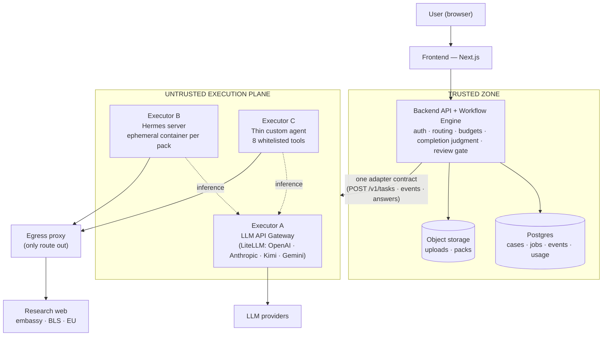
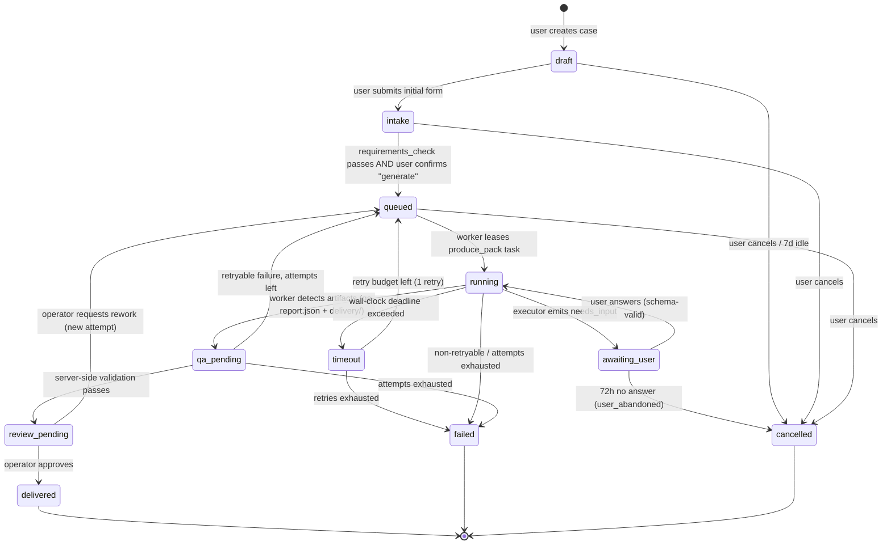
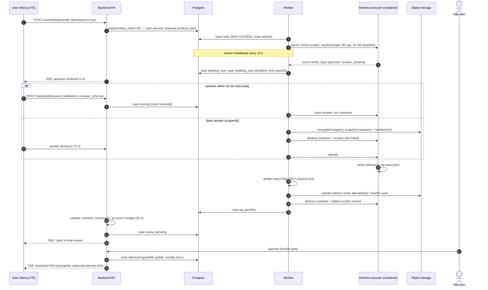
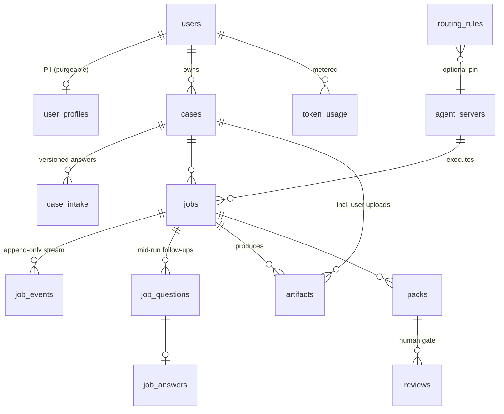
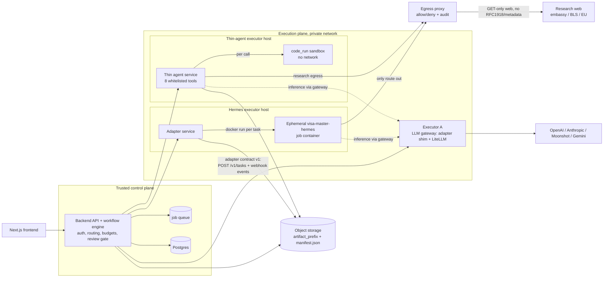

# Visa Master Platform Architecture (v0.4)

**Version:** v0.4
**Status:** Architecture Proposal
**Builds on:** [architecture-v0.3](architecture-v0.3-en.md) (trust boundary, ephemeral single-tenant execution, egress control) · [ADR-002](../discussion/withchatgpt/ADR-002-Agent-Framework-Evaluation.md) (custom workflow engine, LLM APIs as intelligence services — Accepted) · [Discussion 01](../discussion/withclaude/01-hermes-vs-custom-agent-loop.md) (Hermes vs. thin custom agent; middle path)
**Companion:** [Platform selection & development plan](platform-and-dev-plan-en.md) — the platform-specific half of this proposal.

> 中文版：[架构 v0.4（中文）](architecture-v0.4-zh.md)

v0.1–v0.3 answered *how to run one agent safely*. v0.4 is the first **whole-product** architecture: the trusted Backend API server, a **multi-server agent execution plane**, routing, completion judgment, data layer, and user management — platform-agnostic. It is written in two tiers: **Part I** is the high-level abstract (read this first; ~10 minutes), **Part II** is the detailed specification (contracts, DDL, state machines, sequences).

---

# Part I — High-level architecture (abstract tier)

## I.1 Thesis

Visa Master is a **workflow-centric** product (ADR-002): collect information → validate → research → generate documents → QA → human review → deliver. The architecture therefore has exactly one brain and several pairs of hands:

> **The trusted Backend owns the workflow.** A deterministic **workflow engine** — plain code and Postgres, no framework — drives every case through an explicit state machine. It owns users, money, data, and the verdict on whether work is done.
>
> **The execution plane does the work.** Multiple **agent execution servers** sit behind one uniform adapter contract, outside the trust boundary (v0.3): an **LLM API gateway** (stateless calls to OpenAI / Anthropic / Kimi / Gemini — the V1 workhorse), a **Hermes server** (the currently-working full-pack producer, wrapped in v0.3's ephemeral-container discipline), and a **thin custom agent server** (the Discussion-01 migration target). The Backend decides *which* server runs *which* task; no server ever decides for itself.

This reconciles ADR-002 with the multi-agent-server requirement: the custom workflow engine **is** the control plane; Hermes was not adopted as the *core runtime*, but it remains a *pluggable executor* — today's only producer of a sellable pack — that the routing table can eventually strangle out in favor of the gateway and the thin agent.

## I.2 One diagram



Two properties carry most of the security story: **all inference flows through the gateway** (provider API keys and token metering exist in exactly one place — this also retires the personal Codex OAuth used in development), and **all research egress flows through the audited proxy** (v0.3 §5).

## I.3 The three executors at a glance

| | A — LLM API Gateway | B — Hermes server | C — Thin custom agent |
|---|---|---|---|
| What it is | Stateless adapter + version-pinned LiteLLM proxy over OpenAI / Anthropic / Moonshot-Kimi / Gemini | Adapter service driving one ephemeral `visa-master-hermes` container per pack (v0.3 discipline) | Thin agent SDK (Pydantic-AI / OpenAI Agents SDK class) + exactly 8 whitelisted tools |
| Role | **V1 workhorse** — every single-shot step: extraction, translation, drafting, classification | **The working pack producer today** — full research→documents→QA pipeline | **Migration target** — absorbs task types from B via strangler pattern, `produce_pack` last |
| State | None | Single-tenant scratch, destroyed after each task | Per-task scratch, per-call sandboxes |
| Secrets | Provider API keys (the crown jewels) | None in the job container | Zero provider keys |
| Typical latency | 1–8 s | ~10 min | task-dependent |

## I.4 How a case flows

1. **Intake** — a structured form (not a chat) captures route-determining facts. A deterministic `requirements_check` — plain code over a versioned requirements matrix, per ADR-002 — computes missing documents. No LLM decides what to ask.
2. **Queue** — user confirms; the Backend freezes a **sanitized** task payload (no user_id, no email, no JWT — v0.3) and enqueues `produce_pack`.
3. **Execute** — a worker leases the job (Postgres `SKIP LOCKED`), dispatches to the executor chosen by the **routing table**, streams progress to the UI, and enforces budgets and deadlines server-side.
4. **Judge** — completion is a Backend verdict computed from **evidence**: the artifact manifest, recomputed checksums, the QA report, gateway-metered spend. Never process exit (the `workspace open` hang proved a finished pack can coexist with a live process), never the agent's self-report.
5. **Review** — every pack passes the **human review gate** (operator approval) before the user ever gets a download link.
6. **Deliver** — presigned URLs to the approved attempt's artifacts; PII follows a retention schedule and is purgeable per user.

Mid-run follow-up questions are supported (`awaiting_user` state) but deliberately rare: the deterministic intake front-loads them.

## I.5 Key decisions (summary)

| Question | Decision | Where detailed |
|---|---|---|
| Who orchestrates? | **Own code**: ~11-state machine as guarded SQL transitions in Postgres; queue = `SELECT … FOR UPDATE SKIP LOCKED`; no orchestration framework | Part II·A §1, §5 |
| Build vs. Pydantic-AI / OpenAI Agents SDK / LangGraph / Temporal? | Agent SDKs belong **inside Executor C only**; LangGraph rejected for the control plane; Temporal-class deferred behind explicit triggers | Part II·A §5 |
| How is work routed? | Versioned `routing_rules` table keyed by `task_type` assigned in code. An LLM may **classify** free text into a closed enum; it never routes | Part II·A §2 |
| How is completion judged? | Per-task-type completion contracts; `produce_pack` = 6-step server-side validation pipeline ending at the human gate | Part II·A §3 |
| Database? | **Postgres 16+ only** at MVP: relational core + JSONB + queue + LISTEN/NOTIFY + pgvector later; Redis deferred behind triggers | Part II·B §1 |
| Object storage? | S3-compatible, two buckets (uploads / artifacts), opaque keys, presigned flows; job containers never hold storage credentials | Part II·B §3 |
| Auth & users? | **Better-Auth self-hosted** default (no third-party domain in the login path — China reachability); **Supabase Auth via the platform carve-out** when the control plane is Supabase (as the companion plan adopts), with server-side revocation checks; RBAC user/operator/admin; Clerk as fallback | Part II·B §4 |
| Agent servers? | Three kinds behind **one adapter contract** (`POST /v1/tasks`, status, answers, cancel, webhook events, artifact manifest) | Part II·C |
| Model credentials? | Real API keys, gateway-held only, per-task budgets — replacing the dev-time Codex subscription OAuth | Part II·C §2 |
| Security zones? | v0.3 controls mapped per executor: sanitized input, ephemeral tenancy, egress proxy authoritative, human gate | Part II·C §5 |

## I.6 What this deliberately defers

Concurrency > 1, Redis, Temporal-class durable execution, egress DLP (TLS-intercept), the thin agent's `produce_pack` takeover, multi-region, Stripe self-serve billing — each parked behind an explicit trigger listed in the companion [platform & dev plan](platform-and-dev-plan-en.md).

---

# Part II — Detailed specification

Part II is three chapters, each self-contained: **A. Control plane** (workflow engine, routing, completion), **B. Data layer & user management**, **C. Agent execution plane** (adapter contract + three executors).

> **Model reconciliation note (read once).** The chapters were drafted against the same requirements but differ deliberately in altitude, and three vocabularies must be read as one:
>
> 1. **Process model (canonical): Chapter A.** `cases` carry the user-visible 11-state lifecycle; `tasks` are executor invocations; `task_attempts` are the retry unit (fresh scratch + per-attempt S3 prefix per attempt). The canonical `task_type` vocabulary is Chapter A §2.2's eight types (`intake_chat`, `requirements_check`, `doc_field_extraction`, `translation`, `itinerary_draft`, `produce_pack`, `qa_check`, `custom_research`).
> 2. **Physical MVP schema: Chapter B.** For single-concurrency MVP, `tasks` + `task_attempts` may be collapsed into the single `jobs` table Chapter B specifies (inline `attempt` counter); grow back to attempt rows when suspend/resume (A §1.7) lands. Chapter B's coarser `cases.status` is the product-facing projection of Chapter A's workflow states (`ready`≈`queued`, `processing`≈`running`/`qa_pending`, `in_review`≈`review_pending`, plus `closed` as post-delivery archival).
> 3. **Deployment identifiers: the dev plan** (companion doc) uses versioned kind strings (`pack.schengen.v1`, `step.translate.v1`) — these are wire-format names for Chapter A's task types, versioned so contracts can evolve.
>
> 4. **Gateway step names & sub-steps.** Chapter C §2.2's `llm.*` names are Executor A's internal operation names: `llm.extract`→`doc_field_extraction`, `llm.translate`→`translation`, `llm.draft`→`itinerary_draft` (and pack sub-step drafting), `llm.classify`→the intent classifier embedded in `intake_chat` (A §2.1), `llm.gap_check`→an LLM-advisory complement to the deterministic `requirements_check` (advisory only). The dev plan's kind strings map `pack.schengen.v1`→`produce_pack`, `step.translate.v1`→`translation`; `step.cover_letter.v1`/`step.checklist.v1` are `produce_pack` sub-steps carved out per C §4.1 and join the vocabulary (and the `jobs.task_type` CHECK) as they are cut over. `jobs.task_type` stores canonical names; kind strings are wire-format aliases resolved in `packages/core`.
> 5. **Physical-schema projections.** Chapter B's coarser `cases.status` projects Chapter A's `failed`/`timeout` onto `failed` (timeout detail lives on the job row). The platform doc's B.1 table is an illustrative minimal sketch of Chapter B's `jobs` — the dev plan builds the Chapter B form (Chapter B state names, `attempt`/`max_attempts`, `idempotency_key`, budget columns). `executor_kind` includes `backend_code` for tasks like `requirements_check` that run inside the trusted backend, not on any agent server.
> 6. **Timeouts.** The routing table's 20 min `produce_pack` default (2× the observed ~10 min run) is the steady-state target and Chapter B's DDL default (1200 s) matches it; Chapter C's 1800 s example and the dev plan's 60 min beta cap are per-task budget configuration while duration variance is still being measured. Budgets are per-task config, enforced server-side, and the wall clock starts at **lease time** — queue wait never consumes run budget.
> 7. **Adapter-contract realizations.** Chapter C §1's HTTP+JSON contract is the executor-agnostic wire form; the dev plan's 4-method TypeScript interface is its V1 *in-process* realization (`running`→`running`, `artifact_ready`→`completed`+manifest, `failed`→`failed`; `awaiting_user`/answers/cancel/webhooks deliberately unimplemented while intake is fully front-loaded). The HTTP surface is implemented when the first executor leaves the VM. Likewise artifact upload: with co-located executors the **trusted conductor** stages inputs and uploads/hashes outputs (A §1.5, B §3); C §1.1's `storage_grant` is the remote-executor variant.
> 8. **Auth.** Chapter B §4's default is Better-Auth; the companion plan adopts the **Supabase Auth platform carve-out** (see B §4) because the control plane lands on Supabase — with the revocation and China-reachability mitigations specified there.


## Chapter A — Control plane: workflow engine, routing, and completion judgment

The trusted Backend owns four things the execution plane never touches: user identity, the database of record, money (token/cost budgets), and the verdict on whether work is done. Executors — `llm-gateway`, `hermes-server`, `custom-agent-server` — are untrusted proposal generators behind one adapter contract. This section specifies the orchestration layer that sits above them, consistent with ADR-002 (deterministic workflow engine in code; LLMs as stateless intelligence services) and architecture v0.3 (async jobs, ephemeral single-tenant containers, completion-by-artifact, human gate).

Three invariants govern everything below:

1. **Every state transition is a guarded SQL update in Postgres**, executed by backend code. No executor, and no LLM output, ever transitions a case directly.
2. **Completion is a backend verdict computed from evidence** (artifacts in object storage, gateway metering, egress-proxy audit logs) — never from process exit and never from the agent's self-report. This is a hard lesson from the `workspace open` foreground hang: the pack is finished while the process is still "Up".
3. **Routing decisions are code.** An LLM may classify; only a `switch` statement routes.

### 1. Workflow engine

#### 1.1 Data model

Two levels: a **case** (the customer engagement: one visa application pack, days-long, has a human in it) and **tasks** (single executor invocations: one intake turn, one pack production run). Cases carry the user-visible state machine; tasks carry attempts, budgets, and deadlines.

```sql
CREATE TYPE case_state AS ENUM (
  'draft','intake','queued','running','awaiting_user',
  'qa_pending','review_pending','delivered','failed','timeout','cancelled');

CREATE TABLE cases (
  id              uuid PRIMARY KEY,
  user_id         uuid NOT NULL REFERENCES users(id),
  route           jsonb NOT NULL,          -- {origin_consulate:"chengdu", destination:"ES", visa_type:"schengen_tourism"}
  state           case_state NOT NULL DEFAULT 'draft',
  state_version   int NOT NULL DEFAULT 0,  -- optimistic concurrency on transitions
  intake          jsonb NOT NULL DEFAULT '{}',
  failure_class   text,                    -- see §3.4 taxonomy
  failure_detail  jsonb,
  idempotency_key text UNIQUE,             -- from FE Idempotency-Key header
  deadline_at     timestamptz,             -- case-level (e.g. awaiting_user expiry)
  created_at      timestamptz NOT NULL DEFAULT now(),
  updated_at      timestamptz NOT NULL DEFAULT now());

CREATE TABLE tasks (
  id              uuid PRIMARY KEY,
  case_id         uuid NOT NULL REFERENCES cases(id),
  task_type       text NOT NULL,           -- intake_chat | produce_pack | ... (§2.2)
  state           text NOT NULL,           -- created|queued|leased|running|awaiting_user|succeeded|failed|cancelled
  dedupe_key      text NOT NULL,           -- e.g. 'produce_pack:v1' or 'intake_chat:turn-7'
  input           jsonb NOT NULL,          -- sanitized task payload (no user_id/JWT/email, per v0.3 §11)
  output          jsonb,                   -- schema-validated result (chat-ish tasks)
  routing_rule_id uuid NOT NULL,           -- audit: which rule+version routed this
  max_attempts    int NOT NULL,
  lease_owner     text, lease_expires_at timestamptz,
  UNIQUE (case_id, task_type, dedupe_key));

CREATE TABLE task_attempts (
  id              uuid PRIMARY KEY,
  task_id         uuid NOT NULL REFERENCES tasks(id),
  attempt_no      int  NOT NULL,
  executor_kind   text NOT NULL,           -- llm_gateway | hermes | custom_agent | backend_code
  executor_ref    text,                    -- container id / gateway request id
  scratch_ref     text,                    -- per-attempt volume name (v0.3 §4)
  started_at      timestamptz,
  heartbeat_at    timestamptz,             -- written by the WORKER, never by the agent
  suspended_at    timestamptz,             -- set when parked for awaiting_user
  ended_at        timestamptz,
  outcome         text,                    -- succeeded | agent_error | timeout | budget_exceeded
                                           --  | qa_failed | validation_failed | user_abandoned | cancelled
  error           jsonb,
  tokens_prompt   bigint DEFAULT 0, tokens_completion bigint DEFAULT 0,
  cost_usd_cents  int DEFAULT 0,           -- metered by llm-gateway, not reported by agent
  egress_bytes    bigint DEFAULT 0,        -- from egress-proxy audit log
  UNIQUE (task_id, attempt_no));

CREATE TABLE artifacts (
  id              uuid PRIMARY KEY,
  case_id         uuid NOT NULL,
  task_attempt_id uuid NOT NULL REFERENCES task_attempts(id),
  kind            text NOT NULL,           -- qa_report | manifest | deliverable | suspend_snapshot
  s3_key          text NOT NULL,           -- cases/{case_id}/attempts/{attempt_no}/...
  sha256          text NOT NULL,
  bytes           bigint NOT NULL,
  content_type    text NOT NULL);

CREATE TABLE case_events (                 -- append-only audit + SSE outbox
  id bigserial PRIMARY KEY, case_id uuid NOT NULL, seq int NOT NULL,
  type text NOT NULL, payload jsonb, actor text NOT NULL,  -- user|backend|worker|operator|reaper
  created_at timestamptz NOT NULL DEFAULT now(),
  UNIQUE (case_id, seq));
```

The MVP job queue is the `tasks` table itself (`SELECT … WHERE state='queued' FOR UPDATE SKIP LOCKED LIMIT 1`). At single concurrency (v0.3 MVP) a dedicated broker is pure overhead; Redis remains optional for SSE pub/sub only.

#### 1.2 Case state machine



#### 1.3 Transitions: trigger, guard, side effects

| From → To | Triggered by | Guard (code) | Side effects |
|---|---|---|---|
| `draft → intake` | user (FE) | initial form schema-valid | create first `intake_chat` task |
| `intake → queued` | backend rule | `requirements_check` (deterministic, §2.2) returns complete AND user clicked Generate | enqueue `produce_pack` task, freeze intake snapshot into `tasks.input` |
| `queued → running` | worker | lease acquired (`SKIP LOCKED`), attempt row created | create fresh scratch volume, launch container (v0.3 §4) |
| `running → awaiting_user` | worker, on executor `needs_input` event | question payload schema-valid | pause task deadline clock; SSE question to FE; start 72 h abandon timer |
| `awaiting_user → running` | user answer via backend | answer validates against the question's declared JSON schema | resume or restore executor (§1.7); resume deadline clock |
| `running → qa_pending` | worker | `qa-report.json` + delivery folder present in scratch (artifact watch, v0.3 §7.1) | upload artifacts to S3 under attempt prefix; destroy container + scratch |
| `qa_pending → review_pending` | backend validator | §3.3 checks all pass | notify operator; SSE "in review" to user |
| `review_pending → delivered` | operator | explicit approval (human gate, v0.3 §8) | set delivery pointer to approved attempt's artifacts; notify user |
| `review_pending → queued` | operator | rework note attached | enqueue new `produce_pack` attempt with operator feedback in input |
| `running → timeout` | worker timer or backend reaper | `now() > attempt deadline` (pauses excluded) | force-destroy container + scratch; attempt `outcome=timeout` |
| `timeout → queued / failed` | backend | attempts remaining? | new attempt or terminal fail per §3.4 |
| `running/qa_pending → failed` | backend | non-retryable outcome or `attempt_no = max_attempts` | set `failure_class`; alert operator; refund/credit hook |
| `awaiting_user → cancelled` | reaper | 72 h without answer | `failure_class=user_abandoned`; destroy any suspended state; PII retention timer starts |
| `any non-terminal → cancelled` | user or operator | — | destroy container/scratch if running |

Every transition goes through one function:

```
transition(case_id, from_states[], to_state, actor, event_payload)
  = UPDATE cases SET state=$to, state_version=state_version+1, updated_at=now()
    WHERE id=$case_id AND state = ANY($from_states)
    RETURNING *;   -- 0 rows ⇒ lost race ⇒ caller re-reads and no-ops
```

plus an insert into `case_events` in the same DB transaction (outbox → SSE relay). This makes every trigger — user click, worker event, reaper sweep — idempotent and race-safe by construction, and makes the audit trail exactly equal to the state history.

#### 1.4 Leases, heartbeats, and the reaper

- **Lease:** a worker leases a queued task (`lease_owner`, `lease_expires_at = now() + 90s`) and renews the lease with every heartbeat.
- **Heartbeat:** the **worker** (trusted) writes `task_attempts.heartbeat_at` every **15 s** while the container runs. The agent contributes nothing to liveness — an agent that stops emitting events but keeps its container alive is still "live" only as long as the worker says so, and the worker also checks container status + event-stream tail.
- **Reaper (backend cron, every 30 s):** (a) attempts with `heartbeat_at` older than **60 s** → mark `outcome=agent_error, error={class:"worker_lost"}`, release lease, re-queue if attempts remain; (b) attempts past their wall-clock deadline → `timeout` path; (c) `awaiting_user` cases past 72 h → `user_abandoned`; (d) `draft` cases idle 7 days → cancelled.

Worker crash mid-job therefore costs one attempt, never a wedged pipeline — critical at single concurrency, where one stuck slot is a full outage.

#### 1.5 Idempotency and retry semantics

- **Case creation:** FE sends `Idempotency-Key`; unique index makes double-submit return the existing case.
- **Task enqueue:** `UNIQUE (case_id, task_type, dedupe_key)`; re-enqueue is a no-op returning the existing task.
- **Attempts are the retry unit.** A retry never mutates a prior attempt: it inserts `attempt_no+1` with a **fresh scratch volume** (v0.3 §4 guarantees no residue) and writes artifacts under a new S3 prefix `cases/{case_id}/attempts/{n}/`. Nothing is ever overwritten; the case's delivery pointer is set exactly once, at operator approval, to one attempt's validated artifact set.
- **Retryability is per failure class** (§3.4), max attempts per task type (§2.2). Retries use the same frozen `tasks.input`, so an attempt is reproducible from the DB alone.
- **Side-effect safety:** executors have no write path except their own scratch and the LLM gateway; S3 uploads are performed by the worker, keyed by attempt. Hence retries are safe without distributed-transaction machinery — the only at-most-once effect in the system is the `delivered` transition, protected by the guarded update.

#### 1.6 Deadlines

Two clocks, both enforced server-side:

- **Attempt wall-clock** (per task type, §2.2): the worker arms a local timer at container launch **and** the reaper independently checks `started_at + deadline - paused_duration`. On expiry: force-destroy (docker rm -v), `outcome=timeout`. `produce_pack` gets **20 min** (observed ~10 min real runs; 2× margin) — this is the backstop for the `workspace open` hang class of bugs.
- **Case clock:** `awaiting_user` 72 h; `draft` idle 7 days. Human-gate (`review_pending`) has an SLA alert at 24 h but no auto-expiry — the gate is mandatory (v0.3 §8).

The `awaiting_user` pause **stops** the attempt clock (`suspended_at`/resume accounting); total pause per attempt is capped at 72 h, and active-run time still may not exceed the wall-clock budget.

#### 1.7 Mid-run follow-up (`awaiting_user`) mechanics

A mid-run question from `produce_pack` is expensive at single concurrency: an idle container wedges the only slot. Two-phase policy:

1. **Hot wait (≤ 10 min):** on `needs_input`, the container stays up, paused; worker keeps heartbeating. If the user answers within 10 min, the worker injects the answer and the run continues — cheapest path, no state loss.
2. **Suspend (> 10 min):** the worker tars the PII-bearing writable state (`sessions/`, `workbench/`) to S3 as an encrypted `suspend_snapshot` artifact (SSE-KMS, lifecycle-delete at 72 h), destroys container + scratch, frees the slot. When the answer arrives, resume = new attempt with the snapshot restored into a fresh scratch (Hermes session-resume makes this viable). If no answer in 72 h → `user_abandoned`, snapshot deleted.

Product-level mitigation stays primary: ADR-002's deterministic `requirements_check` front-loads all predictable questions into `intake`, so mid-run questions are the exception, not the flow.

### 2. Agent router

#### 2.1 Routing model: rules first, LLM never decides

Routing input is always a **`task_type` assigned by workflow code** — the state machine knows what it needs next; nothing infers it. The router is a lookup against a versioned table (seeded from a YAML file in the repo, loaded into DB on deploy; each task records `routing_rule_id` for audit):

```sql
CREATE TABLE routing_rules (
  id uuid PRIMARY KEY,
  task_type       text NOT NULL,
  match           jsonb NOT NULL DEFAULT '{}',   -- optional predicates, e.g. {"destination":"ES"}; most specific wins
  executor_kind   text NOT NULL,   -- llm_gateway | hermes | custom_agent | backend_code
  model_primary   text,            -- gateway model id; fallback on 429/5xx only
  model_fallback  text,
  max_cost_usd_cents int NOT NULL, -- hard cap enforced by llm-gateway per task
  max_tokens_out  int,
  wall_clock_s    int NOT NULL,
  max_attempts    int NOT NULL,
  version int NOT NULL, active boolean NOT NULL DEFAULT true,
  UNIQUE (task_type, match, version));
```

**Where an LLM may appear:** free-text intake messages are ambiguous ("其实我也想顺便去葡萄牙玩几天"). A **small classifier call via llm-gateway** maps the message to a closed intent enum — `{answer_field, route_change, doc_upload_question, custom_research_request, smalltalk, unknown}` — with schema-validated output. The backend then routes on that enum **in code**; `unknown` or low confidence falls through to a clarifying question, never to an executor. The classifier can mislabel; it cannot mis-route, because it holds no routing authority. This is the ADR-002 boundary made mechanical.

Executor-kind fallback (e.g. Hermes down → custom agent) is **not** automatic in v1 — it is an operator config change. Automatic fallback across runtimes with different output contracts is a correctness hazard, not resilience.

#### 2.2 v1 routing table

| task_type | executor_kind | model preference (primary → fallback) | cost cap / task | wall-clock | max attempts | Notes |
|---|---|---|---|---|---|---|
| `intake_chat` (one turn) | `llm_gateway` | kimi-k2-class → gpt-4.1-mini-class | $0.05 | 60 s | 2 | Small prompt per ADR-002; returns `IntakeDelta` (§3.2) |
| `requirements_check` | `backend_code` | — (no LLM) | $0 | 1 s | 1 | Pure code over a versioned `route_requirements` matrix (destination × visa_type × consulate → required docs). "Spain requires passport/bank statement/employment letter" is a row + a loop, per ADR-002 |
| `doc_field_extraction` | `llm_gateway` | gemini-flash-class (vision) → gpt-4.1-mini-class | $0.10 | 120 s | 3 | Passport/bank-statement OCR+fields; parallelizable across docs |
| `translation` | `llm_gateway` | kimi-k2-class → gemini-flash-class | $0.05 | 90 s | 3 | zh↔en/es snippets; cache by content hash |
| `itinerary_draft` | `llm_gateway` | claude-sonnet-class → kimi-k2-class | $0.25 | 180 s | 2 | Single structured-output call; feeds pack input, also usable as the fast "staged draft" (Discussion 01 §C6) |
| `produce_pack` | `hermes` | Hermes-configured large model (claude-sonnet-class) via gateway credential | $5.00 hard | 20 min | 2 | The working full pipeline today; completion by artifact only (§3.3) |
| `qa_check` | `hermes` (CLI tool-only: `visa-master qa run`) | — (deterministic, no LLM planning) | $0 | 5 min | 2 | Runs inside the produce_pack container normally; standalone re-run path for operator rework |
| `custom_research` | `custom_agent` | claude-sonnet-class planner + haiku-class extraction | $1.00 | 10 min | 2 | Thin-SDK agent, ~8 whitelisted tools (Discussion 01 §8); the migration target |

Exact gateway model IDs live in config, not code, so provider swaps stay a config change (v0.3 §9). Budgets are **enforced by the llm-gateway at call time** — every executor's LLM traffic, including the Hermes container's, egresses only to the gateway (its "LLM provider host" per v0.3 §5.2 rule 2). When a task's cap is exhausted the gateway refuses the call; the agent fails; the worker records `budget_exceeded` from **gateway metering**, not from anything the agent said. This also retires the Codex device-code OAuth: only the gateway holds real API keys.

### 3. Completion judgment

#### 3.1 Principle

**The executor proposes; the backend disposes.** A task is `succeeded` only when backend code has verified evidence it can independently check. Process exit is not evidence (the `workspace open` hang proves a finished pack can coexist with a live process — and the converse, a clean exit with garbage output, is just as possible). An agent message saying "done" is not evidence.

#### 3.2 Per-task-type completion contracts

| Task class | Terminal signal | Backend validation before `succeeded` |
|---|---|---|
| Single-shot LLM (`intake_chat`, `doc_field_extraction`, `translation`, `itinerary_draft`) | Gateway response complete | `finish_reason == "stop"` (a length-truncated reply is a failure, not an answer); body parses against the task's JSON Schema (`IntakeDelta`, `ExtractedFields{field, value, confidence, source_page}`, `ItineraryDraft`); referential checks (extracted dates parse, itinerary dates within trip window); one schema-repair retry max |
| `requirements_check` | Function return | None needed — it *is* backend code; output is `{complete: bool, missing: [doc_type], questions: [field]}` |
| Agentic chat (`custom_research`) | Executor emits `terminal` event with typed `ResearchResult{question, findings[], citations[{url, accessed_at, quote}], confidence}` | Schema validation; **every citation host must appear in the egress-proxy audit log for this attempt**, with the thin-agent service's own per-call fetch log as the full-URL evidence (the MVP proxy sees only CONNECT hosts for HTTPS; URL-path verification at the proxy arrives with the phase-2 TLS-intercepting DLP) — a citation the agent never actually fetched is a hallucination, caught mechanically |
| `produce_pack` | **Artifact watch**: `qa-report.json` + delivery folder appear in scratch | Full pipeline below (§3.3) |
| `qa_check` | `qa-report.json` written | Report parses; `status ∈ {pass, visual-review-required}`; `issues` array present |

#### 3.3 `produce_pack` validation pipeline (`qa_pending`)

The worker, on artifact detection, uploads everything under `cases/{id}/attempts/{n}/` with computed sha256 per file, then the backend validator runs:

```json
// manifest.json — written by the builder, treated as a CLAIM to verify, not a fact
{
  "pack_version": "1",
  "route": {"origin_consulate": "chengdu", "destination": "ES", "visa_type": "schengen_tourism"},
  "files": [
    {"path": "delivery/checklist.pdf",         "sha256": "…", "bytes": 48211, "role": "checklist"},
    {"path": "delivery/cover-letter.pdf",      "sha256": "…", "bytes": 2290,  "role": "cover_letter"},
    {"path": "delivery/itinerary.pdf",         "sha256": "…", "bytes": 60518, "role": "itinerary"},
    {"path": "delivery/employment-letter.docx","sha256": "…", "bytes": 18700, "role": "employment_letter"},
    {"path": "delivery/forms/schengen-application.pdf", "sha256": "…", "bytes": 812344, "role": "official_form"}
  ],
  "qa_report": "qa-report.json"
}
```

Checks, in order, all mandatory:

1. **Manifest completeness:** every `role` required by the versioned pack spec for this route is present (spec lives beside `route_requirements`; a missing employment letter for an employed applicant fails here — deterministic code, per ADR-002).
2. **Existence + integrity:** every manifest file exists in S3, `bytes > 0`, recomputed sha256 matches the manifest and the worker's upload-time hash.
3. **Format sanity:** PDFs parse (page count ≥ 1 via poppler backend-side), DOCX opens, no zero-page renders.
4. **QA report:** parses; terminal `status == "visual-review-required"` with `issues == []` (today's known-good terminal state) or `pass`; any listed issue ⇒ `qa_failed`.
5. **Budget/deadline reconciliation:** gateway-metered cost ≤ cap, active wall-clock ≤ deadline, egress-proxy bytes within cap. Server-side numbers only.
6. All pass ⇒ `review_pending`. **Nothing reaches the user without the operator approval click** (v0.3 §8) — the human gate is also the compensating control while egress DLP is phase-2.

#### 3.4 Failure taxonomy

| `failure_class` | Detected by | Retry policy | Then |
|---|---|---|---|
| `agent_error` | worker (container crash, non-zero adapter error, worker_lost) or validator (unparseable output on chat tasks) | retry, fresh scratch, up to `max_attempts` | terminal `failed`; operator alert; refund/credit hook |
| `timeout` | worker timer / reaper vs. wall-clock | 1 retry (may be a hang bug, may be a slow run) | terminal `failed`; alert flagged "possible hang" — feeds the `VISA_MASTER_SERVER_MODE` fix |
| `budget_exceeded` | llm-gateway metering | **no auto-retry** (a retry doubles spend on a run that already blew its cap) | park for operator: raise cap and re-queue, or fail with refund |
| `qa_failed` | validator (qa-report issues > 0) | 1 retry with QA issues fed back into attempt input | operator triage in `review_pending` with issue list attached |
| `validation_failed` | validator (manifest/checksum/schema/format breach) | 1 retry | terminal `failed` + high-priority alert — persistent validation failure means executor contract drift, i.e. a bug, not bad luck |
| `user_abandoned` | reaper (72 h in `awaiting_user`) | none | case `cancelled`, suspend snapshot + scratch destroyed, PII retention clock starts |

### 4. Sequence: a pack job with a mid-run follow-up



### 5. Build vs. framework for the control plane

**Recommendation: own the state machine in plain backend code on Postgres. Agent SDKs live inside executors. Defer Temporal-class durable execution until measurable triggers fire.**

| Option | Verdict | Reasoning |
|---|---|---|
| **Own code + Postgres** (recommended) | ✅ control plane | The machine is ~11 states, single concurrency, one queue. Guarded-update transitions + `SKIP LOCKED` leases + a 30 s reaper cron reproduce every durability property this workload needs in well under 1 kLOC of boring, testable code (the transition function is pure: property-test the whole graph). State lives in the same schema as users/cases/artifacts — one query answers "which delivered packs used routing rule v3", which no external engine gives for free. This *is* ADR-002's decision ("custom Workflow Engine… Excellent debuggability") applied to itself. |
| **Pydantic-AI / OpenAI Agents SDK / Claude Agent SDK** | ✅ but **inside `custom-agent-server` only** | These are in-process agent-loop frameworks: tool dispatch, retries, streaming around one model conversation (Discussion 01 §7's "thin agent SDK"). They solve the executor's problem. They have no answer for days-long cases, human gates, operator approvals, or attempt accounting — putting one in the control plane would put an LLM loop where ADR-002 explicitly put deterministic code. |
| **LangGraph** | ❌ control plane; optional inside `custom-agent-server` | Could encode the case FSM, but drags its own checkpointer/persistence alongside Postgres, splitting the source of truth and weakening the audit story. Justified only if the custom agent's internal loop grows genuinely graph-shaped. |
| **Temporal / Inngest / Trigger.dev** | ⏸ not now | Durable execution solves exactly-once orchestration of many concurrent long workflows across a worker fleet. At 1 concurrent job, its costs dominate: Temporal server (or cloud spend) to run, workflow-versioning discipline for every deploy with in-flight runs, and execution state in Temporal's event history — which we'd mirror into Postgres anyway for product queries and the operator console, i.e. double bookkeeping. Inngest/Trigger.dev add vendor coupling and are a poor fit for the job's core side effect: managing local container + volume lifecycles needs a resident worker daemon regardless. |

**Re-evaluation triggers for Temporal-class adoption** (any two ⇒ spike it): (a) worker pool spans multiple hosts with ≥ ~20 concurrent long-running jobs; (b) multi-step compensation flows emerge (payment capture + pack production + notification + refund) where hand-written sagas start accreting bugs; (c) ≥ 3 backend engineers, so the workflow-versioning tax amortizes; (d) the reaper/lease code has produced ≥ 2 production incidents of its own. Until then, the guarded-update transition function plus attempt records **is** the durable-execution story — and every line of it is greppable.

This keeps a clean layering: **control plane = deterministic code + Postgres (ADR-002); executors = where agent frameworks live (Hermes today, thin SDK agent as migration target per Discussion 01); llm-gateway = the V1 workhorse and the single metering point.** The three server kinds stay pluggable behind the adapter contract without the control plane ever inheriting their frameworks.

## Chapter B — Data layer and user management

### 1. Database choice: Postgres

**Decision: PostgreSQL 16+ is the only database at MVP.** One instance carries the relational core (users, cases, jobs, billing), the job queue, the progress-event stream, and semi-structured agent payloads. Managed options (Neon, Supabase, RDS `db.t4g.micro`) cost $0–25/mo at this scale.

Why Postgres fits this specific workload:

| Need | Postgres mechanism | Why alternatives lose |
|---|---|---|
| Relational core with FK integrity (users → cases → jobs → packs → reviews; billing joins) | Normal tables, FKs, transactional DDL for fast schema evolution | **Mongo:** the core is relational; review/billing/quota queries are joins. Multi-document transactions exist but are the awkward path, not the default. |
| Agent payloads with evolving shape (sanitized task input, executor result reports, pack manifests, intake answers) | `jsonb` columns with GIN indexes where needed — schema-on-read only where the shape genuinely varies | **MySQL:** JSON support is weaker (no `jsonb` binary storage semantics, no partial indexes, weaker JSON indexing), no transactional DDL, no `LISTEN/NOTIFY`, no RLS pre-8.x-equivalent maturity. |
| Job queue at MVP scale (single concurrency; theoretical max ~6 packs/hour at ~10 min/run) | `SELECT … FOR UPDATE SKIP LOCKED` — exactly-once lease semantics in the same transaction as the state write; partial index makes the dequeue O(1) | **DynamoDB:** forces access-pattern-first design while the schema is still moving pre-PMF; no ad-hoc queries for ops/debugging; queue semantics need Streams+Lambda glue; AWS lock-in. Its win (massive scale) is not this problem. |
| Live progress to the frontend | `LISTEN/NOTIFY` trigger on `job_events` → backend SSE relay | — |
| Later: route-guide / embassy-requirement retrieval (ADR-002 caching, V2 memory) | `pgvector` extension — add a `route_guides` table with an `embedding vector(1536)` column when needed; no new infrastructure | A separate vector DB is a whole extra system for a corpus that will be thousands of rows, not millions. |

**Data volume reality check:** the largest table will be `job_events` (~300–500 rows × ~1 KB per full-pack run — dozens of sequential tool calls). 10,000 packs ≈ 5 GB total including indexes. Nothing here stresses Postgres.

#### What Redis would add, and why it is deferred

Redis buys: sub-millisecond rate limiting, high-fan-out pub/sub, distributed locks, and the BullMQ ecosystem. At MVP none of these bind:

- **Queue:** single concurrency (v0.3 MVP) means the queue depth is single digits; `SKIP LOCKED` polling every 1–2 s is free.
- **Pub/sub:** `LISTEN/NOTIFY` handles SSE fan-out fine for one backend instance; even at a few hundred concurrent watchers it holds.
- **Rate limiting:** enforce per-user job quotas with a `count(*)` over `jobs`/`token_usage` (indexed, sub-ms at this size); API rate limiting in-process per instance.
- **Caching:** embassy-requirement and template caches (ADR-002) are small, slow-changing documents — a Postgres table or S3 object with an in-process LRU is sufficient.

**Introduce Redis when** any of: >1 backend instance needs shared SSE fan-out, worker pool grows past ~5 concurrent jobs, or queue throughput exceeds ~10 jobs/min. The `jobs` table contract below survives that migration unchanged (Redis would only carry notifications; Postgres stays the source of truth for job state).

### 2. Schema (DDL)

Conventions: `uuid` PKs (`gen_random_uuid()`; switch the default to `uuidv7()` on PG18 for index locality), `timestamptz` everywhere, `text + CHECK` instead of native enums (cheap to evolve), `citext` for email. All access goes through one backend role `app_rw`; append-only tables get `UPDATE/DELETE` revoked.

```sql
CREATE EXTENSION IF NOT EXISTS citext;
-- CREATE EXTENSION IF NOT EXISTS vector;   -- deferred: pgvector for route-guide retrieval

CREATE OR REPLACE FUNCTION set_updated_at() RETURNS trigger AS $$
BEGIN NEW.updated_at = now(); RETURN NEW; END $$ LANGUAGE plpgsql;

-- ============ Identity ============
-- Credentials/OAuth/2FA live in the auth layer (Better-Auth tables or a managed IdP).
-- This is the app's own user record, keyed by the provider's subject.
CREATE TABLE users (
  id                 uuid PRIMARY KEY DEFAULT gen_random_uuid(),
  auth_provider      text NOT NULL DEFAULT 'better-auth',   -- 'better-auth' | 'clerk' | ...
  auth_subject       text NOT NULL,                          -- IdP user id / JWT sub
  email              citext NOT NULL,
  email_verified     boolean NOT NULL DEFAULT false,
  role               text NOT NULL DEFAULT 'user'
                     CHECK (role IN ('user','operator','admin')),
  status             text NOT NULL DEFAULT 'active'
                     CHECK (status IN ('active','suspended','pending_deletion','deleted')),
  plan               text NOT NULL DEFAULT 'free',           -- quota tier; Stripe hook
  stripe_customer_id text,
  locale             text NOT NULL DEFAULT 'zh-CN',
  created_at         timestamptz NOT NULL DEFAULT now(),
  updated_at         timestamptz NOT NULL DEFAULT now(),
  deleted_at         timestamptz,
  UNIQUE (auth_provider, auth_subject)
);
CREATE UNIQUE INDEX users_email_live_uq ON users (email) WHERE status <> 'deleted';

-- PII split into its own row so account purge = delete this row (+ intake + S3),
-- while the users tombstone keeps billing/audit integrity.
CREATE TABLE user_profiles (
  user_id        uuid PRIMARY KEY REFERENCES users(id) ON DELETE CASCADE,
  display_name   text,
  passport_name  text,          -- pinyin name as in passport
  phone          text,
  wechat_id      text,
  residence_city text,          -- drives BLS/consulate jurisdiction (e.g. Chengdu)
  notify_prefs   jsonb NOT NULL DEFAULT '{}',
  updated_at     timestamptz NOT NULL DEFAULT now()
);

-- ============ Cases & intake ============
CREATE TABLE cases (
  id                  uuid PRIMARY KEY DEFAULT gen_random_uuid(),
  user_id             uuid NOT NULL REFERENCES users(id),
  visa_type           text NOT NULL DEFAULT 'schengen_tourism',
  origin_country      char(2) NOT NULL DEFAULT 'CN',
  destination_country char(2) NOT NULL,                      -- 'ES'
  consulate_city      text,                                  -- 'Chengdu'
  travel_start        date,
  travel_end          date,
  status              text NOT NULL DEFAULT 'draft'
                      CHECK (status IN ('draft','intake','ready','processing',
                             'awaiting_user','in_review','delivered','failed',
                             'closed','cancelled')),
  created_at          timestamptz NOT NULL DEFAULT now(),
  updated_at          timestamptz NOT NULL DEFAULT now()
);
CREATE INDEX cases_user_idx ON cases (user_id, updated_at DESC);

-- Versioned structured intake. `validation` is the OUTPUT of the deterministic
-- completeness check (ADR-002: "Spain requires passport/bank/employment letter"
-- is code, not an LLM decision). answers is PII → purged on account deletion.
CREATE TABLE case_intake (
  id           uuid PRIMARY KEY DEFAULT gen_random_uuid(),
  case_id      uuid NOT NULL REFERENCES cases(id) ON DELETE CASCADE,
  version      int  NOT NULL,
  answers      jsonb NOT NULL,
  validation   jsonb NOT NULL DEFAULT '{}',
  missing_docs text[] NOT NULL DEFAULT '{}',
  submitted_at timestamptz NOT NULL DEFAULT now(),
  UNIQUE (case_id, version)                                  -- insert with max(version)+1 under
);                                                           -- pg_advisory_xact_lock(hashtext(case_id::text))

-- ============ Executor registry & routing ============
CREATE TABLE agent_servers (
  id                   uuid PRIMARY KEY DEFAULT gen_random_uuid(),
  name                 text NOT NULL UNIQUE,                 -- 'hermes-1','gateway-1','agent-1'
  kind                 text NOT NULL
                       CHECK (kind IN ('llm_gateway','custom_agent','hermes')),
  base_url             text NOT NULL,
  enabled              boolean NOT NULL DEFAULT true,
  max_concurrency      int NOT NULL DEFAULT 1,               -- Hermes MVP: 1
  supported_task_types text[] NOT NULL DEFAULT '{}',
  auth_secret_ref      text NOT NULL,                        -- secret-manager NAME, never the value
  healthy              boolean NOT NULL DEFAULT false,
  last_health_at       timestamptz,
  meta                 jsonb NOT NULL DEFAULT '{}',          -- image version, models, region
  created_at           timestamptz NOT NULL DEFAULT now(),
  updated_at           timestamptz NOT NULL DEFAULT now()
);

-- Backend resolves executor at enqueue: lowest priority enabled rule whose
-- task_type matches and whose `match` predicates are contained in job input
-- (jsonb @> containment). agent_server_id optionally pins a specific server.
CREATE TABLE routing_rules (
  id              uuid PRIMARY KEY DEFAULT gen_random_uuid(),
  priority        int  NOT NULL,
  task_type       text NOT NULL,
  match           jsonb NOT NULL DEFAULT '{}',               -- e.g. {"visa_type":"schengen_tourism"}
  executor_kind   text NOT NULL
                  CHECK (executor_kind IN ('llm_gateway','custom_agent','hermes',
                         'backend_code')),
  agent_server_id uuid REFERENCES agent_servers(id),
  enabled         boolean NOT NULL DEFAULT true,
  note            text,
  created_at      timestamptz NOT NULL DEFAULT now(),
  UNIQUE (task_type, priority)
);

-- ============ Jobs (queue = this table) ============
CREATE TABLE jobs (
  id               uuid PRIMARY KEY DEFAULT gen_random_uuid(),
  case_id          uuid NOT NULL REFERENCES cases(id),
  user_id          uuid NOT NULL REFERENCES users(id),       -- denormalized for quota queries
  task_type        text NOT NULL
                   CHECK (task_type IN ('intake_chat','requirements_check',
                          'doc_field_extraction','translation','itinerary_draft',
                          'produce_pack','qa_check','custom_research')),
  executor_kind    text NOT NULL
                   CHECK (executor_kind IN ('llm_gateway','custom_agent','hermes',
                          'backend_code')),
  agent_server_id  uuid REFERENCES agent_servers(id),        -- set at lease time
  state            text NOT NULL DEFAULT 'queued'
                   CHECK (state IN ('queued','leased','running','awaiting_input',
                          'validating','succeeded','failed','cancelled','timed_out')),
  priority         smallint NOT NULL DEFAULT 100,            -- lower = sooner
  attempt          smallint NOT NULL DEFAULT 0,
  max_attempts     smallint NOT NULL DEFAULT 2,
  idempotency_key  text UNIQUE,                              -- dedupes frontend retries
  input            jsonb NOT NULL,   -- SANITIZED task (v0.3: no user_id/JWT/email inside)
  result           jsonb,            -- executor completion report (artifact list, QA status)
  error            jsonb,
  max_tokens_total int NOT NULL DEFAULT 400000,
  max_cost_usd     numeric(8,2) NOT NULL DEFAULT 5.00,
  deadline_seconds int NOT NULL DEFAULT 1200,  -- 20 min wall clock (routing-table default); pack ~10 min.
                                               -- Backstop for the `workspace open` hang:
                                               -- completion is detected BY ARTIFACT, never exit code.
  created_at       timestamptz NOT NULL DEFAULT now(),
  leased_at        timestamptz,
  lease_expires_at timestamptz,
  started_at       timestamptz,
  heartbeat_at     timestamptz,
  finished_at      timestamptz,
  updated_at       timestamptz NOT NULL DEFAULT now()
);
CREATE INDEX jobs_queue_idx  ON jobs (priority, created_at) WHERE state = 'queued';
CREATE INDEX jobs_reaper_idx ON jobs (lease_expires_at)
  WHERE state IN ('leased','running','awaiting_input','validating');
CREATE INDEX jobs_case_idx   ON jobs (case_id, created_at DESC);
CREATE INDEX jobs_user_idx   ON jobs (user_id, created_at DESC);

-- ============ Progress stream (append-only) ============
CREATE TABLE job_events (
  id         bigint GENERATED ALWAYS AS IDENTITY PRIMARY KEY,
  job_id     uuid NOT NULL REFERENCES jobs(id) ON DELETE CASCADE,
  seq        int  NOT NULL,                                  -- per-job monotonic, writer-assigned
  event_type text NOT NULL
             CHECK (event_type IN ('state','progress','step','tool_call','question',
                    'artifact','budget','log','error')),
  payload    jsonb NOT NULL DEFAULT '{}',
  created_at timestamptz NOT NULL DEFAULT now(),
  UNIQUE (job_id, seq)
);
CREATE INDEX job_events_job_idx ON job_events (job_id, id);
REVOKE UPDATE, DELETE ON job_events FROM app_rw;             -- append-only

CREATE OR REPLACE FUNCTION notify_job_event() RETURNS trigger AS $$
BEGIN
  PERFORM pg_notify('job_events',
    json_build_object('job_id', NEW.job_id, 'id', NEW.id)::text);
  RETURN NEW;
END $$ LANGUAGE plpgsql;
CREATE TRIGGER job_events_notify AFTER INSERT ON job_events
  FOR EACH ROW EXECUTE FUNCTION notify_job_event();          -- backend LISTENs → SSE to frontend

-- ============ Mid-run follow-ups ============
-- Executor emits a question → job parks in 'awaiting_input' → user answers →
-- backend forwards the answer and the job resumes (or re-enqueues a continuation).
CREATE TABLE job_questions (
  id            uuid PRIMARY KEY DEFAULT gen_random_uuid(),
  job_id        uuid NOT NULL REFERENCES jobs(id) ON DELETE CASCADE,
  case_id       uuid NOT NULL REFERENCES cases(id),
  question      text NOT NULL,                               -- user-facing (zh-CN)
  answer_schema jsonb NOT NULL DEFAULT '{}',                 -- JSON Schema for expected answer
  status        text NOT NULL DEFAULT 'open'
                CHECK (status IN ('open','answered','expired','cancelled')),
  asked_at      timestamptz NOT NULL DEFAULT now(),
  expires_at    timestamptz NOT NULL                         -- expiry → job fails or proceeds with defaults
);
CREATE INDEX job_questions_open_idx ON job_questions (job_id) WHERE status = 'open';

CREATE TABLE job_answers (
  id          uuid PRIMARY KEY DEFAULT gen_random_uuid(),
  question_id uuid NOT NULL UNIQUE REFERENCES job_questions(id) ON DELETE CASCADE,
  user_id     uuid NOT NULL REFERENCES users(id),
  answer      jsonb NOT NULL,
  answered_at timestamptz NOT NULL DEFAULT now()
);

-- ============ Binary objects (uploads AND outputs) ============
CREATE TABLE artifacts (
  id            uuid PRIMARY KEY DEFAULT gen_random_uuid(),
  case_id       uuid NOT NULL REFERENCES cases(id),
  job_id        uuid REFERENCES jobs(id),                    -- NULL for user uploads
  kind          text NOT NULL
                CHECK (kind IN ('user_upload','qa_report','pack_zip','cover_letter',
                       'itinerary','employment_letter','checklist','application_form',
                       'official_pdf','manifest','run_log')),
  s3_bucket     text NOT NULL,
  s3_key        text NOT NULL UNIQUE,
  sha256        char(64),
  size_bytes    bigint,
  content_type  text NOT NULL,
  original_name text,                                        -- user's CJK filename, display only
  status        text NOT NULL DEFAULT 'pending'
                CHECK (status IN ('pending','stored','deleted')),
  created_at    timestamptz NOT NULL DEFAULT now(),
  deleted_at    timestamptz                                  -- row survives S3 purge for audit
);
CREATE INDEX artifacts_case_idx ON artifacts (case_id, kind);
CREATE INDEX artifacts_job_idx  ON artifacts (job_id);

-- ============ Packs & human review gate ============
CREATE TABLE packs (
  id           uuid PRIMARY KEY DEFAULT gen_random_uuid(),
  case_id      uuid NOT NULL REFERENCES cases(id),
  job_id       uuid NOT NULL REFERENCES jobs(id),
  version      int  NOT NULL,
  manifest     jsonb NOT NULL,                 -- ordered [{artifact_id, role, filename}]
  qa_status    text NOT NULL,                  -- 'visual-review-required' from QA runner
  qa_issues    int  NOT NULL DEFAULT 0,
  status       text NOT NULL DEFAULT 'in_review'
               CHECK (status IN ('in_review','changes_requested','approved',
                      'delivered','superseded','rejected')),
  delivered_at timestamptz,
  created_at   timestamptz NOT NULL DEFAULT now(),
  UNIQUE (case_id, version)
);

CREATE TABLE reviews (
  id          uuid PRIMARY KEY DEFAULT gen_random_uuid(),
  pack_id     uuid NOT NULL REFERENCES packs(id) ON DELETE CASCADE,
  reviewer_id uuid NOT NULL REFERENCES users(id),            -- must hold operator/admin role
  verdict     text NOT NULL CHECK (verdict IN ('approved','changes_requested','rejected')),
  notes       text,
  checklist   jsonb NOT NULL DEFAULT '{}',                   -- per-document check results
  created_at  timestamptz NOT NULL DEFAULT now()
);
CREATE INDEX reviews_pack_idx ON reviews (pack_id, created_at DESC);
-- Invariant (enforced in the API state machine): packs.status may reach
-- 'delivered' only after a reviews row with verdict='approved' exists.

-- ============ Metering & audit ============
CREATE TABLE token_usage (
  id                bigint GENERATED ALWAYS AS IDENTITY PRIMARY KEY,
  job_id            uuid REFERENCES jobs(id),
  user_id           uuid NOT NULL REFERENCES users(id),
  provider          text NOT NULL
                    CHECK (provider IN ('openai','anthropic','moonshot','gemini','nous')),
  model             text NOT NULL,
  prompt_tokens     int NOT NULL DEFAULT 0,
  completion_tokens int NOT NULL DEFAULT 0,
  cached_tokens     int NOT NULL DEFAULT 0,
  cost_usd          numeric(10,6) NOT NULL DEFAULT 0,
  recorded_at       timestamptz NOT NULL DEFAULT now()
);
CREATE INDEX token_usage_user_idx ON token_usage (user_id, recorded_at);
CREATE INDEX token_usage_job_idx  ON token_usage (job_id);
-- Written by the LLM gateway / worker per provider response; quota check =
-- SUM(cost_usd) per user per billing period vs plan limit, enforced pre-enqueue
-- and mid-run (budget events on job_events).

CREATE TABLE audit_log (
  id          bigint GENERATED ALWAYS AS IDENTITY PRIMARY KEY,
  actor_type  text NOT NULL
              CHECK (actor_type IN ('user','operator','admin','system','agent_server')),
  actor_id    uuid,
  action      text NOT NULL,        -- 'case.create','pack.approve','user.purge_pii','job.cancel'
  entity_type text NOT NULL,
  entity_id   uuid,
  meta        jsonb NOT NULL DEFAULT '{}',
  ip          inet,
  created_at  timestamptz NOT NULL DEFAULT now()
);
CREATE INDEX audit_entity_idx ON audit_log (entity_type, entity_id, created_at DESC);
CREATE INDEX audit_actor_idx  ON audit_log (actor_id, created_at DESC);
REVOKE UPDATE, DELETE ON audit_log FROM app_rw;              -- append-only
```

The worker's dequeue — the reason `SKIP LOCKED` was a selection criterion:

```sql
WITH next AS (
  SELECT id FROM jobs
  WHERE state = 'queued'
  ORDER BY priority, created_at
  FOR UPDATE SKIP LOCKED
  LIMIT 1
)
UPDATE jobs j
SET state = 'leased', leased_at = now(),
    lease_expires_at = now() + interval '90 seconds',   -- heartbeat renews; reaper re-queues or fails on expiry
    attempt = attempt + 1, agent_server_id = $1
FROM next WHERE j.id = next.id
RETURNING j.*;
```



#### RLS posture

Default posture: **the database is not exposed to clients at all** — every query goes through the backend as role `app_rw`, and authorization lives in the API layer. If the DB is nevertheless exposed via a BaaS (Supabase/PostgREST), enable RLS as a second line, exactly on the user-facing tables:

- **RLS on:** `users` (self, read + limited update), `user_profiles`, `cases`, `case_intake`, `jobs` (SELECT own), `job_events` (SELECT via owning job), `job_questions` (SELECT own), `job_answers` (INSERT own), `packs` (SELECT own where status ∈ approved/delivered), `artifacts` (SELECT own metadata only — bytes always via backend-signed URLs).
- **Never exposed, no client role grants at all:** `agent_servers`, `routing_rules`, `reviews`, `token_usage`, `audit_log`. Operator/admin surfaces are backend-only endpoints, not direct DB access.

Ownership predicate pattern: `user_id = (SELECT id FROM users WHERE auth_provider = current_setting('app.provider') AND auth_subject = auth.jwt()->>'sub')`.

### 3. Object storage

S3-compatible API so the provider is swappable. Default **AWS S3** (SSE-S3 encryption, Block Public Access on, versioning **off** — for PII, deletes must actually delete); evaluate **Cloudflare R2** once download volume matters, since zero-egress pricing directly cuts the cost of pack downloads to users in China.

#### Layout

Two buckets — they carry different retention and access policies:

```
s3://vm-prod-uploads/                       # user-supplied documents (PII)
  u/{user_id}/c/{case_id}/{artifact_id}.pdf

s3://vm-prod-artifacts/                     # generated material
  c/{case_id}/j/{job_id}/{artifact_id}.{ext}     # per-job outputs incl. qa-report.json, run logs
  c/{case_id}/packs/v{version}/{artifact_id}.zip # reviewed deliverables
```

Keys are opaque (`artifact_id`); the user's original filename (frequently CJK) lives only in `artifacts.original_name`. Every object has exactly one `artifacts` row; user-scoped prefixes make account purge a prefix listing, not a table scan.

#### Signed-URL flows

**Browser direct upload** (bytes never transit the backend):
1. `POST /api/cases/:id/uploads` with `{content_type, size, original_name}`. Backend validates (allowlist `application/pdf`, `image/jpeg`, `image/png`; max 20 MB), inserts `artifacts` row (`kind='user_upload'`, `status='pending'`), returns a presigned PUT (10 min expiry) with enforced `Content-Type` and `x-amz-checksum-sha256`.
2. Browser PUTs directly to S3.
3. `POST /api/uploads/:artifact_id/complete` → backend HEADs the object, records verified `sha256` + `size_bytes`, sets `status='stored'`. Pending rows older than 1 h are garbage-collected.

**Download:** `GET /api/packs/:id/download` → backend checks ownership + `packs.status IN ('approved','delivered')` (the human gate — no signed URL exists before an operator approves) → presigned GET, 15 min expiry, `response-content-disposition: attachment`. Operators get the same flow gated on role, audited.

**Job container never touches S3.** Per v0.3, the worker stages uploads from S3 into the fresh per-job scratch volume before launch, and after artifact-detection (`qa-report.json` + delivery folder) uploads outputs from the scratch to `vm-prod-artifacts`. The untrusted container holds no S3 credentials, and the egress proxy would refuse the host anyway.

#### Retention and PII deletion

The ephemeral-scratch model means the container leaves nothing behind; durable PII exists in exactly three places — `vm-prod-uploads`, `case_intake.answers`/`user_profiles`, and delivered packs. Policy per class:

| Class | Location | Retention |
|---|---|---|
| User uploads | `vm-prod-uploads/u/…` | Delete 90 days after case reaches `closed`/`cancelled`; immediately on account purge |
| Job intermediates (QA reports, run logs, fetched official PDFs) | `…/c/{case}/j/…` | S3 lifecycle rule: delete after 30 days |
| Delivered packs | `…/c/{case}/packs/…` | 180 days after `delivered_at` (re-download window), then delete |
| DB rows for deleted objects | `artifacts` | Row kept with `status='deleted'`, `sha256` retained for audit; bytes gone |

**Account deletion pipeline** (see §4 lifecycle): a purge worker (a) lists and batch-deletes both buckets under the user's prefixes, (b) deletes `user_profiles` and `case_intake` rows and nulls `jobs.input`/`job_questions.question`/`job_answers.answer` payloads for their cases, (c) rewrites `users.email` to `deleted+{id}@invalid` and sets `status='deleted'`. `token_usage` and `audit_log` survive (billing/audit records, no document PII). S3 lifecycle rules act as the backstop if the purge worker fails mid-way.

### 4. Auth and user management

#### Options

| Option | Type | Cost | Fit for this product |
|---|---|---|---|
| **Better-Auth** | Library, tables in your Postgres | $0 | TS-first, owns `session`/`account`/`verification` tables in the same DB as `users`; email OTP + password out of the box; plugins for admin/roles, rate limiting, Stripe; **no third-party auth domain in the login path** — matters for users in mainland China |
| **Clerk** | Managed IdP | Free ≤10k MAU, then paid | Fastest to ship (drop-in Next.js components), but login depends on Clerk-hosted JS/API endpoints — reachability/latency from China is a live risk even with a custom domain; per-MAU pricing later |
| **Supabase Auth** | Managed (bundled) | ~$0 | Only sensible if Supabase is also the Postgres host; couples DB and IdP choices |
| **Auth0** | Managed IdP | Expensive | Enterprise SSO strength is irrelevant here; overkill |
| **Auth.js (NextAuth v5)** | Library | $0 | Workable but OTP/credentials flows are DIY and docs churn is high; no advantage over Better-Auth for a fresh build |
| **Lucia** | — | — | No longer a maintained library (now a learning resource); do not adopt |

**Default: Better-Auth, self-hosted inside the Next.js backend, tables in the same Postgres.** Rationale: zero third-party domains in the login path (China reachability), zero per-MAU cost, real FK integrity from auth tables to `users`, and one database to back up and purge. Sign-in methods at launch: email OTP (primary — works for Chinese users without foreign OAuth) + password; WeChat OAuth later via generic-OAuth plugin.

**Fallback: Clerk.** If auth maintenance burden bites (deliverability, abuse, MFA), swap it in — the schema absorbs the change by design: `users(auth_provider, auth_subject)` is the only coupling, so migration is a backfill of subjects plus a login-path change, with no rewiring of cases/jobs/billing.

**Platform carve-out (adopted by the companion dev plan).** When the control plane lands on Supabase (the [platform doc](platform-and-dev-plan-en.md) ranks it #1), use **Supabase Auth** instead — auth, Postgres, storage and realtime then share one vendor, and RLS keys directly off `auth.uid()`. Two v0.4 requirements need explicit handling in that configuration: (1) *instant revocation* — Supabase sessions are JWT-based, so sensitive routes (operator actions, review-gate mutations, pack downloads) must re-check `users.status`/`role` server-side per request via the `authorize()` chokepoint (they do anyway), keep access-token TTL ≤ 1 h, and kill sessions via refresh-token revocation; acceptable because every high-consequence action is server-verified, never claims-trusted. (2) *China reachability* — serve auth under a first-party custom domain and monitor mainland login success; if it degrades, migrate to Better-Auth — `users(auth_provider, auth_subject)` was designed to absorb exactly that swap. Better-Auth remains the default whenever the database is plain Postgres.

#### Session model

**DB sessions with an httpOnly, Secure, SameSite=Lax cookie** (Better-Auth's default: opaque token → `session` row), 30-day rolling expiry. Chosen over stateless JWT because suspension, role changes (user → operator), and pack-access revocation must take effect immediately — non-negotiable with a human review gate and PII downloads. The per-request session lookup is a PK hit on the same Postgres; cache in-process (60 s TTL) if it ever shows up in profiles. Short-lived signed JWTs (≤10 min) appear only as internal service tokens — backend ↔ agent-server calls — never as the user session.

#### RBAC

`users.role`, three roles, enforced in one backend `authorize(actor, action, resource)` chokepoint (RLS mirrors it if a BaaS is in play). Every operator/admin action writes `audit_log`.

| Role | Grants |
|---|---|
| `user` | Own cases/jobs/packs; upload; answer `job_questions`; download own approved packs |
| `operator` | Human review gate: list `packs` in `in_review`, view pack artifacts (audited, watermarked viewer later), write `reviews` verdicts, request re-runs; no user management, no registry access |
| `admin` | Operator + user management (suspend, purge), `agent_servers` / `routing_rules` CRUD, budget overrides, refunds |

Operators are created by admin invitation only — no self-serve path to elevated roles.

#### Account lifecycle

`active → suspended` (admin action or abuse/rate triggers; sessions revoked immediately) and `active → pending_deletion → deleted`:

1. User requests deletion → `status='pending_deletion'`, sessions revoked, 7-day grace (cancel restores).
2. Purge worker runs the §3 pipeline: S3 prefixes, PII rows/columns, auth-layer rows (or IdP delete API on Clerk), email tombstoned.
3. `status='deleted'`; `users` tombstone + `token_usage` + `audit_log` retained for billing/audit. Target: purge complete ≤30 days from request, typically ≤8 days.

#### Quota / subscription hooks (Stripe later)

Already in schema: `users.plan`, `users.stripe_customer_id`, and `token_usage` as the metering source. Plan limits live in code config at MVP (e.g. `free: 1 pack total / $2 LLM budget; paid: per-pack purchase or monthly cap`), checked at two points: pre-enqueue (packs-per-period via `jobs`, spend via `SUM(token_usage.cost_usd)`) and mid-run (worker emits `budget` events; breach → job `failed` with budget error). When Stripe lands, add a `subscriptions` table (`user_id, stripe_subscription_id, plan, status, current_period_end`) written only by the webhook handler, and resolve the effective plan as `subscriptions.status='active' ? subscriptions.plan : users.plan`. No schema migration needed on existing tables.

## Chapter C — Agent execution plane: one adapter contract, three executor kinds

### 0. Position in the architecture

Per ADR-002, the trusted Backend (Node/TypeScript, same trust zone as auth + Postgres + object storage) **is** the workflow engine and the control plane. Everything that executes model calls or autonomous work lives in the **execution plane**: three *executor kinds* behind one uniform HTTP+JSON **adapter contract**. The backend decides which executor runs which `task_type` (routing table, §1.7), judges completion (terminal webhook + artifact manifest + its own validation), and owns users, budgets, and the human-review gate. Executors are replaceable workers; none of them hold business rules.

- **Executor A — LLM API Gateway**: stateless, the V1 workhorse (ADR-002's "LLM as intelligence service").
- **Executor B — Hermes server**: the currently working full-pack producer, wrapped in the v0.3 container discipline.
- **Executor C — Thin custom agent**: the migration target from Discussion 01; absorbs task types from B via strangler pattern.



Note the two dashed edges: **all inference from B and C is routed through Executor A's OpenAI-compatible endpoint** (Hermes's provider config and the thin agent SDK both accept a custom base URL). Provider API keys then exist in exactly one place, and per-user token metering is a single chokepoint (v0.3 §6).

---

### 1. The Agent Adapter Contract (v1)

Every executor exposes the same API on the private network. The backend is executor-agnostic: dispatch, poll, answer, cancel — identical for all three kinds.

#### 1.1 `POST /v1/tasks` — dispatch

Headers: `Authorization: Bearer <executor_token>` · `Idempotency-Key: <task_id>` · `X-VM-Contract: 1`

```json
{
  "contract": "1.0",
  "task_id": "task_01J9XZ3R8QWKQ",
  "task_type": "produce_pack",
  "case_ref": "case_2094",
  "input": {
    "route": {"nationality": "CN", "residence_city": "Chengdu",
              "destination": "ES", "visa_type": "schengen_tourism"},
    "applicant": {"occupation": "software_engineer",
                  "trip_dates": {"start": "2026-09-14", "end": "2026-09-28"}},
    "uploads": [{"key": "cases/case_2094/in/bank-statement.pdf",
                 "content_type": "application/pdf", "sha256": "9f2a..."}]
  },
  "artifact_prefix": "cases/case_2094/tasks/task_01J9XZ3R8QWKQ/",
  "storage_grant": {"kind": "sts_scoped", "expires_at": "2026-08-03T12:00:00Z"},
  "budgets": {"max_tokens": 400000, "max_wall_seconds": 1800, "max_usd": 3.50},
  "callback_url": "http://backend.internal:8080/v1/executor-events",
  "callback_token": "cbk_7f3e...",
  "trace_id": "tr_a1b2c3"
}
```

Rules:

- `task_id` is a backend-generated ULID and **is** the idempotency key. Re-POST of a known `task_id` returns `200` with the current status document — never a duplicate run.
- `input` is the **sanitized** payload (v0.3 §11): destination/occupation/dates, never `user_id`, JWT, email. `case_ref` is an opaque correlation handle.
- `uploads` are object-storage keys, not bytes. `storage_grant` is either `sts_scoped` (short-lived credentials IAM-scoped to `artifact_prefix` + read on the listed upload keys) or `presign_endpoint` (executor exchanges `callback_token` for batch presigned URLs at the backend). No executor ever holds long-lived storage credentials.
- Budgets are hard caps the **executor** enforces locally; the backend enforces them again on the metering side (gateway spend logs).
- Responses: `202 {"task_id":..., "state":"queued"}` normally; `429` + `Retry-After` when at capacity (the backend queue retains the job — executors do not queue deeply); `422` on schema violation; `409` on `task_id` reuse with different body.
- **Fast path**: `POST /v1/tasks?wait_seconds=25` may return `200` with a terminal status document if the task finishes within the window. Executor A completes most calls in 1–8 s this way; the workflow engine avoids a webhook round-trip for sub-second steps while the contract stays uniform.

#### 1.2 `GET /v1/tasks/{task_id}` — status (reconciliation source of truth)

```json
{
  "task_id": "task_01J9XZ3R8QWKQ",
  "state": "running",
  "progress": {"stage": "research", "pct": 40,
               "message": "Fetching BLS Spain checklist"},
  "usage": {"input_tokens": 51234, "output_tokens": 9021,
            "usd": 0.83, "wall_seconds": 412},
  "question": null,
  "result": null,
  "error": null
}
```

States: `queued → running → (awaiting_user → running)* → completed | failed`. Cancellation terminates as `failed` with `error.code = "cancelled"`. `question` is set iff `awaiting_user`; `result` iff `completed`; `error` iff `failed`. The backend polls this every 60 s as a backstop against lost webhooks.

#### 1.3 `POST /v1/tasks/{task_id}/answers` — resume `awaiting_user`

```json
{"question_id": "q_1", "answers": {"hotel_booked": false, "cities": ["Barcelona", "Madrid"]}}
```

`answers` must validate against the `answer_schema` published in the `question` event. `204` on success; `409` if the task is not `awaiting_user` or `question_id` is stale; `422` on schema mismatch. Intake back-and-forth is exactly this loop repeated.

#### 1.4 `POST /v1/tasks/{task_id}/cancel`

`{"reason": "user_cancelled"}` → `202`. The executor must reach a terminal state within **30 s**; otherwise the backend marks `failed(code=cancel_timeout)` and, for Executor B, force-destroys via docker (`docker rm -f` + volume delete). Idempotent; cancelling a terminal task is a `204` no-op.

#### 1.5 Webhook event stream (executor → `callback_url`)

Envelope, POSTed with `Authorization: Bearer <callback_token>`:

```json
{"contract": "1.0", "event_id": "evt_01J9Y0...", "task_id": "task_01J9XZ3R8QWKQ",
 "seq": 7, "type": "task.progress", "at": "2026-08-03T10:22:31Z", "data": {}}
```

`data` per type:

| type | data |
|---|---|
| `task.queued` | `{}` |
| `task.started` | `{"executor_id": "hermes-1"}` |
| `task.progress` | `{"stage": "intake\|research\|drafting\|rendering\|qa", "pct": 0-100, "message": "..."}` — throttled to ≥ 2 s apart; also serves as heartbeat (one at least every 60 s while `running`) |
| `task.question` | `{"question_id": "q_1", "prompt": "...", "answer_schema": {<JSON Schema>}, "expires_at": "..."}` — task enters `awaiting_user` |
| `task.artifact` | `{"key": "cases/.../pack/cover-letter.docx", "role": "cover_letter", "content_type": "...", "bytes": 48211, "sha256": "..."}` — one per uploaded file, emitted as uploads land |
| `task.completed` | `{"manifest_key": ".../manifest.json", "result": {<inline iff ≤ 64 KB>}, "usage": {...}, "qa": {"status": "visual-review-required", "issues": 0}}` |
| `task.failed` | `{"code": "budget_exceeded\|wall_clock_exceeded\|provider_error\|container_error\|bad_input\|cancelled\|cancel_timeout", "message": "...", "retryable": false, "usage": {...}}` |

Delivery is **at-least-once with retries** (exponential backoff, up to 24 h); ordering is not guaranteed, so the backend dedupes and orders on `(task_id, seq)`. `callback_token` is minted per task and only proves authority over that `task_id` — a compromised executor cannot forge events for other tasks. Backend relays progress to the frontend over SSE/WebSocket (v0.3 §3).

#### 1.6 Artifact handoff: object storage + manifest, never inline

Executors write every deliverable under `artifact_prefix` and finish by writing `manifest.json` there. `task.completed` is only emitted **after** the manifest upload succeeds. Inline `result` is permitted only for small JSON (≤ 64 KB) — Executor A's normal case.

```json
{
  "manifest_version": 1,
  "task_id": "task_01J9XZ3R8QWKQ",
  "produced_at": "2026-08-03T10:31:02Z",
  "files": [
    {"key": ".../pack/cover-letter.docx", "role": "cover_letter",
     "content_type": "application/vnd.openxmlformats-officedocument.wordprocessingml.document",
     "bytes": 48211, "sha256": "ab12..."},
    {"key": ".../pack/itinerary.pdf", "role": "itinerary", "bytes": 191553, "sha256": "..."},
    {"key": ".../qa/qa-report.json", "role": "qa_report", "bytes": 4102, "sha256": "..."}
  ],
  "qa": {"status": "visual-review-required", "issues": 0,
         "report_key": ".../qa/qa-report.json"}
}
```

Roles are a closed enum: `cover_letter | employment_letter | itinerary | checklist | official_form | research_note | qa_report | pack_zip`. The backend validates the manifest (sha256, roles present for the `task_type`), persists it, and gates delivery behind human review (v0.3 §8).

> **MVP note (co-located executors).** In the companion plan's V1 deployment every executor runs on the same VM as the conductor: the **trusted conductor** stages inputs into scratch and uploads/hashes artifacts itself (A §1.5, B §3), and `storage_grant` goes unused. The grant mechanism above is the scale-out variant for genuinely remote executors; the backend's §3.3 validation (recomputed sha256, manifest checks) is identical in both variants.

#### 1.7 Auth, routing, versioning

- **Network**: executors listen only on the private network (VPC subnet / WireGuard / docker network) — never internet-exposed. Backend→executor auth is a per-executor bearer token from the secret store, rotated; TLS with an internal CA on top.
- **Routing**: a config table in the backend, `task_type → {executor, fallback, canary_weight}`; each executor advertises itself at `GET /v1/meta` → `{"name":"hermes-1","kind":"hermes","task_types":["produce_pack"],"contract_versions":["1.0"],"capacity":1,"active":0}`. MVP dispatch = single concurrency per Hermes host, simple capacity check.
- **Versioning**: major version in the path (`/v1/`), `contract` field + `X-VM-Contract` header for minor. Within a major, changes are **additive-only** (new optional fields, new event types the backend must ignore-if-unknown). A breaking change is `/v2/` served alongside `/v1/` during migration.

---

### 2. Executor Kind A — LLM API Gateway (V1 workhorse)

Stateless. Two components on one host: a ~300-line **adapter shim** implementing §1, and an inference proxy exposing one **OpenAI-compatible** surface over OpenAI, Anthropic, Moonshot (Kimi), and Gemini.

#### 2.1 LiteLLM proxy vs hand-rolled

| Criterion | LiteLLM proxy | Hand-rolled |
|---|---|---|
| Provider coverage | All four target providers incl. Moonshot, one config file | Four SDKs + normalization layer to write |
| Cost tracking | Built-in spend logs per virtual key, priced per model, Postgres-backed | Own price table, breaks on every provider price change |
| Per-key budgets | Virtual keys with `max_budget`, TPM/RPM limits — maps 1:1 to per-user token budgets | Build from scratch |
| Fallbacks / outage routing | Declarative fallback model lists, cooldown on failing deployments | Build from scratch |
| Structured outputs | Normalizes `response_format: json_schema` across providers | Per-provider quirks yours to own |
| Risks | Version churn, config sprawl; **holds provider keys → deploy in the trusted-adjacent zone, pin the version, no auto-upgrade** | ~1–2 weeks initial + permanent maintenance tax |

**Decision: LiteLLM proxy, version-pinned, fronted by the adapter shim.** The shim isolates the contract from LiteLLM, so replacing it later is a swap invisible to the backend.

#### 2.2 How workflow steps map to tasks

Prompts are **business logic and live in the backend** (ADR-002: rules in deterministic code); the gateway is transport + metering + model routing. Task input is fully rendered: `{"model_tier": "small|large", "messages": [...], "response_schema": {<JSON Schema>}, "max_output_tokens": 4096}`. The gateway maps tier → concrete model with fallbacks (e.g. `small: kimi-k2 → gpt-4.1-mini → claude-haiku`; `large: claude-sonnet → gpt-4.1 → gemini-2.5-pro`).

| Workflow step | `task_type` | Tier | Output schema (backend-owned) | Typical budget |
|---|---|---|---|---|
| Extract fields from OCR'd passport/bank text | `llm.extract` | small | `PassportFields` / `BankFields` | 4 k tok, <2 s |
| Translate employment letter zh→en | `llm.translate` | small | `{"translated_text": str}` | 8 k tok |
| Draft one itinerary section | `llm.draft` | large | `ItinerarySection[]` | 16 k tok |
| Requirements gap-check vs. cached route guide | `llm.gap_check` | large | `{"missing": [], "warnings": []}` | 8 k tok |
| Classify user free-text intent | `llm.classify` | small | enum | 1 k tok |

Every call is single-shot with a small task-specific prompt and schema-enforced JSON — no agent loop, no memory. Independent steps (OCR-extract, embassy-cache check, translation, template fill) are dispatched by the workflow engine **in parallel**; results are synthesized by one `large` call. This executor plus cached route guides/templates is the entire V1 product path for everything except full-pack production.

---

### 3. Executor Kind B — Hermes server (working pack producer)

A small adapter service (Node, on a docker-capable host with socket access) that implements §1 by driving one **ephemeral `visa-master-hermes:latest` container per task**, exactly per v0.3 §4–5. Capacity = 1 (MVP).

#### 3.1 Task lifecycle

1. **Accept** `produce_pack` (429 if busy). Emit `task.queued`.
2. **Stage**: create per-job volume `vm-scratch-<task_id>`; download `input.uploads` from object storage into `scratch/uploads/` using the storage grant.
3. **Launch** (emit `task.started`):

```bash
docker network create --internal vm-egress-internal   # once; egress-proxy is dual-homed on it

docker run -d --name vm-job-${TASK_ID} \
  --network vm-egress-internal \
  --read-only --tmpfs /tmp:rw,size=512m \
  --cap-drop ALL --security-opt no-new-privileges --pids-limit 512 \
  --memory 4g --cpus 2 \
  -e HTTP_PROXY=http://egress-proxy:3128 \
  -e HTTPS_PROXY=http://egress-proxy:3128 -e NO_PROXY= \
  -e HERMES_HOME=/opt/data -e VISA_MASTER_SERVER_MODE=1 \
  -v vm-profile-ro:/opt/data/profiles:ro \
  -v vm-auth-ro:/opt/data/auth:ro \
  -v vm-scratch-${TASK_ID}:/opt/data/work:rw \
  visa-master-hermes:latest \
  hermes run --yolo -z "$(render_prompt sanitized_input.json)"
```

   The `-z` prompt is rendered by the adapter from the sanitized `input` only. The **job container receives no `callback_url`, no `callback_token`, no storage grant, and no backend token** — those stay in the adapter process. A prompt injection inside the container can at worst write garbage into scratch (caught by QA + human gate) or attempt egress (caught by the proxy).
4. **Tail progress**: `docker logs -f` piped through a milestone matcher (skill-phase markers → `task.progress` stages `research/drafting/rendering/qa`), throttled to the 2 s rule.
5. **Detect completion BY ARTIFACT, never by exit**: poll scratch every 5 s for `workspace/<case>/qa-report.json` + the delivery folder; require the delivery folder quiescent (no writes for 10 s). This is mandatory because the final `workspace open` step starts a foreground web server and the process never exits headless (v0.3 §7.1). Backstop: `budgets.max_wall_seconds` (default **1800 s** ≈ 3× the observed ~10 min run) → force-destroy + `task.failed(wall_clock_exceeded)`.
6. **Upload**: push the pack + `qa-report.json` to `artifact_prefix`, emitting `task.artifact` per file; write `manifest.json`; emit `task.completed` with `qa.status = "visual-review-required"`.
7. **Destroy for real**: `docker rm -f vm-job-<task_id>` **and** `docker volume rm vm-scratch-<task_id>` (a stopped container keeps its writable layer — v0.3 §4b). PII lifetime = task lifetime.

#### 3.2 Network topology

`vm-egress-internal` is `internal: true` — no default route; the only reachable peer is `egress-proxy` (Squid/Envoy), which is dual-homed onto an egress-capable network. `HTTP(S)_PROXY` is set *and* the network enforces it, so ignoring the env var gains nothing; DNS resolution happens at the proxy via `CONNECT`, killing DNS-tunnel exfil. Proxy policy (v0.3 §5.2): hard-block RFC1918, `169.254.0.0/16`, `127.0.0.0/8`, non-80/443; allow the LLM route (**recommended: only the gateway host — point Hermes's provider config at Executor A's OpenAI-compatible base URL, so no provider key is mounted in `vm-auth-ro` at all**); allow general GET to public web; block/size-cap POST/PUT/PATCH to non-allowlisted hosts; per-job rate + bandwidth caps; audit-log every request.

---

### 4. Executor Kind C — Custom thin agent server (migration target)

A FastAPI (or Node) service embedding a thin agent SDK — Pydantic-AI, OpenAI Agents SDK, or Claude Agent SDK — running the ~150-line native tool-calling loop from Discussion 01, with exactly **8 whitelisted tools**. Inference goes through Executor A (so this executor holds **zero provider keys**); research egress goes through the same proxy as B. It implements §1 identically; `ask_user` is what makes `awaiting_user` natural here.

| Tool | Signature | Egress class |
|---|---|---|
| `search` | `(query, engine) → results[]` | proxy, GET only |
| `fetch` | `(url, render_js: bool) → {text, content_type, saved_path?}` | proxy, GET only |
| `pdf_extract` | `(path) → {text, pages, form_fields}` | none (local poppler) |
| `code_run` | `(python_src, files[]) → {stdout, files[]}` | **none** — per-call sandbox container: `--network none`, read-only rootfs, 60 s / 1 GB caps |
| `docx_render` | `(template_id, data) → path` | none (python-docx + LibreOffice) |
| `qa_render` | `(paths[]) → qa_report` | none |
| `ask_user` | `(prompt, answer_schema) → answers` | none — emits `task.question`, parks the loop until `/answers` |
| `save_artifact` | `(path, role) → registered` | none — registers into the manifest; the **service**, not the tool, uploads |

Every tool result is truncated/summarized before re-entering context (small per-turn context is the speed lever from Discussion 01 §11A). Per-task loop guard: max 60 turns, token budget enforced in-loop against gateway usage headers.

#### 4.1 Strangler migration from Hermes

The backend routing table moves `task_type`s to C one at a time (step 1 migrates from A; steps 2–5 carve `produce_pack` sub-steps out of B, each registered as a new task type at cutover), each behind **shadow mode first** (run C in parallel on real inputs, discard output, diff against B), then a canary weight, then cutover. Order — cheapest/least-tooling first, `produce_pack` last:

1. **`intake_chat`** — migrates **from Executor A**, not B: A's single-shot form turns become C's conversational `ask_user` loop (A keeps the intent classifier). No documents, no research — C's natural first proving ground. Exit: question-quality parity on 20 shadowed cases.
2. **`draft_cover_letter`, `draft_employment_letter`** — gateway drafting + `docx_render` on cached templates.
3. **`research_requirements`** — `search`/`fetch`/`pdf_extract`; output becomes the cached route guide (Chengdu→Spain first). Exit: checklist matches Hermes research on the same route.
4. **`build_itinerary`** — research + drafting composition.
5. **`produce_pack`** — full composition + `qa_render`; only after `docx_render`+`qa_render` (the two genuinely hard rebuilds per Discussion 01 §9) are proven in steps 2–4. Until then Hermes keeps it.

Executor B is decommissioned when `produce_pack` has run ≥ 50 cases on C with QA parity; the contract makes that a routing-table edit, not an architecture change.

---

### 5. Security zones: v0.3 controls mapped onto the three executors

| v0.3 control | A: LLM gateway | B: Hermes | C: Thin agent |
|---|---|---|---|
| Trust zone | Trusted-adjacent (holds all provider keys; hardened, no user-web egress) | Untrusted job container; adapter semi-trusted | Untrusted tool execution; service semi-trusted |
| Egress allowlist | **LLM provider hosts only** (`api.openai.com`, `api.anthropic.com`, `api.moonshot.ai`, `generativelanguage.googleapis.com`) | Gateway host (inference) + public-web **GET** via proxy; POST constrained; RFC1918/metadata/non-80-443 blocked | Same as B; `code_run` sandbox additionally `--network none` |
| Tenancy / lifecycle | Stateless per request, nothing persisted | Single-tenant ephemeral container + scratch volume, destroyed after (container **and** volume) | Single-tenant task; per-call sandboxes; scratch destroyed after |
| PII at rest | None (request bodies not logged; spend logs are counts + model ids) | Scratch volume only, lifetime = task | Scratch only, lifetime = task |
| Secrets held | Provider API keys (the crown jewels — rotate, pin, isolate) | None in container (inference via gateway); adapter holds per-task storage grant + callback token | Zero provider keys; service holds per-task grant + callback token |
| Completion signal | Synchronous / fast-path | **Artifact**: `qa-report.json` + quiescent delivery folder; never process exit | Loop end + `save_artifact` manifest |
| Budget enforcement | Virtual-key budgets + TPM/RPM (the metering chokepoint for all three) | `max_wall_seconds` force-destroy + token budget via gateway | In-loop turn/token caps + wall clock |
| Human review gate | N/A (upstream workflow output) | Always before delivery (`visual-review-required`) | Always before delivery |

The invariants that hold regardless of executor: sanitized input only; artifacts out via object storage + manifest only; no executor reaches the DB or business secrets; egress proxy is authoritative, never agent self-restraint; human gate before anything is treated as final.


---

# Closing

## Relationship to prior documents

- **v0.3** remains the authoritative treatment of the trust boundary, ephemeral single-tenant execution, egress policy, and the human review gate; v0.4 embeds those controls per executor (Chapter C §5) rather than restating them.
- **ADR-002**'s decision (custom workflow engine; LLMs as stateless intelligence services) is implemented literally by Chapter A; Hermes appears only as a pluggable executor, matching ADR-002's "general-purpose Agent Runtimes remain future options" — inverted into "remains a present option behind the contract, strangled over time" (Chapter C §4.1). This amendment is recorded as [ADR-003](../discussion/withclaude/ADR-003-hermes-as-pluggable-executor-in-v1.md), so ADR-002 read alone does not mislead.
- **Discussion 01**'s thin-agent middle path is Executor C; its speed levers (model routing, parallel steps, caching, small prompts) are realized in the routing table (A §2.2) and the gateway step design (C §2.2).

## Open questions

1. Suspend/resume for mid-run questions (A §1.7 phase 2) relies on Hermes session-resume inside a restored scratch — validate with a real suspended run before relying on it in production.
2. The pack-spec / route-requirements matrix (A §3.3, B `case_intake.validation`) needs an authoring workflow of its own once routes multiply.
3. WeChat OAuth and Alipay both touch mainland-China platform review processes — timeline risk to track outside engineering.

*End of architecture v0.4.*
