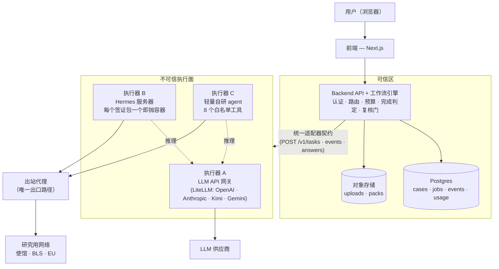
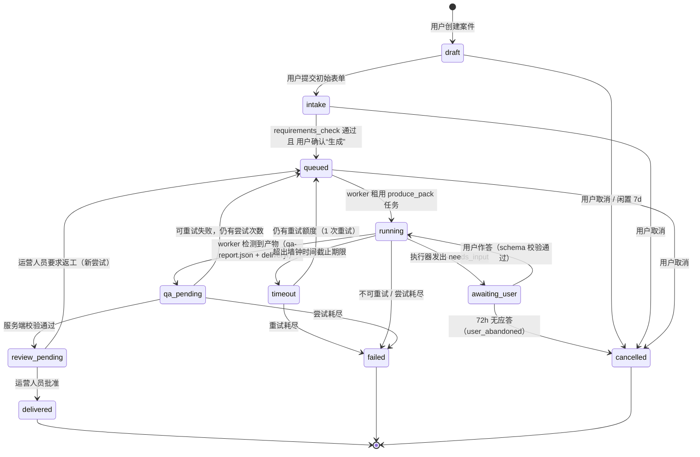
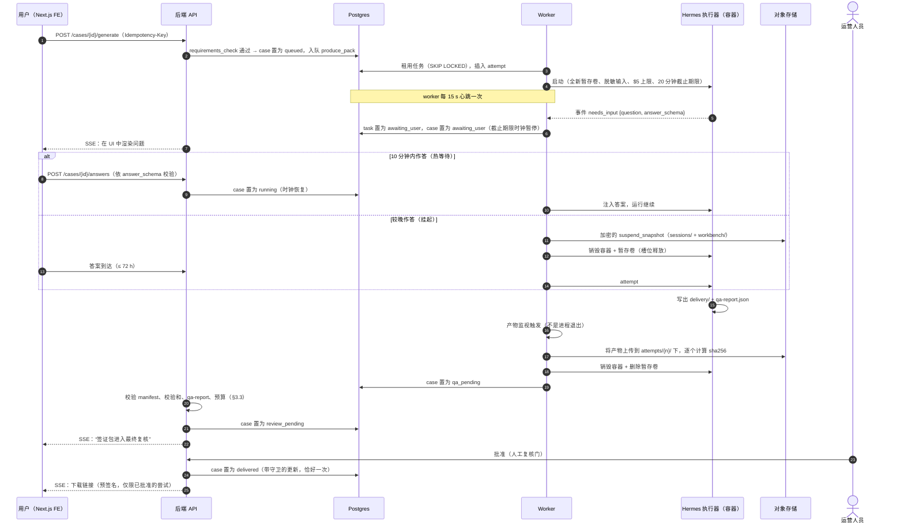
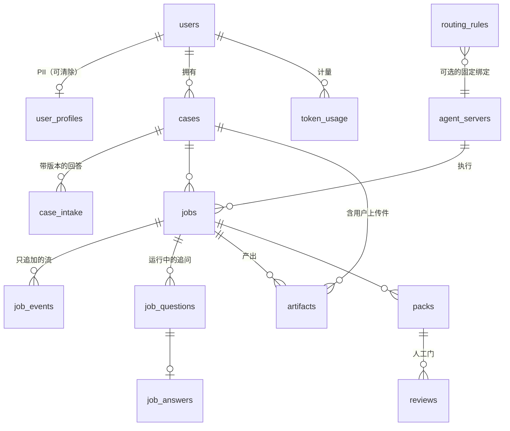
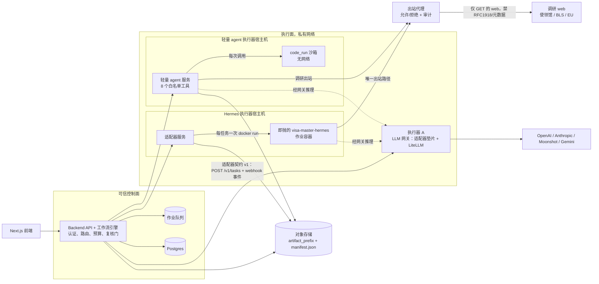

# Visa Master 平台架构 (v0.4)

**版本：** v0.4
**状态：** 架构提案
**承接自：** [architecture-v0.3](architecture-v0.3-en.md)（信任边界、即抛单租户执行、出站管控）· [ADR-002](../discussion/withchatgpt/ADR-002-Agent-Framework-Evaluation.md)（自研工作流引擎，LLM API 作为智能服务 — 已接受）· [讨论 01](../discussion/withclaude/01-hermes-vs-custom-agent-loop.md)（Hermes 对比轻量自研 agent；折中路线）
**配套文档：** [平台选型与开发计划](platform-and-dev-plan-zh.md) — 本提案中与平台相关的另一半。

> 英文原件：[architecture-v0.4 (English)](architecture-v0.4-en.md)

v0.1–v0.3 回答的是*如何安全地运行一个 agent*。v0.4 是第一份**完整产品**级架构：可信的 Backend API 服务器、**多服务器 Agent 执行面**、路由、完成判定、数据层与用户管理 — 与平台无关。全文分两个层次撰写：**第一部分**是高层摘要（请先读这部分；约 10 分钟），**第二部分**是详细规格（契约、DDL、状态机、时序）。

---

# 第一部分 — 高层架构（摘要层）

## I.1 论点

Visa Master 是一个**以工作流为中心**的产品（ADR-002）：收集信息 → 校验 → 研究 → 生成文档 → QA → 人工复核 → 交付。因此该架构恰好有一个大脑和若干双手：

> **可信后端拥有工作流。** 一个确定性的**工作流引擎** — 纯代码加 Postgres，无框架 — 通过显式状态机驱动每一个案件。它拥有用户、资金、数据，以及"工作是否完成"的裁决权。
>
> **执行面负责干活。** 多个 **Agent 执行服务器**位于统一的适配器契约之后、信任边界之外（v0.3）：一个 **LLM API 网关**（对 OpenAI / Anthropic / Kimi / Gemini 的无状态调用 — V1 的主力）、一个 **Hermes 服务器**（目前唯一可用的完整签证包生产者，被包裹进 v0.3 的即抛容器纪律中），以及一个**轻量自研 agent 服务器**（讨论 01 中的迁移目标）。后端决定*哪个*服务器运行*哪个*任务；任何服务器都不会自行决定。

这调和了 ADR-002 与多 agent 服务器需求之间的关系：自研工作流引擎**就是**控制面；Hermes 未被采纳为*核心运行时*，但它仍是一个*可插拔执行器* — 今天唯一能产出可售卖签证包的执行器 — 路由表最终可以用绞杀者模式把它换成网关与轻量 agent。

## I.2 一张图



安全叙事的大部分由两个属性承担：**所有推理都流经网关**（供应商 API key 与 token 计量只存在于唯一一处 — 这同时也终结了开发期使用的个人 Codex OAuth），以及**所有研究类出站流量都流经受审计的代理**（v0.3 §5）。

## I.3 三个执行器速览

| | A — LLM API 网关 | B — Hermes 服务器 | C — 轻量自研 agent |
|---|---|---|---|
| 是什么 | 无状态适配器 + 版本锁定的 LiteLLM 代理，覆盖 OpenAI / Anthropic / Moonshot-Kimi / Gemini | 适配器服务，每个签证包驱动一个即抛的 `visa-master-hermes` 容器（v0.3 纪律） | 轻量 agent SDK（Pydantic-AI / OpenAI Agents SDK class）+ 恰好 8 个白名单工具 |
| 角色 | **V1 主力** — 所有单次调用步骤：抽取、翻译、起草、分类 | **当下可用的签证包生产者** — 完整的 研究→文档→QA 流水线 | **迁移目标** — 通过绞杀者模式从 B 吸收任务类型，`produce_pack` 放在最后 |
| 状态 | 无 | 单租户暂存，每个任务结束后销毁 | 每任务暂存，每次调用独立沙箱 |
| 密钥 | 供应商 API key（核心机密） | 作业容器内没有 | 零供应商 key |
| 典型延迟 | 1–8 秒 | 约 10 分钟 | 取决于任务 |

## I.4 一个案件如何流转

1. **信息采集** — 一个结构化表单（不是聊天）采集决定路线的事实。一个确定性的 `requirements_check` — 依据 ADR-002，用纯代码在版本化的材料要求矩阵上运行 — 计算出缺失的文档。没有 LLM 决定该问什么。
2. **入队** — 用户确认后，后端冻结一份**脱敏**的任务载荷（无 user_id、无 email、无 JWT — v0.3）并将 `produce_pack` 入队。
3. **执行** — worker 租约取得该作业（Postgres `SKIP LOCKED`），分派给**路由表**选中的执行器，向 UI 流式推送进度，并在服务端强制执行预算与截止时间。
4. **判定** — 完成与否是后端基于**证据**计算出的裁决：产物清单、重算的校验和、QA 报告、网关计量的花费。绝不依据进程退出（`workspace open` 挂起证明了一个已完成的签证包可以与仍存活的进程共存），也绝不依据 agent 的自我报告。
5. **复核** — 每个签证包在用户拿到下载链接之前，都必须通过**人工复核门**（运营人员审批）。
6. **交付** — 指向已批准那次尝试的产物的预签名 URL；PII 遵循留存计划，并可按用户清除。

支持运行中途的追问（`awaiting_user` 状态），但刻意做得很少见：确定性的信息采集已把这些问题前置。

## I.5 关键决策（摘要）

| 问题 | 决策 | 详见 |
|---|---|---|
| 谁来编排？ | **自研代码**：约 11 个状态的状态机，以 Postgres 中带守卫的 SQL 迁移实现；队列 = `SELECT … FOR UPDATE SKIP LOCKED`；不使用编排框架 | Part II·A §1, §5 |
| 自研 vs. Pydantic-AI / OpenAI Agents SDK / LangGraph / Temporal？ | Agent SDK **只属于执行器 C 内部**；控制面拒绝 LangGraph；Temporal 一类方案推迟到显式触发条件之后 | Part II·A §5 |
| 工作如何路由？ | 版本化的 `routing_rules` 表，以代码中指派的 `task_type` 为键。LLM 可以把自由文本**分类**进一个封闭枚举；它绝不做路由 | Part II·A §2 |
| 完成如何判定？ | 按任务类型定义完成契约；`produce_pack` = 6 步服务端校验流水线，终点是人工门 | Part II·A §3 |
| 数据库？ | MVP 阶段**仅 Postgres 16+**：关系型内核 + JSONB + 队列 + LISTEN/NOTIFY + 后续 pgvector；Redis 推迟到触发条件之后 | Part II·B §1 |
| 对象存储？ | S3 兼容，两个 bucket（uploads / artifacts），不透明 key，预签名流程；作业容器永远不持有存储凭据 | Part II·B §3 |
| 认证与用户？ | 默认 **Better-Auth 自托管**（登录路径上没有第三方域名 — 中国可达性）；当控制面是 Supabase 时（如配套计划所采纳）使用**平台特例条款下的 Supabase Auth**，并配合服务端吊销检查；RBAC 分 user/operator/admin；Clerk 作为兜底 | Part II·B §4 |
| Agent 服务器？ | 三种，统一置于**同一个适配器契约**之后（`POST /v1/tasks`、状态、answers、cancel、webhook 事件、产物清单） | Part II·C |
| 模型凭据？ | 真实 API key，仅由网关持有，按任务设预算 — 取代开发期的 Codex 订阅 OAuth | Part II·C §2 |
| 安全分区？ | v0.3 的控制项按执行器映射：脱敏输入、即抛租户、出站代理为唯一权威出口、人工门 | Part II·C §5 |

## I.6 本文刻意推迟的内容

并发 > 1、Redis、Temporal 一类的持久化执行、出站 DLP（TLS 拦截）、轻量 agent 接管 `produce_pack`、多区域、Stripe 自助计费 — 每一项都停在一个显式触发条件之后，列于配套的[平台与开发计划](platform-and-dev-plan-zh.md)中。

---

# 第二部分 — 详细规格

第二部分由三章组成，各自自成体系：**A. 控制面**（工作流引擎、路由、完成判定）、**B. 数据层与用户管理**、**C. Agent 执行面**（适配器契约 + 三个执行器）。

> **模型对齐说明（读一次即可）。** 各章是针对同一套需求起草的，但在抽象高度上刻意不同，且有三套术语必须当作一套来读：
>
> 1. **流程模型（权威）：A 章。** `cases` 承载用户可见的 11 状态生命周期；`tasks` 是执行器调用；`task_attempts` 是重试单位（每次尝试都有全新的暂存卷 + 每尝试独立的 S3 前缀）。权威的 `task_type` 词汇表是 A 章 §2.2 的八种类型（`intake_chat`、`requirements_check`、`doc_field_extraction`、`translation`、`itinerary_draft`、`produce_pack`、`qa_check`、`custom_research`）。
> 2. **物理 MVP schema：B 章。** 对于单并发的 MVP，`tasks` + `task_attempts` 可以折叠成 B 章所规定的单张 `jobs` 表（内联 `attempt` 计数器）；当挂起/恢复（A §1.7）落地时再长回尝试行。B 章更粗粒度的 `cases.status` 是 A 章工作流状态面向产品的投影（`ready`≈`queued`，`processing`≈`running`/`qa_pending`，`in_review`≈`review_pending`，另加 `closed` 表示交付后的归档）。
> 3. **部署标识符：开发计划**（配套文档）使用版本化的 kind 字符串（`pack.schengen.v1`、`step.translate.v1`）— 它们是 A 章任务类型的线格式名称，带版本以便契约演进。
>
> 4. **网关步骤名与子步骤。** C 章 §2.2 的 `llm.*` 名称是执行器 A 的内部操作名：`llm.extract`→`doc_field_extraction`，`llm.translate`→`translation`，`llm.draft`→`itinerary_draft`（以及签证包内的起草子步骤），`llm.classify`→嵌在 `intake_chat` 中的意图分类器（A §2.1），`llm.gap_check`→对确定性 `requirements_check` 的 LLM 建议性补充（仅供参考）。开发计划的 kind 字符串映射为 `pack.schengen.v1`→`produce_pack`，`step.translate.v1`→`translation`；`step.cover_letter.v1`/`step.checklist.v1` 是按 C §4.1 切分出来的 `produce_pack` 子步骤，会在切换过去时加入该词汇表（以及 `jobs.task_type` 的 CHECK 约束）。`jobs.task_type` 存储权威名称；kind 字符串是在 `packages/core` 中解析的线格式别名。
> 5. **物理 schema 投影。** B 章更粗粒度的 `cases.status` 把 A 章的 `failed`/`timeout` 都投影到 `failed`（超时细节落在作业行上）。平台文档的 B.1 表格是对 B 章 `jobs` 的一份示意性最小草图 — 开发计划构建的是 B 章的形态（B 章的状态名、`attempt`/`max_attempts`、`idempotency_key`、预算列）。`executor_kind` 包含 `backend_code`，用于像 `requirements_check` 这类在可信 backend 内部运行、而不在任何 agent 服务器上运行的任务。
> 6. **超时。** 路由表中 `produce_pack` 的 20 分钟默认值（观测到的约 10 分钟运行时长的 2 倍）是稳态目标，B 章 DDL 的默认值（1200 秒）与之一致；C 章的 1800 秒示例以及开发计划中 60 分钟的 beta 上限，是在时长方差仍在测量期间的按任务预算配置。预算是按任务配置、服务端强制执行的，且墙钟时间从**取得租约时**开始计 — 排队等待绝不消耗运行预算。
> 7. **适配器契约的实现形态。** C 章 §1 的 HTTP+JSON 契约是与执行器无关的线格式；开发计划中 4 个方法的 TypeScript 接口是它在 V1 的*进程内*实现（`running`→`running`，`artifact_ready`→`completed`+清单，`failed`→`failed`；在信息采集完全前置的前提下，`awaiting_user`/answers/cancel/webhooks 刻意不实现）。当第一个执行器离开这台 VM 时，才实现 HTTP 表面。产物上传同理：在执行器同机部署的情况下，由**可信的 conductor**准备输入并上传/哈希输出（A §1.5，B §3）；C §1.1 的 `storage_grant` 是远程执行器的变体。
> 8. **认证。** B 章 §4 的默认选择是 Better-Auth；配套计划采纳的是 **Supabase Auth 平台特例条款**（见 B §4），因为控制面落在 Supabase 上 — 并配合该处规定的吊销与中国可达性缓解措施。

## 第 A 章 — 控制面：工作流引擎、路由与完成判定

可信后端独占执行面永远不会触碰的四样东西：用户身份、记录型数据库、钱（token/成本预算），以及"工作是否已完成"的裁决权。执行器——`llm-gateway`、`hermes-server`、`custom-agent-server`——是同一套适配器契约背后的不可信提案生成器。本章规定位于它们之上的编排层，与 ADR-002（工作流引擎以确定性代码实现；LLM 作为无状态智能服务）以及 architecture v0.3（异步作业、即抛单租户容器、按产物判定完成、人工复核门）保持一致。

以下所有内容都受三条不变量约束：

1. **每一次状态转移都是 Postgres 中一条带守卫的 SQL 更新**，由后端代码执行。任何执行器、任何 LLM 输出，都绝不会直接让案件发生状态转移。
2. **完成是后端依据证据计算出的裁决**（对象存储中的产物、gateway 计量、出站代理审计日志）——绝不依据进程退出，也绝不依据 agent 的自我报告。这是 `workspace open` 前台挂起事故换来的血的教训：签证包已经做完了，进程却还是 "Up"。
3. **路由决策是代码。** LLM 可以做分类；只有 `switch` 语句才做路由。

### 1. 工作流引擎

#### 1.1 数据模型

两个层级：**案件**（case，客户的一次委托：一份签证申请包，持续数天，其中有人参与）与**任务**（tasks，单次执行器调用：一轮信息采集、一次签证包生产运行）。案件承载用户可见的状态机；任务承载尝试、预算与截止期限。

```sql
CREATE TYPE case_state AS ENUM (
  'draft','intake','queued','running','awaiting_user',
  'qa_pending','review_pending','delivered','failed','timeout','cancelled');

CREATE TABLE cases (
  id              uuid PRIMARY KEY,
  user_id         uuid NOT NULL REFERENCES users(id),
  route           jsonb NOT NULL,          -- {origin_consulate:"chengdu", destination:"ES", visa_type:"schengen_tourism"}
  state           case_state NOT NULL DEFAULT 'draft',
  state_version   int NOT NULL DEFAULT 0,  -- 状态转移上的乐观并发
  intake          jsonb NOT NULL DEFAULT '{}',
  failure_class   text,                    -- 见 §3.4 分类法
  failure_detail  jsonb,
  idempotency_key text UNIQUE,             -- 来自 FE 的 Idempotency-Key 头
  deadline_at     timestamptz,             -- 案件级（例如 awaiting_user 过期）
  created_at      timestamptz NOT NULL DEFAULT now(),
  updated_at      timestamptz NOT NULL DEFAULT now());

CREATE TABLE tasks (
  id              uuid PRIMARY KEY,
  case_id         uuid NOT NULL REFERENCES cases(id),
  task_type       text NOT NULL,           -- intake_chat | produce_pack | ...（§2.2）
  state           text NOT NULL,           -- created|queued|leased|running|awaiting_user|succeeded|failed|cancelled
  dedupe_key      text NOT NULL,           -- 例如 'produce_pack:v1' 或 'intake_chat:turn-7'
  input           jsonb NOT NULL,          -- 脱敏后的任务 payload（不含 user_id/JWT/email，依 v0.3 §11）
  output          jsonb,                   -- 经 schema 校验的结果（chat 类任务）
  routing_rule_id uuid NOT NULL,           -- 审计：由哪条规则+版本完成的路由
  max_attempts    int NOT NULL,
  lease_owner     text, lease_expires_at timestamptz,
  UNIQUE (case_id, task_type, dedupe_key));

CREATE TABLE task_attempts (
  id              uuid PRIMARY KEY,
  task_id         uuid NOT NULL REFERENCES tasks(id),
  attempt_no      int  NOT NULL,
  executor_kind   text NOT NULL,           -- llm_gateway | hermes | custom_agent | backend_code
  executor_ref    text,                    -- 容器 id / gateway 请求 id
  scratch_ref     text,                    -- 每次尝试独立的卷名（v0.3 §4）
  started_at      timestamptz,
  heartbeat_at    timestamptz,             -- 由 WORKER 写入，绝不由 agent 写入
  suspended_at    timestamptz,             -- 因 awaiting_user 停泊时置位
  ended_at        timestamptz,
  outcome         text,                    -- succeeded | agent_error | timeout | budget_exceeded
                                           --  | qa_failed | validation_failed | user_abandoned | cancelled
  error           jsonb,
  tokens_prompt   bigint DEFAULT 0, tokens_completion bigint DEFAULT 0,
  cost_usd_cents  int DEFAULT 0,           -- 由 llm-gateway 计量，而非 agent 上报
  egress_bytes    bigint DEFAULT 0,        -- 来自出站代理审计日志
  UNIQUE (task_id, attempt_no));

CREATE TABLE artifacts (
  id              uuid PRIMARY KEY,
  case_id         uuid NOT NULL,
  task_attempt_id uuid NOT NULL REFERENCES task_attempts(id),
  kind            text NOT NULL,           -- qa_report | manifest | deliverable | suspend_snapshot
  s3_key          text NOT NULL,           -- cases/{case_id}/attempts/{attempt_no}/...
  sha256          text NOT NULL,
  bytes           bigint NOT NULL,
  content_type    text NOT NULL);

CREATE TABLE case_events (                 -- 只追加审计 + SSE 发件箱
  id bigserial PRIMARY KEY, case_id uuid NOT NULL, seq int NOT NULL,
  type text NOT NULL, payload jsonb, actor text NOT NULL,  -- user|backend|worker|operator|reaper
  created_at timestamptz NOT NULL DEFAULT now(),
  UNIQUE (case_id, seq));
```

MVP 的作业队列就是 `tasks` 表本身（`SELECT … WHERE state='queued' FOR UPDATE SKIP LOCKED LIMIT 1`）。在单并发下（v0.3 MVP），专门的消息代理纯属额外开销；Redis 仅作为 SSE pub/sub 的可选项保留。

#### 1.2 案件状态机



#### 1.3 状态转移：触发条件、守卫、副作用

| From → To | 触发方 | 守卫（代码） | 副作用 |
|---|---|---|---|
| `draft → intake` | 用户（FE） | 初始表单通过 schema 校验 | 创建首个 `intake_chat` 任务 |
| `intake → queued` | 后端规则 | `requirements_check`（确定性，§2.2）返回 complete 且 用户点击了 Generate | 入队 `produce_pack` 任务，将 intake 快照冻结进 `tasks.input` |
| `queued → running` | worker | 获得租约（`SKIP LOCKED`），已创建尝试记录行 | 创建全新暂存卷，启动容器（v0.3 §4） |
| `running → awaiting_user` | worker，在执行器 `needs_input` 事件时 | 问题 payload 通过 schema 校验 | 暂停任务截止期限时钟；通过 SSE 把问题推给 FE；启动 72 h 弃置计时 |
| `awaiting_user → running` | 用户经后端作答 | 答案通过该问题声明的 JSON schema 校验 | 恢复或还原执行器（§1.7）；恢复截止期限时钟 |
| `running → qa_pending` | worker | 暂存卷中出现 `qa-report.json` + delivery 目录（产物监视，v0.3 §7.1） | 将产物上传到 S3 的该尝试前缀下；销毁容器 + 暂存卷 |
| `qa_pending → review_pending` | 后端校验器 | §3.3 各项检查全部通过 | 通知运营人员；向用户 SSE 推送"复核中" |
| `review_pending → delivered` | 运营人员 | 显式批准（人工复核门，v0.3 §8） | 将交付指针指向已批准尝试的产物；通知用户 |
| `review_pending → queued` | 运营人员 | 已附返工说明 | 入队新的 `produce_pack` 尝试，把运营反馈放进 input |
| `running → timeout` | worker 定时器或后端收割器 | `now() > attempt deadline`（不计暂停时间） | 强制销毁容器 + 暂存卷；尝试 `outcome=timeout` |
| `timeout → queued / failed` | 后端 | 是否还有剩余尝试次数？ | 按 §3.4 开启新尝试或终态失败 |
| `running/qa_pending → failed` | 后端 | 不可重试的 outcome 或 `attempt_no = max_attempts` | 设置 `failure_class`；告警运营人员；退款/补偿钩子 |
| `awaiting_user → cancelled` | 收割器 | 72 h 无应答 | `failure_class=user_abandoned`；销毁任何挂起状态；PII 留存计时开始 |
| `任意非终态 → cancelled` | 用户或运营人员 | — | 若正在运行则销毁容器/暂存卷 |

每一次状态转移都经由同一个函数：

```
transition(case_id, from_states[], to_state, actor, event_payload)
  = UPDATE cases SET state=$to, state_version=state_version+1, updated_at=now()
    WHERE id=$case_id AND state = ANY($from_states)
    RETURNING *;   -- 0 行 ⇒ 竞态落败 ⇒ 调用方重新读取并空操作
```

再加上在同一个数据库事务中向 `case_events` 插入一条记录（发件箱 → SSE 中继）。这在构造上就让每一个触发条件——用户点击、worker 事件、收割器扫描——都是幂等且抗竞态的，并且让审计轨迹与状态历史完全相等。

#### 1.4 租约、心跳与收割器

- **租约：** worker 租用一个 queued 任务（`lease_owner`、`lease_expires_at = now() + 90s`），并在每次心跳时续租。
- **心跳：** 容器运行期间，由**worker**（可信）每 **15 s** 写一次 `task_attempts.heartbeat_at`。agent 对存活性没有任何贡献——一个不再发出事件却让容器保持存活的 agent，只有在 worker 认可时才算"活着"，而且 worker 还会检查容器状态 + 事件流尾部。
- **收割器（后端 cron，每 30 s）：**（a）`heartbeat_at` 早于 **60 s** 的尝试 → 标记 `outcome=agent_error, error={class:"worker_lost"}`，释放租约，若仍有尝试次数则重新入队；（b）超过墙钟时间截止期限的尝试 → 走 `timeout` 路径；（c）处于 `awaiting_user` 超过 72 h 的案件 → `user_abandoned`；（d）闲置 7 天的 `draft` 案件 → cancelled。

因此，worker 在作业中途崩溃只会付出一次尝试的代价，绝不会卡死整条流水线——这在单并发下至关重要，因为一个卡住的槽位就等于全面停摆。

#### 1.5 幂等性与重试语义

- **案件创建：** FE 发送 `Idempotency-Key`；唯一索引使重复提交返回已存在的案件。
- **任务入队：** `UNIQUE (case_id, task_type, dedupe_key)`；重复入队是空操作，返回已存在的任务。
- **尝试是重试的单位。** 重试绝不修改先前的尝试：它插入 `attempt_no+1`，配以**全新的暂存卷**（v0.3 §4 保证无残留），并把产物写到新的 S3 前缀 `cases/{case_id}/attempts/{n}/` 下。任何东西都不会被覆盖；案件的交付指针只在运营人员批准时被设置恰好一次，指向某一次尝试经校验的产物集合。
- **可重试性按失败类别决定**（§3.4），每种 task type 的最大尝试次数见 §2.2。重试使用同一份已冻结的 `tasks.input`，因此仅凭数据库就能复现一次尝试。
- **副作用安全性：** 执行器除了自己的暂存卷和 LLM 网关之外没有任何写入路径；S3 上传由 worker 执行，并以尝试为键。因此重试无需分布式事务机制即可安全——系统中唯一的至多一次效应是 `delivered` 状态转移，由带守卫的更新加以保护。

#### 1.6 截止期限

两个时钟，都在服务端强制执行：

- **尝试墙钟时间**（按 task type，§2.2）：worker 在容器启动时启用本地定时器，**同时**收割器独立检查 `started_at + deadline - paused_duration`。到期即：强制销毁（docker rm -v），`outcome=timeout`。`produce_pack` 分配 **20 分钟**（实测真实运行约 10 分钟；2× 余量）——这是针对 `workspace open` 那一类挂起 bug 的兜底。
- **案件时钟：** `awaiting_user` 72 h；`draft` 闲置 7 天。人工复核门（`review_pending`）在 24 h 时有 SLA 告警，但不会自动过期——该门是强制的（v0.3 §8）。

`awaiting_user` 暂停会**停止**尝试时钟（`suspended_at`/恢复计账）；每次尝试的累计暂停时间上限为 72 h，而活跃运行时间仍不得超过墙钟时间预算。

#### 1.7 运行中追问（`awaiting_user`）机制

在单并发下，`produce_pack` 中途提问代价高昂：一个闲置容器会卡住唯一的槽位。采用两阶段策略：

1. **热等待（≤ 10 分钟）：** 收到 `needs_input` 时，容器保持存活并暂停；worker 继续心跳。若用户在 10 分钟内作答，worker 注入答案，运行继续——这是最省的路径，且不丢失状态。
2. **挂起（> 10 分钟）：** worker 将携带 PII 的可写状态（`sessions/`、`workbench/`）打包上传至 S3，作为一个加密的 `suspend_snapshot` 产物（SSE-KMS，72 h 生命周期删除），销毁容器 + 暂存卷，释放槽位。答案到达时，恢复 = 开启新尝试，把快照还原进一个全新的暂存卷（Hermes 的会话恢复能力使其可行）。若 72 h 内无答案 → `user_abandoned`，快照删除。

产品层面的缓解措施仍是首要手段：ADR-002 的确定性 `requirements_check` 把所有可预见的问题前置到 `intake`，因此运行中提问是例外，而非常规流程。

### 2. Agent 路由器

#### 2.1 路由模型：规则优先，LLM 永不决策

路由的输入永远是**由工作流代码指派的 `task_type`**——状态机知道下一步需要什么；没有任何东西去推断它。路由器是对一张带版本的表的查找（由仓库中的 YAML 文件播种，部署时载入数据库；每个任务记录 `routing_rule_id` 以供审计）：

```sql
CREATE TABLE routing_rules (
  id uuid PRIMARY KEY,
  task_type       text NOT NULL,
  match           jsonb NOT NULL DEFAULT '{}',   -- 可选谓词，例如 {"destination":"ES"}；最具体者胜出
  executor_kind   text NOT NULL,   -- llm_gateway | hermes | custom_agent | backend_code
  model_primary   text,            -- gateway 模型 id；仅在 429/5xx 时回退
  model_fallback  text,
  max_cost_usd_cents int NOT NULL, -- 由 llm-gateway 按任务强制执行的硬上限
  max_tokens_out  int,
  wall_clock_s    int NOT NULL,
  max_attempts    int NOT NULL,
  version int NOT NULL, active boolean NOT NULL DEFAULT true,
  UNIQUE (task_type, match, version));
```

**LLM 可以出现在哪里：** 自由文本的信息采集消息是有歧义的（"其实我也想顺便去葡萄牙玩几天"）。**经由 llm-gateway 的一次小型分类器调用**把消息映射到一个封闭的意图枚举——`{answer_field, route_change, doc_upload_question, custom_research_request, smalltalk, unknown}`——输出经 schema 校验。随后后端**在代码中**依据该枚举做路由；`unknown` 或低置信度会落到一个澄清性提问，绝不会落到执行器。分类器可能标错，但它无法路由错，因为它不持有任何路由权限。这正是把 ADR-002 的边界机制化。

执行器种类的回退（例如 Hermes 宕机 → custom agent）在 v1 中**不**自动进行——它是一次运营配置变更。在输出契约不同的运行时之间自动回退是正确性隐患，而非韧性。

#### 2.2 v1 路由表

| task_type | executor_kind | 模型偏好（primary → fallback） | 每任务成本上限 | 墙钟时间 | 最大尝试次数 | 备注 |
|---|---|---|---|---|---|---|
| `intake_chat`（单轮） | `llm_gateway` | kimi-k2-class → gpt-4.1-mini-class | $0.05 | 60 s | 2 | 依 ADR-002 使用小 prompt；返回 `IntakeDelta`（§3.2） |
| `requirements_check` | `backend_code` | —（无 LLM） | $0 | 1 s | 1 | 在带版本的 `route_requirements` 矩阵（destination × visa_type × consulate → 所需材料）之上的纯代码。依 ADR-002，"西班牙需要护照/银行流水/在职证明"就是一行数据加一个循环 |
| `doc_field_extraction` | `llm_gateway` | gemini-flash-class（视觉） → gpt-4.1-mini-class | $0.10 | 120 s | 3 | 护照/银行流水的 OCR+字段抽取；可跨文档并行 |
| `translation` | `llm_gateway` | kimi-k2-class → gemini-flash-class | $0.05 | 90 s | 3 | zh↔en/es 片段；按内容哈希缓存 |
| `itinerary_draft` | `llm_gateway` | claude-sonnet-class → kimi-k2-class | $0.25 | 180 s | 2 | 单次结构化输出调用；喂给签证包输入，也可用作快速的"分阶段草稿"（Discussion 01 §C6） |
| `produce_pack` | `hermes` | Hermes 配置的大模型（claude-sonnet-class），使用 gateway 凭据 | $5.00 硬上限 | 20 分钟 | 2 | 今天已经跑通的完整流水线；仅按产物判定完成（§3.3） |
| `qa_check` | `hermes`（仅 CLI 工具：`visa-master qa run`） | —（确定性，无 LLM 规划） | $0 | 5 分钟 | 2 | 正常情况下在 produce_pack 容器内运行；为运营返工提供独立重跑路径 |
| `custom_research` | `custom_agent` | claude-sonnet-class 做规划 + haiku-class 做抽取 | $1.00 | 10 分钟 | 2 | 薄 SDK agent，约 8 个白名单工具（Discussion 01 §8）；迁移目标 |

确切的 gateway 模型 ID 存放在配置里而非代码里，因此更换供应商仍只是一次配置变更（v0.3 §9）。预算**由 llm-gateway 在调用时强制执行**——每个执行器的 LLM 流量，包括 Hermes 容器的，都只出站到该网关（即 v0.3 §5.2 规则 2 中的"LLM provider host"）。当某任务的上限耗尽时，网关拒绝该调用；agent 失败；worker 依据**网关计量**（而非 agent 说了什么）记录 `budget_exceeded`。这同时也让 Codex 的 device-code OAuth 退役：只有网关持有真实的 API key。

### 3. 完成判定

#### 3.1 原则

**执行器提议，后端裁决。** 只有当后端代码验证了它能够独立核查的证据时，任务才是 `succeeded`。进程退出不是证据（`workspace open` 挂起证明了一个做完的签证包可以与一个存活进程共存——反过来，干净退出却输出垃圾，同样可能发生）。agent 说一句"完成了"也不是证据。

#### 3.2 按 task type 的完成契约

| 任务类别 | 终止信号 | `succeeded` 之前的后端校验 |
|---|---|---|
| 单次 LLM（`intake_chat`、`doc_field_extraction`、`translation`、`itinerary_draft`） | 网关响应完成 | `finish_reason == "stop"`（被长度截断的回复是失败，不是答案）；正文按该任务的 JSON Schema 解析通过（`IntakeDelta`、`ExtractedFields{field, value, confidence, source_page}`、`ItineraryDraft`）；引用一致性检查（抽取出的日期可解析、行程日期落在行程窗口内）；最多一次 schema 修复重试 |
| `requirements_check` | 函数返回 | 无需校验——它*本身就是*后端代码；输出为 `{complete: bool, missing: [doc_type], questions: [field]}` |
| 智能体式对话（`custom_research`） | 执行器发出 `terminal` 事件，带类型化的 `ResearchResult{question, findings[], citations[{url, accessed_at, quote}], confidence}` | schema 校验；**每一个引用的 host 都必须出现在本次尝试的出站代理审计日志中**，并以薄 agent 服务自身的逐次调用抓取日志作为完整 URL 的证据（MVP 阶段的代理对 HTTPS 只能看到 CONNECT 的 host；代理侧的 URL 路径核验要等第二阶段的 TLS 中间人 DLP）——agent 从未真正抓取过的引用就是幻觉，可被机械地抓出来 |
| `produce_pack` | **产物监视**：暂存卷中出现 `qa-report.json` + delivery 目录 | 下述完整流水线（§3.3） |
| `qa_check` | 已写出 `qa-report.json` | 报告可解析；`status ∈ {pass, visual-review-required}`；`issues` 数组存在 |

#### 3.3 `produce_pack` 校验流水线（`qa_pending`）

worker 在检测到产物后，将 `cases/{id}/attempts/{n}/` 下的一切上传，并为每个文件计算 sha256，然后由后端校验器运行：

```json
// manifest.json — 由构建器写出，被当作待核验的声明（CLAIM），而非事实
{
  "pack_version": "1",
  "route": {"origin_consulate": "chengdu", "destination": "ES", "visa_type": "schengen_tourism"},
  "files": [
    {"path": "delivery/checklist.pdf",         "sha256": "…", "bytes": 48211, "role": "checklist"},
    {"path": "delivery/cover-letter.pdf",      "sha256": "…", "bytes": 2290,  "role": "cover_letter"},
    {"path": "delivery/itinerary.pdf",         "sha256": "…", "bytes": 60518, "role": "itinerary"},
    {"path": "delivery/employment-letter.docx","sha256": "…", "bytes": 18700, "role": "employment_letter"},
    {"path": "delivery/forms/schengen-application.pdf", "sha256": "…", "bytes": 812344, "role": "official_form"}
  ],
  "qa_report": "qa-report.json"
}
```

检查项，按顺序，全部强制：

1. **清单完整性：** 带版本的签证包规格针对该 route 所要求的每一个 `role` 都存在（该规格与 `route_requirements` 放在一起；对在职申请人缺少在职证明会在这里失败——依 ADR-002，是确定性代码）。
2. **存在性 + 完整性：** 清单中的每个文件都存在于 S3，`bytes > 0`，重新计算的 sha256 与清单以及 worker 上传时的哈希一致。
3. **格式合理性：** PDF 可解析（后端侧经 poppler 得到页数 ≥ 1），DOCX 可打开，无零页渲染。
4. **QA 报告：** 可解析；终态 `status == "visual-review-required"` 且 `issues == []`（今天已知的良好终态）或 `pass`；任何列出的 issue ⇒ `qa_failed`。
5. **预算/截止期限对账：** 网关计量的成本 ≤ 上限，活跃墙钟时间 ≤ 截止期限，出站代理字节数在上限内。只采用服务端的数字。
6. 全部通过 ⇒ `review_pending`。**没有运营人员的批准点击，任何东西都不会到达用户**（v0.3 §8）——在出站 DLP 还处于第二阶段期间，人工复核门同时也是补偿性控制措施。

#### 3.4 失败分类法

| `failure_class` | 检出方 | 重试策略 | 然后 |
|---|---|---|---|
| `agent_error` | worker（容器崩溃、适配器返回非零错误、worker_lost）或校验器（chat 类任务输出不可解析） | 重试，全新暂存卷，直至 `max_attempts` | 终态 `failed`；告警运营人员；退款/补偿钩子 |
| `timeout` | worker 定时器 / 收割器对比墙钟时间 | 1 次重试（可能是挂起 bug，也可能只是跑得慢） | 终态 `failed`；告警标注"可能挂起"——为 `VISA_MASTER_SERVER_MODE` 的修复提供输入 |
| `budget_exceeded` | llm-gateway 计量 | **不自动重试**（对一次已经爆掉上限的运行做重试会让花费翻倍） | 停泊等待运营人员：提高上限并重新入队，或失败并退款 |
| `qa_failed` | 校验器（qa-report 中 issues > 0） | 1 次重试，把 QA issues 回灌进尝试输入 | 运营人员在 `review_pending` 中分诊，附上 issue 列表 |
| `validation_failed` | 校验器（清单/校验和/schema/格式违规） | 1 次重试 | 终态 `failed` + 高优先级告警——持续性的校验失败意味着执行器契约漂移，即一个 bug，而非运气不好 |
| `user_abandoned` | 收割器（在 `awaiting_user` 中满 72 h） | 无 | 案件 `cancelled`，挂起快照 + 暂存卷销毁，PII 留存时钟开始 |

### 4. 时序：一次带运行中追问的签证包作业



### 5. 控制面：自建还是用框架

**建议：用 Postgres 上的普通后端代码自己掌控状态机。Agent SDK 活在执行器内部。把 Temporal 这一类持久化执行推迟到可度量的触发条件出现之后。**

| 选项 | 结论 | 理由 |
|---|---|---|
| **自建代码 + Postgres**（推荐） | ✅ 控制面 | 这台状态机约 11 个状态、单并发、一条队列。带守卫的更新式状态转移 + `SKIP LOCKED` 租约 + 30 s 的收割器 cron，用远不到 1 kLOC 平淡而可测试的代码就复现了这套负载所需的全部持久性属性（transition 函数是纯函数：可以对整张图做 property test）。状态与 users/cases/artifacts 位于同一套 schema——一条查询就能回答"哪些已交付的签证包用的是路由规则 v3"，而这是任何外部引擎都不会白送的。这**就是**把 ADR-002 的决定（"自建 Workflow Engine…… 极佳的可调试性"）应用到它自己身上。 |
| **Pydantic-AI / OpenAI Agents SDK / Claude Agent SDK** | ✅ 但**仅限于 `custom-agent-server` 内部** | 这些是进程内的 agent 循环框架：围绕单次模型对话的工具派发、重试、流式（即 Discussion 01 §7 中的"薄 agent SDK"）。它们解决的是执行器的问题。对于持续数天的案件、人工复核门、运营批准或尝试计账，它们没有任何答案——把其中之一放进控制面，就等于把一个 LLM 循环放到了 ADR-002 明确规定要放确定性代码的位置。 |
| **LangGraph** | ❌ 控制面；在 `custom-agent-server` 内部可选 | 它可以编码案件 FSM，但会在 Postgres 之外再拖进自己的 checkpointer/持久化，割裂事实来源并削弱审计叙事。只有当自定义 agent 的内部循环真的长成图状时才有理由采用。 |
| **Temporal / Inngest / Trigger.dev** | ⏸ 现在不用 | 持久化执行解决的恰恰是跨一个 worker 机群、对大量并发长流程做恰好一次编排的问题。在 1 个并发作业的规模上，它的成本占了主导：要运行 Temporal server（或掏云端开支）、对每一次带在途运行的部署都要遵守工作流版本化纪律，而且执行状态存在 Temporal 的事件历史里——为了产品查询和运营控制台，我们无论如何都得把它镜像进 Postgres，也就是双份记账。Inngest/Trigger.dev 带来供应商耦合，而且对该作业的核心副作用适配很差：管理本地容器 + 卷的生命周期，无论如何都需要一个常驻的 worker 守护进程。 |

**重新评估采用 Temporal 一类方案的触发条件**（满足任意两条 ⇒ 做一次 spike）：（a）worker 池跨多台主机，且有 ≥ 约 20 个并发的长时运行作业；（b）出现多步补偿流程（支付捕获 + 签证包生产 + 通知 + 退款），手写的 saga 开始不断累积 bug；（c）后端工程师 ≥ 3 人，从而摊薄工作流版本化的税负；（d）收割器/租约代码自身已造成 ≥ 2 起生产事故。在那之前，带守卫的更新式 transition 函数加上尝试记录**就是**我们的持久化执行方案——而且它的每一行都是可以 grep 出来的。

这样就保持了清晰的分层：**控制面 = 确定性代码 + Postgres（ADR-002）；执行器 = agent 框架的栖息地（今天是 Hermes，按 Discussion 01 以薄 SDK agent 为迁移目标）；llm-gateway = V1 的主力与唯一的计量点。** 三种服务器种类在适配器契约之后保持可插拔，而控制面永远不必继承它们的框架。

## 第 B 章 — 数据层与用户管理

### 1. 数据库选型：Postgres

**决策：MVP 阶段唯一的数据库是 PostgreSQL 16+。** 单个实例同时承载关系型核心（users、cases、jobs、billing）、作业队列、进度事件流以及半结构化的 agent 载荷。在这个规模下，托管方案（Neon、Supabase、RDS `db.t4g.micro`）每月成本为 $0–25。

Postgres 为何契合这个具体的工作负载：

| 需求 | Postgres 机制 | 备选方案为何落败 |
|---|---|---|
| 带 FK 完整性的关系型核心（users → cases → jobs → packs → reviews；billing 关联查询） | 普通表、FK、事务性 DDL 以支持快速的 schema 演进 | **Mongo：** 核心本身就是关系型的；复核 / 计费 / 配额查询都是 join。多文档事务虽然存在，但属于别扭的路径，而非默认路径。 |
| 形态仍在演进的 agent 载荷（脱敏后的任务输入、执行器结果报告、签证包清单、信息采集回答） | `jsonb` 列，必要处加 GIN 索引 —— 只在形态确实多变的地方使用读时 schema | **MySQL：** JSON 支持更弱（没有 `jsonb` 的二进制存储语义、没有部分索引、JSON 索引能力更弱），没有事务性 DDL，没有 `LISTEN/NOTIFY`，也没有可与 8.x 之前对应的 RLS 成熟度。 |
| MVP 规模的作业队列（单并发；按每次运行约 10 分钟计，理论上限约 6 个签证包/小时） | `SELECT … FOR UPDATE SKIP LOCKED` —— 在与状态写入同一事务内实现恰好一次的租约语义；部分索引让出队成为 O(1) | **DynamoDB：** 在 PMF 之前 schema 仍在变动时，强迫你先设计访问模式；无法做运维/调试用的临时查询；队列语义需要 Streams+Lambda 胶水；AWS 锁定。它的强项（超大规模）不是本问题所在。 |
| 前端的实时进度 | `job_events` 上的 `LISTEN/NOTIFY` 触发器 → 后端 SSE 中继 | — |
| 后续：路线指南 / 使馆要求检索（ADR-002 缓存，V2 记忆） | `pgvector` 扩展 —— 需要时新增一张 `route_guides` 表，带 `embedding vector(1536)` 列；无需新增基础设施 | 对于一个只有数千行、而非数百万行的语料库来说，单独的向量数据库是一整套额外的系统。 |

**数据量现实核对：** 最大的表将是 `job_events`（每次完整签证包运行约 300–500 行 × 约 1 KB —— 数十次顺序工具调用）。10,000 个签证包 ≈ 含索引共 5 GB。这里没有任何东西会给 Postgres 造成压力。

#### Redis 能带来什么，以及为何推迟

Redis 能买到：亚毫秒级限流、高扇出 pub/sub、分布式锁，以及 BullMQ 生态。在 MVP 阶段，这些都不构成约束：

- **队列：** 单并发（v0.3 MVP）意味着队列深度是个位数；每 1–2 秒轮询一次 `SKIP LOCKED` 的开销可以忽略。
- **Pub/sub：** 对单个后端实例，`LISTEN/NOTIFY` 足以处理 SSE 扇出；即便有几百个并发观察者也扛得住。
- **限流：** 用对 `jobs`/`token_usage` 的 `count(*)`（有索引，在这个数据量下亚毫秒）来强制执行每用户作业配额；API 限流则在每个实例进程内完成。
- **缓存：** 使馆要求与模板缓存（ADR-002）是体积小、变化慢的文档 —— 一张 Postgres 表或一个 S3 对象配合进程内 LRU 就够了。

**引入 Redis 的时机** 为以下任一条件：需要 >1 个后端实例共享 SSE 扇出、worker 池增长超过约 5 个并发作业、或队列吞吐超过约 10 作业/分钟。下文的 `jobs` 表契约在那次迁移中原封不动地保留（Redis 只承载通知；Postgres 仍是作业状态的唯一真相来源）。

### 2. Schema（DDL）

约定：`uuid` 主键（`gen_random_uuid()`；在 PG18 上把默认值切换为 `uuidv7()` 以获得索引局部性）、处处使用 `timestamptz`、用 `text + CHECK` 代替原生枚举（演进成本低）、email 使用 `citext`。所有访问都经由唯一的后端角色 `app_rw`；只追加的表会被回收 `UPDATE/DELETE` 权限。

```sql
CREATE EXTENSION IF NOT EXISTS citext;
-- CREATE EXTENSION IF NOT EXISTS vector;   -- 推迟：用于路线指南检索的 pgvector

CREATE OR REPLACE FUNCTION set_updated_at() RETURNS trigger AS $$
BEGIN NEW.updated_at = now(); RETURN NEW; END $$ LANGUAGE plpgsql;

-- ============ 身份 ============
-- 凭据/OAuth/2FA 存放在 auth 层（Better-Auth 的表或托管 IdP）。
-- 这是应用自己的用户记录，以 provider 的 subject 为键。
CREATE TABLE users (
  id                 uuid PRIMARY KEY DEFAULT gen_random_uuid(),
  auth_provider      text NOT NULL DEFAULT 'better-auth',   -- 'better-auth' | 'clerk' | ...
  auth_subject       text NOT NULL,                          -- IdP 用户 id / JWT sub
  email              citext NOT NULL,
  email_verified     boolean NOT NULL DEFAULT false,
  role               text NOT NULL DEFAULT 'user'
                     CHECK (role IN ('user','operator','admin')),
  status             text NOT NULL DEFAULT 'active'
                     CHECK (status IN ('active','suspended','pending_deletion','deleted')),
  plan               text NOT NULL DEFAULT 'free',           -- 配额档位；Stripe 钩子
  stripe_customer_id text,
  locale             text NOT NULL DEFAULT 'zh-CN',
  created_at         timestamptz NOT NULL DEFAULT now(),
  updated_at         timestamptz NOT NULL DEFAULT now(),
  deleted_at         timestamptz,
  UNIQUE (auth_provider, auth_subject)
);
CREATE UNIQUE INDEX users_email_live_uq ON users (email) WHERE status <> 'deleted';

-- PII 拆分到独立的行，于是账号清除 = 删除该行（+ intake + S3），
-- 而 users 的墓碑记录保留计费/审计完整性。
CREATE TABLE user_profiles (
  user_id        uuid PRIMARY KEY REFERENCES users(id) ON DELETE CASCADE,
  display_name   text,
  passport_name  text,          -- 与护照一致的拼音姓名
  phone          text,
  wechat_id      text,
  residence_city text,          -- 决定 BLS/领事馆辖区（例如成都）
  notify_prefs   jsonb NOT NULL DEFAULT '{}',
  updated_at     timestamptz NOT NULL DEFAULT now()
);

-- ============ 案件与信息采集 ============
CREATE TABLE cases (
  id                  uuid PRIMARY KEY DEFAULT gen_random_uuid(),
  user_id             uuid NOT NULL REFERENCES users(id),
  visa_type           text NOT NULL DEFAULT 'schengen_tourism',
  origin_country      char(2) NOT NULL DEFAULT 'CN',
  destination_country char(2) NOT NULL,                      -- 'ES'
  consulate_city      text,                                  -- 'Chengdu'
  travel_start        date,
  travel_end          date,
  status              text NOT NULL DEFAULT 'draft'
                      CHECK (status IN ('draft','intake','ready','processing',
                             'awaiting_user','in_review','delivered','failed',
                             'closed','cancelled')),
  created_at          timestamptz NOT NULL DEFAULT now(),
  updated_at          timestamptz NOT NULL DEFAULT now()
);
CREATE INDEX cases_user_idx ON cases (user_id, updated_at DESC);

-- 带版本的结构化信息采集。`validation` 是确定性完整性检查的输出
-- （ADR-002：“西班牙要求护照/银行流水/在职证明”是代码，不是 LLM 的决定）。
-- answers 属于 PII → 账号删除时清除。
CREATE TABLE case_intake (
  id           uuid PRIMARY KEY DEFAULT gen_random_uuid(),
  case_id      uuid NOT NULL REFERENCES cases(id) ON DELETE CASCADE,
  version      int  NOT NULL,
  answers      jsonb NOT NULL,
  validation   jsonb NOT NULL DEFAULT '{}',
  missing_docs text[] NOT NULL DEFAULT '{}',
  submitted_at timestamptz NOT NULL DEFAULT now(),
  UNIQUE (case_id, version)                                  -- 在 pg_advisory_xact_lock(hashtext(case_id::text))
);                                                           -- 之下以 max(version)+1 插入

-- ============ 执行器注册表与路由 ============
CREATE TABLE agent_servers (
  id                   uuid PRIMARY KEY DEFAULT gen_random_uuid(),
  name                 text NOT NULL UNIQUE,                 -- 'hermes-1','gateway-1','agent-1'
  kind                 text NOT NULL
                       CHECK (kind IN ('llm_gateway','custom_agent','hermes')),
  base_url             text NOT NULL,
  enabled              boolean NOT NULL DEFAULT true,
  max_concurrency      int NOT NULL DEFAULT 1,               -- Hermes MVP：1
  supported_task_types text[] NOT NULL DEFAULT '{}',
  auth_secret_ref      text NOT NULL,                        -- secret manager 中的名称，绝不是值本身
  healthy              boolean NOT NULL DEFAULT false,
  last_health_at       timestamptz,
  meta                 jsonb NOT NULL DEFAULT '{}',          -- 镜像版本、模型、区域
  created_at           timestamptz NOT NULL DEFAULT now(),
  updated_at           timestamptz NOT NULL DEFAULT now()
);

-- 后端在入队时解析执行器：取 priority 最低的已启用规则，其 task_type 匹配
-- 且其 `match` 谓词被包含在作业输入中（jsonb @> 包含关系）。
-- agent_server_id 可选地固定到某台特定服务器。
CREATE TABLE routing_rules (
  id              uuid PRIMARY KEY DEFAULT gen_random_uuid(),
  priority        int  NOT NULL,
  task_type       text NOT NULL,
  match           jsonb NOT NULL DEFAULT '{}',               -- 例如 {"visa_type":"schengen_tourism"}
  executor_kind   text NOT NULL
                  CHECK (executor_kind IN ('llm_gateway','custom_agent','hermes',
                         'backend_code')),
  agent_server_id uuid REFERENCES agent_servers(id),
  enabled         boolean NOT NULL DEFAULT true,
  note            text,
  created_at      timestamptz NOT NULL DEFAULT now(),
  UNIQUE (task_type, priority)
);

-- ============ 作业（队列 = 这张表） ============
CREATE TABLE jobs (
  id               uuid PRIMARY KEY DEFAULT gen_random_uuid(),
  case_id          uuid NOT NULL REFERENCES cases(id),
  user_id          uuid NOT NULL REFERENCES users(id),       -- 为配额查询做的反范式化
  task_type        text NOT NULL
                   CHECK (task_type IN ('intake_chat','requirements_check',
                          'doc_field_extraction','translation','itinerary_draft',
                          'produce_pack','qa_check','custom_research')),
  executor_kind    text NOT NULL
                   CHECK (executor_kind IN ('llm_gateway','custom_agent','hermes',
                          'backend_code')),
  agent_server_id  uuid REFERENCES agent_servers(id),        -- 在取得租约时设置
  state            text NOT NULL DEFAULT 'queued'
                   CHECK (state IN ('queued','leased','running','awaiting_input',
                          'validating','succeeded','failed','cancelled','timed_out')),
  priority         smallint NOT NULL DEFAULT 100,            -- 越小越早
  attempt          smallint NOT NULL DEFAULT 0,
  max_attempts     smallint NOT NULL DEFAULT 2,
  idempotency_key  text UNIQUE,                              -- 对前端重试去重
  input            jsonb NOT NULL,   -- 已脱敏的任务（v0.3：内部不含 user_id/JWT/email）
  result           jsonb,            -- 执行器完成报告（产物列表、QA 状态）
  error            jsonb,
  max_tokens_total int NOT NULL DEFAULT 400000,
  max_cost_usd     numeric(8,2) NOT NULL DEFAULT 5.00,
  deadline_seconds int NOT NULL DEFAULT 1200,  -- 20 分钟墙钟时间（路由表默认值）；签证包约 10 分钟。
                                               -- 针对 `workspace open` 挂起的兜底：
                                               -- 完成判定依据产物，绝不依据退出码。
  created_at       timestamptz NOT NULL DEFAULT now(),
  leased_at        timestamptz,
  lease_expires_at timestamptz,
  started_at       timestamptz,
  heartbeat_at     timestamptz,
  finished_at      timestamptz,
  updated_at       timestamptz NOT NULL DEFAULT now()
);
CREATE INDEX jobs_queue_idx  ON jobs (priority, created_at) WHERE state = 'queued';
CREATE INDEX jobs_reaper_idx ON jobs (lease_expires_at)
  WHERE state IN ('leased','running','awaiting_input','validating');
CREATE INDEX jobs_case_idx   ON jobs (case_id, created_at DESC);
CREATE INDEX jobs_user_idx   ON jobs (user_id, created_at DESC);

-- ============ 进度流（只追加） ============
CREATE TABLE job_events (
  id         bigint GENERATED ALWAYS AS IDENTITY PRIMARY KEY,
  job_id     uuid NOT NULL REFERENCES jobs(id) ON DELETE CASCADE,
  seq        int  NOT NULL,                                  -- 每作业单调递增，由写入方分配
  event_type text NOT NULL
             CHECK (event_type IN ('state','progress','step','tool_call','question',
                    'artifact','budget','log','error')),
  payload    jsonb NOT NULL DEFAULT '{}',
  created_at timestamptz NOT NULL DEFAULT now(),
  UNIQUE (job_id, seq)
);
CREATE INDEX job_events_job_idx ON job_events (job_id, id);
REVOKE UPDATE, DELETE ON job_events FROM app_rw;             -- 只追加

CREATE OR REPLACE FUNCTION notify_job_event() RETURNS trigger AS $$
BEGIN
  PERFORM pg_notify('job_events',
    json_build_object('job_id', NEW.job_id, 'id', NEW.id)::text);
  RETURN NEW;
END $$ LANGUAGE plpgsql;
CREATE TRIGGER job_events_notify AFTER INSERT ON job_events
  FOR EACH ROW EXECUTE FUNCTION notify_job_event();          -- 后端 LISTEN → SSE 推给前端

-- ============ 运行中的追问 ============
-- 执行器发出问题 → 作业停在 'awaiting_input' → 用户作答 →
-- 后端转发答案，作业恢复（或重新入队一个续跑作业）。
CREATE TABLE job_questions (
  id            uuid PRIMARY KEY DEFAULT gen_random_uuid(),
  job_id        uuid NOT NULL REFERENCES jobs(id) ON DELETE CASCADE,
  case_id       uuid NOT NULL REFERENCES cases(id),
  question      text NOT NULL,                               -- 面向用户（zh-CN）
  answer_schema jsonb NOT NULL DEFAULT '{}',                 -- 期望答案的 JSON Schema
  status        text NOT NULL DEFAULT 'open'
                CHECK (status IN ('open','answered','expired','cancelled')),
  asked_at      timestamptz NOT NULL DEFAULT now(),
  expires_at    timestamptz NOT NULL                         -- 到期 → 作业失败或按默认值继续
);
CREATE INDEX job_questions_open_idx ON job_questions (job_id) WHERE status = 'open';

CREATE TABLE job_answers (
  id          uuid PRIMARY KEY DEFAULT gen_random_uuid(),
  question_id uuid NOT NULL UNIQUE REFERENCES job_questions(id) ON DELETE CASCADE,
  user_id     uuid NOT NULL REFERENCES users(id),
  answer      jsonb NOT NULL,
  answered_at timestamptz NOT NULL DEFAULT now()
);

-- ============ 二进制对象（上传件与输出件） ============
CREATE TABLE artifacts (
  id            uuid PRIMARY KEY DEFAULT gen_random_uuid(),
  case_id       uuid NOT NULL REFERENCES cases(id),
  job_id        uuid REFERENCES jobs(id),                    -- 用户上传时为 NULL
  kind          text NOT NULL
                CHECK (kind IN ('user_upload','qa_report','pack_zip','cover_letter',
                       'itinerary','employment_letter','checklist','application_form',
                       'official_pdf','manifest','run_log')),
  s3_bucket     text NOT NULL,
  s3_key        text NOT NULL UNIQUE,
  sha256        char(64),
  size_bytes    bigint,
  content_type  text NOT NULL,
  original_name text,                                        -- 用户的中日韩文件名，仅用于展示
  status        text NOT NULL DEFAULT 'pending'
                CHECK (status IN ('pending','stored','deleted')),
  created_at    timestamptz NOT NULL DEFAULT now(),
  deleted_at    timestamptz                                  -- S3 清除后该行仍保留以供审计
);
CREATE INDEX artifacts_case_idx ON artifacts (case_id, kind);
CREATE INDEX artifacts_job_idx  ON artifacts (job_id);

-- ============ 签证包与人工复核门 ============
CREATE TABLE packs (
  id           uuid PRIMARY KEY DEFAULT gen_random_uuid(),
  case_id      uuid NOT NULL REFERENCES cases(id),
  job_id       uuid NOT NULL REFERENCES jobs(id),
  version      int  NOT NULL,
  manifest     jsonb NOT NULL,                 -- 有序的 [{artifact_id, role, filename}]
  qa_status    text NOT NULL,                  -- 来自 QA runner 的 'visual-review-required'
  qa_issues    int  NOT NULL DEFAULT 0,
  status       text NOT NULL DEFAULT 'in_review'
               CHECK (status IN ('in_review','changes_requested','approved',
                      'delivered','superseded','rejected')),
  delivered_at timestamptz,
  created_at   timestamptz NOT NULL DEFAULT now(),
  UNIQUE (case_id, version)
);

CREATE TABLE reviews (
  id          uuid PRIMARY KEY DEFAULT gen_random_uuid(),
  pack_id     uuid NOT NULL REFERENCES packs(id) ON DELETE CASCADE,
  reviewer_id uuid NOT NULL REFERENCES users(id),            -- 必须持有 operator/admin 角色
  verdict     text NOT NULL CHECK (verdict IN ('approved','changes_requested','rejected')),
  notes       text,
  checklist   jsonb NOT NULL DEFAULT '{}',                   -- 逐份文档的检查结果
  created_at  timestamptz NOT NULL DEFAULT now()
);
CREATE INDEX reviews_pack_idx ON reviews (pack_id, created_at DESC);
-- 不变式（由 API 状态机强制执行）：只有在存在一条 verdict='approved' 的
-- reviews 记录之后，packs.status 才可以到达 'delivered'。

-- ============ 计量与审计 ============
CREATE TABLE token_usage (
  id                bigint GENERATED ALWAYS AS IDENTITY PRIMARY KEY,
  job_id            uuid REFERENCES jobs(id),
  user_id           uuid NOT NULL REFERENCES users(id),
  provider          text NOT NULL
                    CHECK (provider IN ('openai','anthropic','moonshot','gemini','nous')),
  model             text NOT NULL,
  prompt_tokens     int NOT NULL DEFAULT 0,
  completion_tokens int NOT NULL DEFAULT 0,
  cached_tokens     int NOT NULL DEFAULT 0,
  cost_usd          numeric(10,6) NOT NULL DEFAULT 0,
  recorded_at       timestamptz NOT NULL DEFAULT now()
);
CREATE INDEX token_usage_user_idx ON token_usage (user_id, recorded_at);
CREATE INDEX token_usage_job_idx  ON token_usage (job_id);
-- 由 LLM gateway / worker 针对每次供应商响应写入；配额检查 =
-- 每用户每计费周期的 SUM(cost_usd) 对比套餐上限，在入队前
-- 与运行中（job_events 上的 budget 事件）两处强制执行。

CREATE TABLE audit_log (
  id          bigint GENERATED ALWAYS AS IDENTITY PRIMARY KEY,
  actor_type  text NOT NULL
              CHECK (actor_type IN ('user','operator','admin','system','agent_server')),
  actor_id    uuid,
  action      text NOT NULL,        -- 'case.create','pack.approve','user.purge_pii','job.cancel'
  entity_type text NOT NULL,
  entity_id   uuid,
  meta        jsonb NOT NULL DEFAULT '{}',
  ip          inet,
  created_at  timestamptz NOT NULL DEFAULT now()
);
CREATE INDEX audit_entity_idx ON audit_log (entity_type, entity_id, created_at DESC);
CREATE INDEX audit_actor_idx  ON audit_log (actor_id, created_at DESC);
REVOKE UPDATE, DELETE ON audit_log FROM app_rw;              -- 只追加
```

worker 的出队 —— 这正是把 `SKIP LOCKED` 列为选型标准的原因：

```sql
WITH next AS (
  SELECT id FROM jobs
  WHERE state = 'queued'
  ORDER BY priority, created_at
  FOR UPDATE SKIP LOCKED
  LIMIT 1
)
UPDATE jobs j
SET state = 'leased', leased_at = now(),
    lease_expires_at = now() + interval '90 seconds',   -- 心跳续期；到期后 reaper 重新入队或判失败
    attempt = attempt + 1, agent_server_id = $1
FROM next WHERE j.id = next.id
RETURNING j.*;
```



#### RLS 姿态

默认姿态：**数据库完全不向客户端暴露** —— 每一次查询都以 `app_rw` 角色经由后端发出，授权逻辑位于 API 层。如果数据库仍然通过 BaaS（Supabase/PostgREST）暴露出去，则启用 RLS 作为第二道防线，且恰好只作用于面向用户的表：

- **启用 RLS：** `users`（仅自身，读 + 有限更新）、`user_profiles`、`cases`、`case_intake`、`jobs`（SELECT 自身）、`job_events`（通过所属作业 SELECT）、`job_questions`（SELECT 自身）、`job_answers`（INSERT 自身）、`packs`（SELECT 自身且 status ∈ approved/delivered）、`artifacts`（仅 SELECT 自身元数据 —— 字节内容一律通过后端签名的 URL 获取）。
- **绝不暴露，完全不给客户端角色任何授权：** `agent_servers`、`routing_rules`、`reviews`、`token_usage`、`audit_log`。运营人员/管理员的操作界面走后端专属端点，而非直接访问数据库。

归属谓词模式：`user_id = (SELECT id FROM users WHERE auth_provider = current_setting('app.provider') AND auth_subject = auth.jwt()->>'sub')`。

### 3. 对象存储

采用 S3 兼容 API，使供应商可替换。默认 **AWS S3**（SSE-S3 加密、开启 Block Public Access、版本控制**关闭** —— 对 PII 而言，删除必须是真删除）；一旦下载量变得重要，就评估 **Cloudflare R2**，因为零出站费定价直接降低了向中国境内用户交付签证包下载的成本。

#### 布局

两个存储桶 —— 它们承载不同的留存与访问策略：

```
s3://vm-prod-uploads/                       # user-supplied documents (PII)
  u/{user_id}/c/{case_id}/{artifact_id}.pdf

s3://vm-prod-artifacts/                     # generated material
  c/{case_id}/j/{job_id}/{artifact_id}.{ext}     # per-job outputs incl. qa-report.json, run logs
  c/{case_id}/packs/v{version}/{artifact_id}.zip # reviewed deliverables
```

键是不透明的（`artifact_id`）；用户的原始文件名（常为中日韩文字）只存在于 `artifacts.original_name`。每个对象恰好对应一条 `artifacts` 记录；以用户为范围的前缀让账号清除变成一次前缀列举，而不是一次全表扫描。

#### 签名 URL 流程

**浏览器直传**（字节内容从不经过后端）：
1. `POST /api/cases/:id/uploads`，携带 `{content_type, size, original_name}`。后端做校验（白名单 `application/pdf`、`image/jpeg`、`image/png`；最大 20 MB），插入 `artifacts` 记录（`kind='user_upload'`、`status='pending'`），返回一个预签名 PUT（10 分钟有效期），并强制约束 `Content-Type` 与 `x-amz-checksum-sha256`。
2. 浏览器直接 PUT 到 S3。
3. `POST /api/uploads/:artifact_id/complete` → 后端对该对象发起 HEAD，记录经过验证的 `sha256` + `size_bytes`，将 `status` 置为 `'stored'`。超过 1 小时仍为 pending 的记录会被垃圾回收。

**下载：** `GET /api/packs/:id/download` → 后端检查归属关系以及 `packs.status IN ('approved','delivered')`（即人工门 —— 在运营人员批准之前根本不存在签名 URL）→ 预签名 GET，15 分钟有效期，`response-content-disposition: attachment`。运营人员走同样的流程，但以角色为准入条件，并留下审计记录。

**作业容器从不接触 S3。** 依照 v0.3，worker 在启动前把上传件从 S3 暂存到每作业新建的暂存卷中，并在产物检测（`qa-report.json` + 交付目录）之后把输出从暂存卷上传到 `vm-prod-artifacts`。不可信容器不持有任何 S3 凭据，而且出站代理无论如何都会拒绝该主机。

#### 留存与 PII 删除

即抛暂存卷模型意味着容器不会留下任何东西；持久化的 PII 恰好存在于三个地方 —— `vm-prod-uploads`、`case_intake.answers`/`user_profiles`，以及已交付的签证包。按类别的策略：

| 类别 | 位置 | 留存 |
|---|---|---|
| 用户上传件 | `vm-prod-uploads/u/…` | 案件到达 `closed`/`cancelled` 后 90 天删除；账号清除时立即删除 |
| 作业中间产物（QA 报告、运行日志、抓取的官方 PDF） | `…/c/{case}/j/…` | S3 生命周期规则：30 天后删除 |
| 已交付签证包 | `…/c/{case}/packs/…` | `delivered_at` 之后 180 天（重新下载窗口），随后删除 |
| 已删除对象的数据库记录 | `artifacts` | 记录保留并标记 `status='deleted'`，`sha256` 保留以供审计；字节内容已消失 |

**账号删除流水线**（见 §4 生命周期）：一个清除 worker (a) 在两个存储桶中按该用户的前缀列举并批量删除，(b) 删除 `user_profiles` 与 `case_intake` 记录，并将其名下案件的 `jobs.input`/`job_questions.question`/`job_answers.answer` 载荷置空，(c) 把 `users.email` 改写为 `deleted+{id}@invalid` 并将 `status` 置为 `'deleted'`。`token_usage` 与 `audit_log` 得以保留（计费/审计记录，不含文档 PII）。若清除 worker 中途失败，S3 生命周期规则充当兜底。

### 4. 认证与用户管理

#### 备选方案

| 方案 | 类型 | 成本 | 与本产品的契合度 |
|---|---|---|---|
| **Better-Auth** | 库，表建在你自己的 Postgres 中 | $0 | TS 优先，在与 `users` 同一数据库中拥有 `session`/`account`/`verification` 表；开箱即用的邮箱 OTP + 密码；提供 admin/角色、限流、Stripe 等插件；**登录路径中没有任何第三方认证域名** —— 这对中国大陆用户很关键 |
| **Clerk** | 托管 IdP | ≤10k MAU 免费，之后付费 | 上线最快（可直接放入的 Next.js 组件），但登录依赖 Clerk 托管的 JS/API 端点 —— 即便使用自定义域名，从中国访问的可达性/延迟也是现实风险；后期还有按 MAU 计费 |
| **Supabase Auth** | 托管（打包提供） | 约 $0 | 只有当 Supabase 同时也是 Postgres 宿主时才合理；会把数据库与 IdP 的选型耦合在一起 |
| **Auth0** | 托管 IdP | 昂贵 | 其企业 SSO 的强项在这里无关紧要；过度设计 |
| **Auth.js（NextAuth v5）** | 库 | $0 | 可用，但 OTP/凭据流程都得自己做，且文档变动频繁；对于全新构建的项目，相较 Better-Auth 没有优势 |
| **Lucia** | — | — | 已不再是一个持续维护的库（现在是学习资源）；不要采用 |

**默认：Better-Auth，自托管在 Next.js 后端内部，表建在同一个 Postgres 中。** 理由：登录路径中零第三方域名（中国可达性）、零按 MAU 计费、从 auth 表到 `users` 有真正的 FK 完整性，以及只需备份和清除一个数据库。上线时的登录方式：邮箱 OTP（主要方式 —— 无需国外 OAuth 即可服务中国用户）+ 密码；WeChat OAuth 后续通过通用 OAuth 插件接入。

**退路：Clerk。** 如果认证的维护负担开始咬人（送达率、滥用、MFA），就把它换上 —— schema 在设计上就能吸收这一变更：`users(auth_provider, auth_subject)` 是唯一的耦合点，因此迁移只是一次 subject 的回填加上登录路径的改动，无需重新接线 cases/jobs/billing。

**平台特例条款（配套开发计划已采纳）。** 当控制面落在 Supabase 上时（[平台文档](platform-and-dev-plan-zh.md) 将其排为第 1 位），改用 **Supabase Auth** —— 届时认证、Postgres、存储和 realtime 共用同一家供应商，RLS 也直接以 `auth.uid()` 为键。在该配置下，v0.4 的两项要求需要显式处理：(1) *即时吊销* —— Supabase 的会话基于 JWT，因此敏感路由（运营人员操作、复核门变更、签证包下载）必须在每次请求时通过 `authorize()` 收口点在服务端重新检查 `users.status`/`role`（它们本来就会这么做），把 access token 的 TTL 保持在 ≤ 1 小时，并通过吊销 refresh token 来终止会话；这是可接受的，因为每一个高后果动作都经过服务端验证，绝不轻信 claims。（2） *中国可达性* —— 在第一方自定义域名下提供认证服务，并监控大陆的登录成功率；若出现劣化，则迁移到 Better-Auth —— `users(auth_provider, auth_subject)` 的设计初衷正是为了吸收这种替换。只要数据库是普通的 Postgres，Better-Auth 仍是默认选择。

#### 会话模型

**数据库会话 + httpOnly、Secure、SameSite=Lax 的 cookie**（Better-Auth 的默认方式：不透明 token → 一条 `session` 记录），30 天滚动过期。之所以选它而不是无状态 JWT，是因为封禁、角色变更（user → operator）以及签证包访问权限的吊销必须立即生效 —— 在存在人工复核门与 PII 下载的场景下，这一点没有商量余地。每次请求的会话查找是同一个 Postgres 上的一次主键命中；如果它在性能剖析中真的显现出来，就在进程内做缓存（60 秒 TTL）。短时效的签名 JWT（≤10 分钟）只作为内部服务令牌出现 —— 后端 ↔ agent server 之间的调用 —— 绝不用作用户会话。

#### RBAC

`users.role`，三种角色，在后端唯一的 `authorize(actor, action, resource)` 收口点中强制执行（如果引入了 BaaS，则由 RLS 镜像同样的逻辑）。每一个运营人员/管理员动作都会写入 `audit_log`。

| 角色 | 授予的权限 |
|---|---|
| `user` | 自己的 cases/jobs/packs；上传；回答 `job_questions`；下载自己已批准的签证包 |
| `operator` | 人工复核门：列出处于 `in_review` 的 `packs`、查看签证包产物（有审计，后续加水印查看器）、写入 `reviews` 裁定、请求重跑；不含用户管理，不含注册表访问 |
| `admin` | operator 的全部权限 + 用户管理（封禁、清除）、`agent_servers` / `routing_rules` 的增删改查、预算覆盖、退款 |

运营人员只能由管理员邀请创建 —— 不存在自助获取高权限角色的路径。

#### 账号生命周期

`active → suspended`（管理员操作，或滥用/频率触发条件；会话立即吊销）以及 `active → pending_deletion → deleted`：

1. 用户请求删除 → `status='pending_deletion'`，会话吊销，7 天宽限期（取消即可恢复）。
2. 清除 worker 执行 §3 的流水线：S3 前缀、PII 行/列、auth 层的记录（在 Clerk 上则是 IdP 的删除 API）、邮箱留下墓碑记录。
3. `status='deleted'`；`users` 墓碑记录 + `token_usage` + `audit_log` 出于计费/审计目的保留。目标：自请求起 ≤30 天内完成清除，通常 ≤8 天。

#### 配额 / 订阅钩子（Stripe 后续接入）

schema 中已经就位：`users.plan`、`users.stripe_customer_id`，以及作为计量来源的 `token_usage`。MVP 阶段套餐上限放在代码配置中（例如 `free: 1 pack total / $2 LLM budget; paid: per-pack purchase or monthly cap`），在两个点位检查：入队前（通过 `jobs` 统计每周期签证包数，通过 `SUM(token_usage.cost_usd)` 统计花费）与运行中（worker 发出 `budget` 事件；超限 → 作业 `failed` 并带预算错误）。等 Stripe 接入时，新增一张 `subscriptions` 表（`user_id, stripe_subscription_id, plan, status, current_period_end`），只由 webhook 处理器写入，并按 `subscriptions.status='active' ? subscriptions.plan : users.plan` 解析生效套餐。现有表无需任何 schema 迁移。

## 第 C 章 — Agent 执行面：一套适配器契约，三种执行器种类

### 0. 在架构中的位置

按照 ADR-002，可信的 Backend（Node/TypeScript，与 auth + Postgres + 对象存储处于同一信任区）**就是**工作流引擎和控制面。所有执行模型调用或自主工作的部分都位于**执行面**：三种*执行器种类*，统一置于一套 HTTP+JSON **适配器契约**之后。后端决定哪个执行器运行哪个 `task_type`（路由表，§1.7），判定完成（终态 webhook + 产物清单 + 自身校验），并拥有用户、预算和人工复核门。执行器是可替换的 worker；它们都不持有业务规则。

- **执行器 A — LLM API 网关**：无状态，V1 的主力（ADR-002 中的“LLM 作为智能服务”）。
- **执行器 B — Hermes server**：当前可用的完整签证包生产者，包裹在 v0.3 的容器纪律之中。
- **执行器 C — 轻量自研 agent**：来自 Discussion 01 的迁移目标；通过绞杀者模式从 B 吸收任务类型。



注意那两条虚线边：**B 和 C 的全部推理都经由执行器 A 的 OpenAI 兼容端点路由**（Hermes 的 provider 配置与轻量 agent SDK 都接受自定义 base URL）。这样供应商 API key 只存在于唯一一处，按用户的 token 计量也只有单一收敛点（v0.3 §6）。

---

### 1. Agent 适配器契约（v1）

每个执行器都在私有网络上暴露同一套 API。后端与执行器无关：派发、轮询、作答、取消——对三种种类完全一致。

#### 1.1 `POST /v1/tasks` — 派发

Headers：`Authorization: Bearer <executor_token>` · `Idempotency-Key: <task_id>` · `X-VM-Contract: 1`

```json
{
  "contract": "1.0",
  "task_id": "task_01J9XZ3R8QWKQ",
  "task_type": "produce_pack",
  "case_ref": "case_2094",
  "input": {
    "route": {"nationality": "CN", "residence_city": "Chengdu",
              "destination": "ES", "visa_type": "schengen_tourism"},
    "applicant": {"occupation": "software_engineer",
                  "trip_dates": {"start": "2026-09-14", "end": "2026-09-28"}},
    "uploads": [{"key": "cases/case_2094/in/bank-statement.pdf",
                 "content_type": "application/pdf", "sha256": "9f2a..."}]
  },
  "artifact_prefix": "cases/case_2094/tasks/task_01J9XZ3R8QWKQ/",
  "storage_grant": {"kind": "sts_scoped", "expires_at": "2026-08-03T12:00:00Z"},
  "budgets": {"max_tokens": 400000, "max_wall_seconds": 1800, "max_usd": 3.50},
  "callback_url": "http://backend.internal:8080/v1/executor-events",
  "callback_token": "cbk_7f3e...",
  "trace_id": "tr_a1b2c3"
}
```

规则：

- `task_id` 是后端生成的 ULID，并且**就是**幂等键。对已知 `task_id` 的重复 POST 返回 `200` 及当前状态文档——绝不产生重复运行。
- `input` 是**已脱敏**的载荷（v0.3 §11）：目的地/职业/日期，绝不含 `user_id`、JWT、email。`case_ref` 是不透明的关联句柄。
- `uploads` 是对象存储的 key，不是字节流。`storage_grant` 要么是 `sts_scoped`（短时效凭证，IAM 权限收敛到 `artifact_prefix` + 对所列上传 key 的读取），要么是 `presign_endpoint`（执行器用 `callback_token` 在后端换取一批预签名 URL）。任何执行器都不持有长期存储凭证。
- 预算是由**执行器**在本地强制执行的硬上限；后端在计量侧（网关花费日志）再次强制执行。
- 响应：正常为 `202 {"task_id":..., "state":"queued"}`；容量已满时返回 `429` + `Retry-After`（作业仍保留在后端队列中——执行器不做深队列）；schema 违规为 `422`；`task_id` 复用但 body 不同为 `409`。
- **快路径**：`POST /v1/tasks?wait_seconds=25` 在任务于该窗口内完成时可直接返回 `200` 与终态状态文档。执行器 A 大多数调用以这种方式在 1–8 s 内完成；工作流引擎对亚秒级步骤免去一次 webhook 往返，而契约仍保持统一。

#### 1.2 `GET /v1/tasks/{task_id}` — 状态（对账的事实来源）

```json
{
  "task_id": "task_01J9XZ3R8QWKQ",
  "state": "running",
  "progress": {"stage": "research", "pct": 40,
               "message": "Fetching BLS Spain checklist"},
  "usage": {"input_tokens": 51234, "output_tokens": 9021,
            "usd": 0.83, "wall_seconds": 412},
  "question": null,
  "result": null,
  "error": null
}
```

状态机：`queued → running → (awaiting_user → running)* → completed | failed`。取消以 `failed` 终止，`error.code = "cancelled"`。`question` 当且仅当 `awaiting_user` 时被设置；`result` 当且仅当 `completed`；`error` 当且仅当 `failed`。后端每 60 s 轮询一次此接口，作为 webhook 丢失时的兜底。

#### 1.3 `POST /v1/tasks/{task_id}/answers` — 从 `awaiting_user` 恢复

```json
{"question_id": "q_1", "answers": {"hotel_booked": false, "cities": ["Barcelona", "Madrid"]}}
```

`answers` 必须通过 `question` 事件中发布的 `answer_schema` 校验。成功返回 `204`；若任务不处于 `awaiting_user` 或 `question_id` 已过期则返回 `409`；schema 不匹配返回 `422`。信息采集的来回问答就是这个循环的重复。

#### 1.4 `POST /v1/tasks/{task_id}/cancel`

`{"reason": "user_cancelled"}` → `202`。执行器必须在 **30 s** 内到达终态；否则后端标记 `failed(code=cancel_timeout)`，并且对执行器 B 通过 docker 强制销毁（`docker rm -f` + 删除卷）。该接口幂等；取消一个已处于终态的任务是 `204` 空操作。

#### 1.5 webhook 事件流（执行器 → `callback_url`）

信封，以 `Authorization: Bearer <callback_token>` POST 发出：

```json
{"contract": "1.0", "event_id": "evt_01J9Y0...", "task_id": "task_01J9XZ3R8QWKQ",
 "seq": 7, "type": "task.progress", "at": "2026-08-03T10:22:31Z", "data": {}}
```

各类型对应的 `data`：

| type | data |
|---|---|
| `task.queued` | `{}` |
| `task.started` | `{"executor_id": "hermes-1"}` |
| `task.progress` | `{"stage": "intake\|research\|drafting\|rendering\|qa", "pct": 0-100, "message": "..."}` — 节流至间隔 ≥ 2 s；同时充当心跳（`running` 期间至少每 60 s 一次） |
| `task.question` | `{"question_id": "q_1", "prompt": "...", "answer_schema": {<JSON Schema>}, "expires_at": "..."}` — 任务进入 `awaiting_user` |
| `task.artifact` | `{"key": "cases/.../pack/cover-letter.docx", "role": "cover_letter", "content_type": "...", "bytes": 48211, "sha256": "..."}` — 每个已上传文件一条，随上传落地即发出 |
| `task.completed` | `{"manifest_key": ".../manifest.json", "result": {<inline iff ≤ 64 KB>}, "usage": {...}, "qa": {"status": "visual-review-required", "issues": 0}}` |
| `task.failed` | `{"code": "budget_exceeded\|wall_clock_exceeded\|provider_error\|container_error\|bad_input\|cancelled\|cancel_timeout", "message": "...", "retryable": false, "usage": {...}}` |

投递是**至少一次并带重试**（指数退避，最长 24 h）；不保证顺序，因此后端按 `(task_id, seq)` 去重并排序。`callback_token` 按任务铸造，仅能证明对该 `task_id` 的权限——被攻陷的执行器无法伪造其他任务的事件。后端通过 SSE/WebSocket 把进度转发给前端（v0.3 §3）。

#### 1.6 产物交接：对象存储 + 清单，绝不内联

执行器把每一件交付物写到 `artifact_prefix` 之下，并以在该处写入 `manifest.json` 收尾。`task.completed` 只在清单上传成功**之后**才发出。仅当为小体积 JSON（≤ 64 KB）时才允许内联 `result` —— 这是执行器 A 的常规情形。

```json
{
  "manifest_version": 1,
  "task_id": "task_01J9XZ3R8QWKQ",
  "produced_at": "2026-08-03T10:31:02Z",
  "files": [
    {"key": ".../pack/cover-letter.docx", "role": "cover_letter",
     "content_type": "application/vnd.openxmlformats-officedocument.wordprocessingml.document",
     "bytes": 48211, "sha256": "ab12..."},
    {"key": ".../pack/itinerary.pdf", "role": "itinerary", "bytes": 191553, "sha256": "..."},
    {"key": ".../qa/qa-report.json", "role": "qa_report", "bytes": 4102, "sha256": "..."}
  ],
  "qa": {"status": "visual-review-required", "issues": 0,
         "report_key": ".../qa/qa-report.json"}
}
```

role 是一个封闭枚举：`cover_letter | employment_letter | itinerary | checklist | official_form | research_note | qa_report | pack_zip`。后端校验清单（sha256、该 `task_type` 所需 role 是否齐备），持久化它，并把交付卡在人工复核之后（v0.3 §8）。

> **MVP 说明（同机部署的执行器）。** 在配套计划的 V1 部署中，每个执行器都与 conductor 跑在同一台 VM 上：**可信的 conductor** 自己把输入暂存到 scratch 并上传/计算产物哈希（A §1.5、B §3），`storage_grant` 处于闲置状态。上文的授权机制是面向真正远程执行器的横向扩展变体；后端 §3.3 的校验（重算 sha256、清单检查）在两种变体中完全相同。

#### 1.7 认证、路由、版本管理

- **网络**：执行器只在私有网络（VPC 子网 / WireGuard / docker network）上监听——绝不暴露到公网。后端→执行器的认证使用来自密钥库的按执行器 bearer token，并做轮换；其上再叠加使用内部 CA 的 TLS。
- **路由**：后端中的一张配置表，`task_type → {executor, fallback, canary_weight}`；每个执行器在 `GET /v1/meta` 处自我通告 → `{"name":"hermes-1","kind":"hermes","task_types":["produce_pack"],"contract_versions":["1.0"],"capacity":1,"active":0}`。MVP 的派发 = 每台 Hermes 宿主机单并发，加一次简单的容量检查。
- **版本管理**：主版本体现在路径中（`/v1/`），次版本用 `contract` 字段 + `X-VM-Contract` 头。在同一主版本内，变更**只增不改**（新的可选字段、新的事件类型——后端遇到未知类型必须忽略）。破坏性变更以 `/v2/` 在迁移期间与 `/v1/` 并行提供。

---

### 2. 执行器种类 A — LLM API 网关（V1 主力）

无状态。同一宿主机上两个组件：一个约 300 行的**适配器垫片**实现 §1，以及一个推理代理，在 OpenAI、Anthropic、Moonshot（Kimi）和 Gemini 之上暴露单一的 **OpenAI 兼容**面。

#### 2.1 LiteLLM proxy 与自研对比

| 判据 | LiteLLM proxy | 自研 |
|---|---|---|
| 供应商覆盖 | 四家目标供应商全覆盖（含 Moonshot），一个配置文件搞定 | 要自己写四套 SDK + 归一化层 |
| 成本追踪 | 内置按虚拟 key 的花费日志，按模型计价，Postgres 支撑 | 自建价格表，供应商每次调价就失效 |
| 按 key 的预算 | 虚拟 key 带 `max_budget`、TPM/RPM 限制——与按用户的 token 预算 1:1 对应 | 从零构建 |
| 回退 / 故障路由 | 声明式的回退模型列表，对失败部署做冷却 | 从零构建 |
| 结构化输出 | 跨供应商归一化 `response_format: json_schema` | 各供应商的怪癖得你自己扛 |
| 风险 | 版本变动频繁、配置膨胀；**持有供应商 key → 部署在准可信区，锁定版本，禁止自动升级** | 初期约 1–2 周 + 永久的维护税 |

**决策：采用 LiteLLM proxy，版本锁定，前面挡一层适配器垫片。** 垫片把契约与 LiteLLM 隔离开，因此日后替换它对后端而言是一次不可见的调包。

#### 2.2 工作流步骤如何映射为 task

提示词是**业务逻辑，存放于后端**（ADR-002：规则写在确定性代码里）；网关只是传输 + 计量 + 模型路由。任务输入是已完全渲染好的：`{"model_tier": "small|large", "messages": [...], "response_schema": {<JSON Schema>}, "max_output_tokens": 4096}`。网关把 tier 映射到具体模型并带回退（例如 `small: kimi-k2 → gpt-4.1-mini → claude-haiku`；`large: claude-sonnet → gpt-4.1 → gemini-2.5-pro`）。

| 工作流步骤 | `task_type` | Tier | 输出 schema（后端所有） | 典型预算 |
|---|---|---|---|---|
| 从 OCR 后的护照/银行文本中抽取字段 | `llm.extract` | small | `PassportFields` / `BankFields` | 4 k tok，<2 s |
| 把在职证明由中译英 | `llm.translate` | small | `{"translated_text": str}` | 8 k tok |
| 起草一个行程段落 | `llm.draft` | large | `ItinerarySection[]` | 16 k tok |
| 对照缓存的路线指南做材料缺口检查 | `llm.gap_check` | large | `{"missing": [], "warnings": []}` | 8 k tok |
| 分类用户自由文本意图 | `llm.classify` | small | 枚举 | 1 k tok |

每次调用都是单次调用，带一段小而专用的提示词以及 schema 强制的 JSON——没有 agent 循环，没有记忆。相互独立的步骤（OCR 抽取、使领馆缓存检查、翻译、模板填充）由工作流引擎**并行**派发；结果由一次 `large` 调用综合。该执行器加上缓存的路线指南/模板，构成了 V1 中除完整签证包生产之外的全部产品路径。

---

### 3. 执行器种类 B — Hermes server（可用的签证包生产者）

一个小型适配器服务（Node，运行在具备 socket 访问权限、可跑 docker 的宿主机上），通过**每个任务驱动一个即抛的 `visa-master-hermes:latest` 容器**来实现 §1，完全遵循 v0.3 §4–5。容量 = 1（MVP）。

#### 3.1 任务生命周期

1. **接收** `produce_pack`（忙则 429）。发出 `task.queued`。
2. **暂存**：创建按作业的卷 `vm-scratch-<task_id>`；用 storage grant 把 `input.uploads` 从对象存储下载到 `scratch/uploads/`。
3. **启动**（发出 `task.started`）：

```bash
docker network create --internal vm-egress-internal   # 只需一次；egress-proxy 在其上双宿主

docker run -d --name vm-job-${TASK_ID} \
  --network vm-egress-internal \
  --read-only --tmpfs /tmp:rw,size=512m \
  --cap-drop ALL --security-opt no-new-privileges --pids-limit 512 \
  --memory 4g --cpus 2 \
  -e HTTP_PROXY=http://egress-proxy:3128 \
  -e HTTPS_PROXY=http://egress-proxy:3128 -e NO_PROXY= \
  -e HERMES_HOME=/opt/data -e VISA_MASTER_SERVER_MODE=1 \
  -v vm-profile-ro:/opt/data/profiles:ro \
  -v vm-auth-ro:/opt/data/auth:ro \
  -v vm-scratch-${TASK_ID}:/opt/data/work:rw \
  visa-master-hermes:latest \
  hermes run --yolo -z "$(render_prompt sanitized_input.json)"
```

   `-z` 的提示词由适配器仅依据脱敏后的 `input` 渲染。**作业容器不会收到 `callback_url`、不会收到 `callback_token`、不会收到 storage grant，也不会收到任何后端 token**——这些都留在适配器进程里。容器内部的提示词注入，最坏也只能往 scratch 里写垃圾（会被 QA + 人工门拦下）或者尝试出站（会被代理拦下）。
4. **跟踪进度**：`docker logs -f` 经由里程碑匹配器（skill 阶段标记 → `task.progress` 的 `research/drafting/rendering/qa` 阶段），并按 2 s 规则节流。
5. **按产物判定完成，绝不按进程退出判定**：每 5 s 轮询 scratch，检查 `workspace/<case>/qa-report.json` 与交付目录；要求交付目录已静默（不再写入）（10 s 内无写入）。这是必需的，因为最后的 `workspace open` 步骤会启动一个前台 web 服务器，进程在无头模式下永不退出（v0.3 §7.1）。兜底：`budgets.max_wall_seconds`（默认 **1800 s**，约为实测约 10 分钟运行时长的 3 倍）→ 强制销毁 + `task.failed(wall_clock_exceeded)`。
6. **上传**：把签证包 + `qa-report.json` 推送到 `artifact_prefix`，每个文件发出一条 `task.artifact`；写入 `manifest.json`；发出 `task.completed`，其中 `qa.status = "visual-review-required"`。
7. **真正销毁**：`docker rm -f vm-job-<task_id>` **并且** `docker volume rm vm-scratch-<task_id>`（已停止的容器仍保留其可写层——v0.3 §4b）。PII 的生命周期 = 任务的生命周期。

#### 3.2 网络拓扑

`vm-egress-internal` 是 `internal: true` —— 没有默认路由；唯一可达的对端是 `egress-proxy`（Squid/Envoy），它双宿主接入一个具备出站能力的网络。`HTTP(S)_PROXY` 既被设置*而且*由网络强制执行，所以忽略该环境变量毫无收益；DNS 解析通过 `CONNECT` 在代理侧完成，扼杀了 DNS 隧道外泄。代理策略（v0.3 §5.2）：硬阻断 RFC1918、`169.254.0.0/16`、`127.0.0.0/8`、非 80/443；放行 LLM 路由（**建议：只放行网关主机——把 Hermes 的 provider 配置指向执行器 A 的 OpenAI 兼容 base URL，这样 `vm-auth-ro` 里根本不必挂载任何供应商 key**）；放行对公网 web 的一般 GET；对非允许名单主机的 POST/PUT/PATCH 阻断或限制体积；按作业的速率与带宽上限；每一次请求都写审计日志。

---

### 4. 执行器种类 C — 自研轻量 agent server（迁移目标）

一个 FastAPI（或 Node）服务，内嵌一个轻量 agent SDK —— Pydantic-AI、OpenAI Agents SDK 或 Claude Agent SDK —— 运行 Discussion 01 中那个约 150 行的原生 tool-calling 循环，恰好带 **8 个白名单工具**。推理走执行器 A（因此该执行器持有**零个供应商 key**）；调研出站与 B 走同一个代理。它以完全相同的方式实现 §1；`ask_user` 正是让 `awaiting_user` 在这里显得自然的原因。

| 工具 | 签名 | 出站类别 |
|---|---|---|
| `search` | `(query, engine) → results[]` | 走代理，仅 GET |
| `fetch` | `(url, render_js: bool) → {text, content_type, saved_path?}` | 走代理，仅 GET |
| `pdf_extract` | `(path) → {text, pages, form_fields}` | 无（本地 poppler） |
| `code_run` | `(python_src, files[]) → {stdout, files[]}` | **无** —— 每次调用一个沙箱容器：`--network none`、只读 rootfs、60 s / 1 GB 上限 |
| `docx_render` | `(template_id, data) → path` | 无（python-docx + LibreOffice） |
| `qa_render` | `(paths[]) → qa_report` | 无 |
| `ask_user` | `(prompt, answer_schema) → answers` | 无 —— 发出 `task.question`，把循环挂起直到 `/answers` |
| `save_artifact` | `(path, role) → registered` | 无 —— 登记进清单；上传由**服务**完成，而不是工具 |

每个工具结果在重新进入上下文之前都会被截断/摘要（每轮小上下文是 Discussion 01 §11A 中的速度杠杆）。按任务的循环护栏：最多 60 轮，token 预算在循环内依据网关的 usage 响应头强制执行。

#### 4.1 从 Hermes 的绞杀者式迁移

后端路由表一次搬一个 `task_type` 到 C（第 1 步从 A 迁移；第 2–5 步把 `produce_pack` 的子步骤从 B 中剥离出来，每一个在切换时都注册为新的任务类型），每一步都**先经影子模式**（用真实输入并行跑 C，丢弃其输出，与 B 做 diff），再走金丝雀权重，最后切换。顺序——最便宜/工具依赖最少的先行，`produce_pack` 最后：

1. **`intake_chat`** —— 迁移自**执行器 A**，而非 B：A 的单次调用式表单轮次变成 C 的对话式 `ask_user` 循环（意图分类器仍留在 A）。无文档、无调研——是 C 最自然的首个试验场。退出条件：在 20 个影子案例上问题质量达到对等。
2. **`draft_cover_letter`、`draft_employment_letter`** —— 网关起草 + 在缓存模板上做 `docx_render`。
3. **`research_requirements`** —— `search`/`fetch`/`pdf_extract`；输出成为缓存的路线指南（先做成都→西班牙）。退出条件：清单与 Hermes 在同一路线上的调研结果一致。
4. **`build_itinerary`** —— 调研 + 起草的组合。
5. **`produce_pack`** —— 完整组合 + `qa_render`；只有在 `docx_render` + `qa_render`（按 Discussion 01 §9，这是两处真正难重建的部分）于第 2–4 步中被验证之后才做。在此之前由 Hermes 继续承担。

当 `produce_pack` 在 C 上已跑过 ≥ 50 个案例且 QA 达到对等时，执行器 B 即可下线；有了契约，这只是一次路由表编辑，而非架构变更。

---

### 5. 安全区：把 v0.3 的控制项映射到三个执行器上

| v0.3 控制项 | A：LLM 网关 | B：Hermes | C：轻量 agent |
|---|---|---|---|
| 信任区 | 准可信（持有全部供应商 key；已加固，无面向用户 web 的出站） | 不可信的作业容器；适配器半可信 | 不可信的工具执行；服务半可信 |
| 出站允许名单 | **仅 LLM 供应商主机**（`api.openai.com`、`api.anthropic.com`、`api.moonshot.ai`、`generativelanguage.googleapis.com`） | 网关主机（推理）+ 经代理的公网 **GET**；POST 受限；RFC1918/元数据/非 80-443 被阻断 | 与 B 相同；`code_run` 沙箱额外加 `--network none` |
| 租户 / 生命周期 | 每请求无状态，不持久化任何东西 | 单租户即抛容器 + 暂存卷，事后销毁（容器**和**卷） | 单租户任务；按调用的沙箱；暂存事后销毁 |
| 静态 PII | 无（不记录请求体；花费日志只有计数 + 模型 id） | 仅在暂存卷中，生命周期 = 任务 | 仅在暂存中，生命周期 = 任务 |
| 持有的机密 | 供应商 API key（核心机密——轮换、锁定、隔离） | 容器内无（推理经网关）；适配器持有按任务的 storage grant + callback token | 零供应商 key；服务持有按任务的 grant + callback token |
| 完成信号 | 同步 / 快路径 | **产物**：`qa-report.json` + 静默（不再写入）的交付目录；绝不看进程退出 | 循环结束 + `save_artifact` 清单 |
| 预算强制 | 虚拟 key 预算 + TPM/RPM（三者共同的计量收敛点） | `max_wall_seconds` 强制销毁 + 经网关的 token 预算 | 循环内的轮次/token 上限 + 墙钟时间 |
| 人工复核门 | 不适用（上游工作流输出） | 交付前始终经过（`visual-review-required`） | 交付前始终经过 |

无论哪种执行器都成立的不变量：只接收脱敏输入；产物只经对象存储 + 清单输出；没有执行器能触及数据库或业务机密；出站代理是权威，绝不依赖 agent 的自我克制；任何东西被当作最终结果之前都要先过人工门。


---

# 结语

## 与既有文档的关系

- **v0.3** 仍是关于信任边界、即抛单租户执行、出站策略和人工复核门的权威论述；v0.4 是把这些控制项按执行器嵌入（章节 C §5），而不是重述它们。
- **ADR-002** 的决策（自研工作流引擎；LLM 作为无状态智能服务）被章节 A 逐字实现；Hermes 只以可插拔执行器的身份出现，契合 ADR-002 的“通用 Agent Runtime 仍是未来选项”——并被反转为“在契约之后它仍是当下的选项，并随时间被绞杀”（章节 C §4.1）。该修订记录在 [ADR-003](../discussion/withclaude/ADR-003-hermes-as-pluggable-executor-in-v1-zh.md)，以免单独阅读 ADR-002 时产生误导。
- **Discussion 01** 的轻量 agent 中间路线就是执行器 C；其速度杠杆（模型路由、并行步骤、缓存、小提示词）在路由表（A §2.2）和网关步骤设计（C §2.2）中得以落地。

## 开放问题

1. 针对运行中途提问的挂起/恢复（A §1.7 阶段 2）依赖于在恢复出来的 scratch 内做 Hermes 会话恢复——在生产中依赖它之前，需要用一次真实的挂起运行来验证。
2. 签证包规格 / 路线要求矩阵（A §3.3、B 的 `case_intake.validation`）在路线数量增多后，需要有属于它自己的编写工作流。
3. 微信 OAuth 与支付宝都会牵涉中国大陆的平台审核流程——属于需要在工程之外跟踪的时间线风险。

*架构 v0.4 完。*
