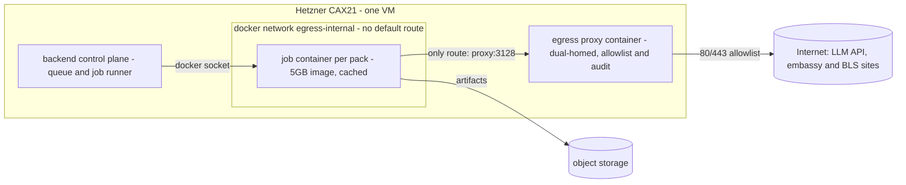
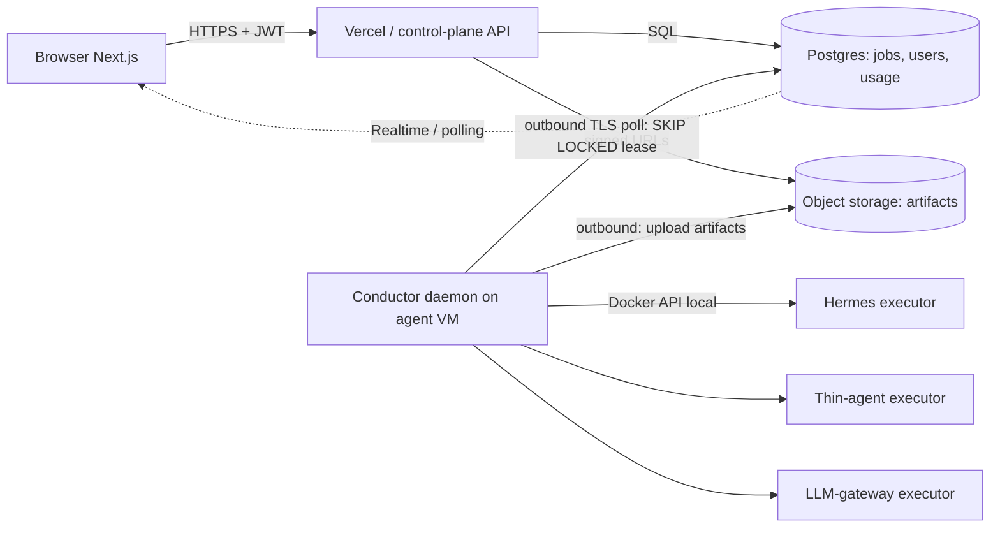
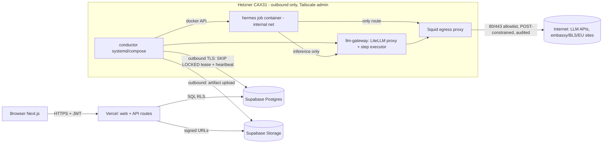

# Platform Selection & Development Plan (v0.4 companion)

**Status:** Superseded by [platform-and-dev-plan-v2-en.md](../platform-and-dev-plan-v2-en.md) (2026-08-12, [ADR-004](../../discussion/ADR-004-api-first-control-plane.md)); kept as the decision record it was
**Companion to:** [architecture-v0.4](../architecture-v0.4-en.md) — this document is the platform-specific half: where to run the architecture, and the concrete build plan.

> 中文版：[平台选型与开发计划（中文）](platform-and-dev-plan-zh.md)

## Executive summary

**Recommendation: a two-plane deployment.**

| Plane | Choice | Monthly cost |
|---|---|---|
| **Trusted control plane** — frontend, API, Postgres, auth, storage, realtime | **Vercel (Next.js) + Supabase** (Postgres + Auth + Storage + Realtime, one vendor replaces four) | ~$45 + ~$10 PITR |
| **Agent execution plane** — conductor (workflow engine), Hermes executor, LLM gateway, egress proxy | **One Hetzner CAX31 arm64 VM** (8 vCPU / 16 GB, docker compose — the ~5 GB arm64 image runs unmodified, cached on disk, zero per-job pull) | ~$19 |

Joined by the **"DB as the interface, outbound-only VM"** pattern: the conductor on the VM polls the `jobs` table over TLS (`FOR UPDATE SKIP LOCKED`) and uploads artifacts to storage — the VM exposes **no inbound port at all** (admin via Tailscale). Fixed infra lands at **~$75/mo**; LLM usage is the entire variable cost line (~$0.60–4.00 per pack depending on model class).

Why not the obvious alternatives, in one line each:

- **Vercel alone** — serverless functions cap far below the ~10-min agent jobs and have no Docker; the split is architectural, not a workaround.
- **AWS / GCP / Azure all-in** — 1–2 weeks of VPC/IAM/Cognito plumbing and a NAT-gateway bill before the first pack; the right answer at 50× scale, deferred (portable Postgres schema + S3-compatible storage keep the exit clean).
- **Fly.io Machines** — the best per-job primitive (stopped-machine pool, microVM isolation) and the designated **scale-up target**, but its egress enforcement is in-guest (no platform firewall), so it inherits rather than solves the hardest v0.3 requirement.
- **Railway / Render** — no egress-network control at all: fails v0.3 outright for the agent plane.
- **Self-hosted everything** — passport-and-bank-statement PII on DIY backups is the wrong risk for a solo founder, and colocating the trusted DB with untrusted agent containers violates the v0.3 trust split.

The document has three parts: **Part I** compares container/agent-plane platforms, **Part II** compares trusted-zone stacks, **Part III** is the reconciled stack and the 8-week development plan. Pricing claims are tagged **[V]** (web-verified Aug 2026) or **[T]** (training knowledge — re-verify before committing).


## Part I — Container platforms for the agent plane

### A.1 Workload profile (what the platform must fit)

| Constraint | Value |
|---|---|
| Image | `visa-master-hermes:latest`, ~5 GB, currently **arm64-tested** (built on Apple Silicon); amd64 needs a `buildx` multi-arch rebuild |
| Job shape | Spawn-and-destroy per pack; ~10 min typical, 60 min hard cap; heavy sequential LLM round-trips + live web browsing + LibreOffice/Python renders |
| Image economics | A 5 GB registry pull **per job** is disqualifying; image must be cached at the execution host (or platform must make size irrelevant) |
| Egress | Job container must have **no default route**; only path out is the egress proxy (RFC1918 + 169.254.0.0/16 blocked, 80/443 only, per v0.3) |
| Completion | Detected **by artifact** (`qa-report.json` + delivery folder), never by process exit — the final "workspace open" step starts a foreground server. On any per-job platform the entrypoint wrapper MUST watch-for-artifact → upload to object storage → `exit 0`, or the job burns budget until its timeout. This wrapper is a prerequisite for options 2–6, not just a nicety. |
| Scale | MVP = 1 concurrent job, ~5–30 packs/day; solo founder; cost-sensitive |

Cost figures below are normalized to a **4 vCPU / 8 GB, 10-min job**; multiply by 6 for the 60-min worst case. Confidence tags: **[V]** = verified against 2026 sources this session; **[T]** = training knowledge, re-verify before committing.

### A.2 Option-by-option assessment

#### 1. Plain VM + docker compose (Hetzner; EC2/Lightsail for comparison)

- **Per-job spawn fit: excellent.** "Per-job container" = `docker run --rm --network egress-internal ...` (or `docker compose run`) driven by the backend's job runner over the local Docker socket. The compose file already exists and this is exactly the topology validated locally. Fresh writable layer per job, `docker rm` on completion — the v0.3 ephemeral-scratch model, minus microVM hardening.
- **5 GB image: solved by construction.** Pulled once per *release* (from GHCR/registry), cached on VM disk forever. Per-job container start < 5 s. Only option with literally zero per-job image cost.
- **Egress control: strongest of all options, already proven.** Docker `internal: true` network gives the job container **no default route at all**; the proxy container is dual-homed (internal + external). Hetzner's metadata service (169.254.169.254) is unreachable from an internal network. This is the v0.3 egress design implemented in ~15 lines of compose.



- **Pricing [V]:** Hetzner **CAX21 (4 vCPU Ampere arm64, 8 GB, 80 GB, 20 TB traffic) = €7.99/mo + €0.50 IPv4 ≈ €8.50 (~$10)**. The arm64-tested image runs **unmodified** — no amd64 rebuild, and it matches the founder's Apple Silicon dev loop. amd64 alternative: CX33 (4 vCPU/8 GB) €6.49+€0.50. Next size up CAX31 (8 vCPU/16 GB) €15.99. (Post-April-2026 prices; cost-optimized plans are EU + Singapore regions.) AWS comparison [T, high]: t4g.large (2 vCPU/8 GB) ≈ $49/mo on-demand, Lightsail 8 GB ≈ $44/mo, plus $0.09/GB egress — **4–6× Hetzner for less machine**; only choose EC2 if the rest of the stack must be AWS on day one.
- **Ops burden: low and familiar.** One box, compose, a systemd unit, unattended-upgrades. Honest weaknesses: (a) isolation is a shared Docker daemon — a container escape owns the VM incl. the control plane if co-hosted (cheap hardening: `runsc`/gVisor runtime for the job container, works on arm64 [T, med-high]; no-new-privileges, non-root, seccomp); (b) capacity is fixed — at worst-case 60-min jobs, 30 packs/day exceeds one VM's day at concurrency 1, so the runner needs concurrency 2 or a second VM; (c) you own kernel/docker patching.

#### 2. Fly.io Machines

- **Per-job spawn fit: excellent — this is the product's design center.** Machines REST API creates/starts/stops/destroys Firecracker microVMs; **apps created via the Machines API get no public IP by default** [V]. The Hermes image entrypoint already supports Fly's non-PID-1 mode (FACTS), so it runs unmodified. Per-VM (not shared-kernel) isolation is a strict upgrade over option 1.
- **5 GB image: solved by the stopped-machine pool pattern.** Fly's own guidance: pre-create Machines, keep them **stopped** ($0.15/GB-mo rootfs → **$0.75/mo per pooled 5 GB machine** [V]), then `start` on job arrival (seconds, no pull) and `stop` after artifact upload; re-image the pool on release via `machine update`. Cold `create` from the registry can take minutes for 5 GB and varies by host cache — so treat pool-of-stopped as mandatory, not optional.
- **Egress control: the weak point.** Fly has **no platform egress firewall / no way to delete the default route**; every machine has outbound NAT [V-supported]. Available mitigations: 6PN private networking to a proxy machine + **in-guest nftables** installed by the (trusted, founder-built) entrypoint before dropping to the non-root agent user, HTTP(S)_PROXY env, static egress IP $3.60/mo if embassy/BLS sites need IP stability [V]. This is enforcement *inside* the untrusted guest — materially weaker than a no-route network. Acceptable interim posture; not defensible to a strict security review.
- **Pricing [V]:** per-second, only while running. performance-2x/4GB = $0.00002484/s → **$0.015 per 10-min job**; shared-cpu-4x/8GB ≈ $0.007 [T, med]. 30 packs/day ≈ **$5–15/mo compute + ~$1.50 for a 2-machine stopped pool** + egress $0.02/GB (NA/EU). Near-zero idle cost.
- **Ops burden: low.** No VPC/IAM plumbing; one small pool-manager loop in the backend (create/start/stop/reap + hard-deadline destroy). Known tail risks: occasional host capacity/placement flakiness [T, med] — the hard wall-clock deadline + retry-on-fresh-machine policy covers it.

#### 3. Railway / Render — **ruled out**

No egress-network primitive at all (cannot remove the default route, no VPC/firewall control) — fails the v0.3 hard requirement on its own. Neither offers a first-class "spawn ephemeral container per job with locally cached image" API; their model is long-running workers + cron (Render's one-off jobs reuse a service's image but still give no network control) [V]. Nothing here beats option 1 on price or option 2 on primitive fit. No further analysis warranted.

#### 4. GCP Cloud Run Jobs

- **Per-job spawn fit: good.** `jobs.run` per pack; task timeout up to **168 h** (default 10 min — raise it); 4-min container startup deadline (fine) [V].
- **5 GB image: non-issue by design.** **"No direct limit"** on image size and cold start is **independent of image size** (Cloud Run streams from its own copy made at deploy) [V]. Best large-image story of the hyperscalers. **Blocker to clear:** manifest **must include linux/amd64** [V] — the arm64-only image needs a multi-arch rebuild, and `nousresearch/hermes-agent` base must exist for amd64 (verify). Writable FS is **in-memory** (counts against the 32 GiB max) — workspace writes of a few hundred MB are fine at 8–16 GiB memory [V].
- **Egress control: genuinely strong.** Direct VPC egress with `all-traffic` + **no Cloud NAT** = no internet route; VPC firewall allows only proxy-VM:3128. Platform-level enforcement equivalent to the v0.3 design [T, high].
- **Pricing [T, high]:** Tier-1 region: 4 vCPU × $0.000024/vCPU-s + 8 GiB × $0.0000025/GiB-s → **~$0.07 per 10-min job**; 30/day ≈ $63/mo, plus proxy e2-micro ~$7 and Artifact Registry ~$0.50. Note Cloud Run vCPU ($0.0864/vCPU-h) is ~2× Fargate's.
- **Ops burden: moderate.** VPC + firewall + AR + IAM + the amd64 rebuild/CI. Less plumbing than AWS, more than Fly/Hetzner.

#### 5. AWS ECS Fargate

- **Per-job spawn fit: good.** `RunTask` per pack; runs arm64 natively (Graviton, 20% cheaper) [V] — no rebuild.
- **5 GB image: the sore spot.** **No image cache across tasks — every task pulls the full image from ECR** [V]; expect 3–7 min pull for 5 GB, and **billing starts at pull start** [T, high]. SOCI lazy-loading indexes (built in CI) cut pull-to-start substantially (50–60% reported on large images) [V]. Tolerable inside the 60-min budget; permanently worse than options 1/2/4 on job latency.
- **Egress control: excellent and canonical.** Task ENI in a private subnet with **no NAT GW / no IGW route** → no default route by construction; SG permits only proxy:3128. Metadata reachable only as the task-scoped ECS endpoint (harmless relative to EC2 creds) [T, high]. Hidden cost of NAT-less designs: image pulls need VPC endpoints (ecr.api, ecr.dkr ≈ $7.3/mo each + free S3 gateway) or a pull-time route via the proxy — budget **~$15–25/mo fixed** [T, med-high].
- **Pricing [V]:** arm64 $0.032384/vCPU-h + $0.003556/GB-h → 4 vCPU/8 GB ≈ $0.158/h → **~$0.026 per 10-min job** (+ pull minutes); 30/day ≈ $24/mo + fixed endpoint/proxy costs. 20 GB ephemeral storage free [V].
- **Ops burden: highest of the serious options for one person** — VPC/subnets/SGs/IAM/ECR/SOCI-CI/task-defs. Worth it when a security review demands AWS-native, auditable isolation.

#### 6. Azure Container Apps Jobs — **ruled out for this team**

Manual-trigger jobs exist and bill only while running (~$0.072 per 10-min 4 vCPU/8 GiB job [T, med]). But: image is pulled per execution with only best-effort node caching [V]; hard egress control (UDR) requires a workload-profiles environment and realistically Azure Firewall (~$290/mo) or a self-managed NVA [T, med]; and it brings a third cloud's learning curve with zero unique advantage over options 4/5. Skip.

#### 7. Kubernetes — **ruled out for MVP; noted as the eventual scale shape**

K8s Jobs + NetworkPolicy(default-deny) + node-cached images + gVisor/Kata is architecturally the *right* long-term primitive — but EKS/GKE ≈ $73–75/mo control plane before any node, plus by far the largest ops surface for a solo founder. Not before ~50–100 jobs/day or a second engineer. A k3s cluster on 2–3 Hetzner nodes (~€25–35/mo) is the cheap middle step if/when the single-VM runner outgrows itself.

### A.3 Comparison matrix

| | Per-job spawn | 5 GB image | Egress "no default route" | ~$/10-min job (4c/8GB) | Fixed $/mo (MVP) | Ops (solo) |
|---|---|---|---|---|---|---|
| **Hetzner VM + compose** | docker run per job | cached on disk, 0/job | **native (internal net)** | ~$0 (flat) | **~$10** | **lowest** |
| **Fly Machines** | native API, microVM | stopped-pool, $0.75/mo/machine | **no platform firewall** — guest nftables only | $0.007–0.03 | ~$2–5 | low |
| Railway/Render | weak | ok-ish | **none — disqualified** | — | — | low |
| **Cloud Run Jobs** | jobs.run | streamed, size-independent; **amd64 rebuild req'd** | VPC egress + no NAT (strong) | ~$0.07 | ~$8 | moderate |
| **ECS Fargate (arm64)** | RunTask | **full pull/job**; SOCI mitigates | private subnet, no NAT (strong) | ~$0.03 + pull | ~$15–25 | high |
| ACA Jobs | manual jobs | pull/job | needs WP env + firewall ($$$) | ~$0.07 | high | high |
| K8s | Jobs (ideal) | node cache (ideal) | NetworkPolicy (ideal) | n/a | $75+ nodes | highest |

### A.4 Recommendation (ranked)

**MVP (now): Hetzner CAX21 + docker compose — ~€8.50/mo.** It is the only option that simultaneously: runs the arm64 image unmodified, eliminates per-job image cost entirely, implements the v0.3 egress boundary *exactly* (internal network + dual-homed proxy) with the compose file that already exists, and costs a flat ~$10/mo at any volume up to ~15–30 packs/day. Harden cheaply: gVisor runtime for the job container, non-root agent user, per-job scratch dir wiped on reap, backend enforces the wall-clock deadline and artifact-watch completion. Accept the documented isolation caveat (shared daemon) as an MVP trade recorded in the ADR. **Sizing note:** Part III revises this to CAX31 (8 vCPU / 16 GB) so the conductor, egress proxy, and Docker daemon can share the box with a full-size job container — CAX21 prices the job container alone.

**Scale-up (next): Fly.io Machines** — pool of pre-created stopped machines (rootfs $0.15/GB-mo), `start`→run→artifact-upload→`stop`, destroy/recreate on release. Best per-job primitive fit, per-VM isolation upgrade, near-zero idle cost, image runs unmodified (non-PID-1 mode already supported). **Carry the caveat forward explicitly:** egress enforcement is in-guest, not platform-level.

**Strict-boundary alternative at scale: ECS Fargate on Graviton (with SOCI)** — choose over Fly when a customer/security review requires platform-enforced no-route networking and AWS-native audit, and accept the pull latency + AWS plumbing tax. (Cloud Run Jobs is the equivalent GCP answer and beats Fargate on image handling, but requires the amd64 rebuild — verify the Hermes base image exists for amd64 before shortlisting it.)

**Migration triggers (VM → Fly/Fargate):**
1. Queue p95 wait > 30 min at peak, or >2 concurrent jobs needed sustained (first response: one size up / second VM; migrate when VM-pool management becomes its own job).
2. First B2B/paying customer whose review requires stronger-than-shared-daemon isolation → Fly (microVM) or Fargate (microVM + network boundary), depending on how hard the egress requirement is pressed.
3. \>50 packs/day or worst-case-duration utilization >60% on one VM.
4. Multi-region execution requirement (latency for China-adjacent users) — per-job platforms give regions for free.
5. Second engineer joins → the AWS ops tax becomes payable; Fargate/K8s enter the frame.

**Sources:** [Fly.io resource pricing](https://fly.io/docs/about/pricing/) · [Fly Machines API](https://fly.io/docs/machines/api/working-with-machines-api/) · [Fly private networking](https://fly.io/docs/networking/private-networking/) · [Cloud Run quotas](https://docs.cloud.google.com/run/quotas) · [Cloud Run container contract](https://docs.cloud.google.com/run/docs/container-contract) · [Cloud Run task timeout](https://docs.cloud.google.com/run/docs/configuring/task-timeout) · [ahmetb Cloud Run FAQ (image size vs cold start)](https://github.com/ahmetb/cloud-run-faq) · [Hetzner 2026 pricing breakdown](https://www.bitdoze.com/hetzner-cloud-cost-optimized-plans/) · [Hetzner price-increase analysis](https://northflank.com/blog/hetzner-cloud-server-price-increases) · [AWS Fargate pricing](https://aws.amazon.com/fargate/pricing/) · [AWS SOCI lazy loading](https://aws.amazon.com/blogs/containers/under-the-hood-lazy-loading-container-images-with-seekable-oci-and-aws-fargate) · [Azure Container Apps Jobs](https://learn.microsoft.com/en-us/azure/container-apps/jobs) · [ACA pricing](https://azure.microsoft.com/en-us/pricing/details/container-apps/)

## Part II — Trusted-zone stack (frontend · API · Postgres · auth · storage · realtime)

### B.0 Framing: the split is architectural, not incidental

A pack job runs ~10 minutes of wall-clock with dozens of sequential LLM calls, Docker, LibreOffice, and live web egress. No serverless platform in this comparison can host that: Vercel functions cap at ~10–60 s (Hobby) / ~300 s, up to ~800 s with Fluid compute (Pro) — barely one typical run and far short of the 60-min worst-case budget — and serverless has no Docker socket, no daemon timers, no filesystem watch for the artifact-based completion detection the agent plane requires. Therefore every candidate is evaluated as **trusted control plane (this research) + separate Docker VM agent plane (fixed, ~$25–40/mo Hetzner/OVH-class, common cost to options 1–5)**.

The cleanest integration pattern — and the one that should be a selection criterion — is **"DB as the interface, outbound-only VM"**:



The agent VM makes **only outbound connections** (Postgres over TLS via pooler, storage uploads, LLM APIs through the egress proxy). No inbound port, no mTLS, no VPN required for v1; add Tailscale for SSH/admin only. This pattern works identically on Supabase, Neon, Railway-Postgres, or self-hosted — it fails only where Postgres has no sane public TLS endpoint (RDS-in-VPC wants the VM inside the VPC).

### B.1 Job contract (the table both planes agree on)

> *Illustrative minimal sketch.* The canonical physical DDL is [architecture v0.4](../architecture-v0.4-en.md) Chapter B §2 — the same contract with Chapter A's state vocabulary and the full column set (`attempt`/`max_attempts`, `idempotency_key`, budget columns). Part III week 2 builds the Chapter B form.

```sql
create table jobs (
  id               uuid primary key default gen_random_uuid(),
  user_id          uuid not null,
  kind             text not null,                  -- 'pack.schengen.v1'
  executor         text,                           -- 'hermes' | 'thin-agent' | 'llm-gateway' (router decision)
  status           text not null default 'queued', -- queued|leased|running|awaiting_review|delivered|failed|expired
  input            jsonb not null,
  progress         jsonb,                          -- {stage, pct, note, updated_at} written by conductor
  lease_owner      text,
  lease_expires_at timestamptz,                    -- conductor heartbeats; expired lease => requeue or fail
  deadline_at      timestamptz not null,           -- hard wall-clock backstop (v0.3)
  artifact_prefix  text,                           -- storage path of delivery folder incl. qa-report.json
  qa_report        jsonb,
  created_at       timestamptz not null default now(),
  updated_at       timestamptz not null default now()
);
-- claim: UPDATE jobs SET status='leased', lease_owner=$1, lease_expires_at=now()+'2 min'
--   WHERE id = (SELECT id FROM jobs WHERE status='queued'
--               ORDER BY created_at FOR UPDATE SKIP LOCKED LIMIT 1) RETURNING *;
```

MVP is single-concurrency (v0.3), so this Postgres queue is more than sufficient; no Redis/SQS needed.

### B.2 Stack comparison

Pricing verified via web search Aug 2026 unless marked *(training knowledge)*. MVP load: ~100 users, 5–30 packs/day, packs ~20–50 MB → ~45 GB/mo new artifacts, ~45 GB/mo download egress.

| Criterion | 1. Vercel + Supabase | 2. Vercel + Neon + Clerk + R2 | 3. All-on-Railway | 4. AWS (Amplify/ECS + RDS + Cognito + S3) | 5. GCP (Cloud Run + Cloud SQL + Firebase Auth + GCS) | 6. Self-hosted Coolify (Next.js + Postgres + MinIO + Better-Auth) |
|---|---|---|---|---|---|---|
| Time to first deploy (solo) | ~0.5 day | ~1 day (3 dashboards to wire) | ~0.5 day (control plane only) | 1–2 weeks done right (VPC, IAM, Cognito) | 2–4 days | 1–2 days incl. TLS, backups, SMTP |
| MVP cost/mo (excl. agent VM) | ~$45 (Vercel Pro $20 + Supabase Pro $25) | ~$25–40 (Vercel $20 + Neon usage ~$5–15 + Clerk $0 + R2 ~$2) | ~$25–45 usage-based; **VM still needed elsewhere** | ~$60–120 (RDS ~$15+, NAT gateway ~$32 trap, Amplify) | ~$15–40 (Cloud SQL micro $7–10 no-SLA, Cloud Run ≈$0 in free tier) | ~$0 extra if colocated; ~$25 if separate VM (recommended) |
| Postgres quality | Pro: daily backups (7-day), PITR paid add-on; branching per-branch metered *(add-on details: training)* | Best-in-class: instant copy-on-write branches, scale-to-zero, PITR (6 h free, longer paid), storage $0.35/GB | Container+volume Postgres; daily volume backups, no PITR *(training)* — weakest managed option | RDS = gold standard: 35-day PITR, Multi-AZ; no branching | Cloud SQL solid backups/PITR; cheapest tier excluded from SLA | Whatever you build: pgBackRest→R2 + tested restores, or it doesn't exist |
| Auth (email OTP + OAuth, RBAC) | Built-in: email OTP/magic link, OAuth providers, RBAC via JWT claims + RLS; 50K MAU free tier | Clerk: best DX, prebuilt Next.js components, orgs/RBAC built-in; free to 50K monthly retained users (Feb 2026 change), Pro $25/mo | BYO (run Better-Auth or pay Clerk) | Cognito: complete but hostile DX; new 2025 tiers — Lite $0.0055/MAU, Essentials $0.015/MAU, 10K MAU free | Firebase Auth: solid, ~50K MAU free *(training)*; JWKS verification from non-Google backend is fine | Better-Auth 1.5: email-OTP + organization plugins production-ready; you own upgrades/security |
| Storage + signed URLs | Supabase Storage, signed URLs, S3-compatible API; Pro incl. 100 GB + 250 GB egress | R2: $0.015/GB-mo, **$0 egress**, S3 API, signed URLs; ~$2/mo at MVP | Railway volumes are not object storage → add R2 anyway | S3: canonical, egress ~$0.09/GB | GCS: fine, egress ~$0.12/GB | MinIO: S3 API, but you patch/monitor it and it holds passport scans |
| Realtime job progress | **Best**: subscribe to `jobs` row via Supabase Realtime (Pro: 500 concurrent conns); falls back to polling | No native realtime: poll `GET /jobs/:id` or SSE from conductor | Polling or SSE from a Railway service | API GW WebSockets/AppSync — heavy | Firestore listener (second DB) or polling | SSE from conductor (needs an inbound port + auth on VM) |
| Vendor risk / egress | Plain Postgres + S3-compatible storage → clean exit; egress beyond quota $0.09/GB *(training)* | Lowest lock-in of managed options: Neon=pure PG, R2=S3 API + zero egress; Clerk user-store migration is the one sticky point | Medium; egress metered *(training)* | Highest complexity-lock-in; egress + NAT costs | Medium; egress fees | Zero vendor risk, maximum founder-time risk |
| Fit with agent VM | Outbound-only conductor vs pooled PG + Storage: ideal | Identical pattern, equally clean | Railway **cannot host the agent plane** (no privileged/DinD containers) → split across 3 parties | Cleanest network *if* agent VM = EC2 in same VPC (private subnets, SGs); overkill now | VM = GCE + Cloud SQL connector/public-IP allowlist: fine | Colocating trusted DB with UNTRUSTED agent containers on one kernel contradicts v0.3 trust separation — use a separate VM, which erodes the cost win |

Notes on load-bearing facts: Vercel **Hobby is non-commercial** — budget Pro ($20/seat) from day one. Supabase Free pauses projects after 7 days idle and has no backups — Pro from day one. Cognito repriced 2025 into Lite/Essentials/Plus with meaningful cost above 10K MAU. Clerk moved to 50K monthly-retained-users free in Feb 2026.

### B.3 Realtime progress: pick boring first

For a 10-minute job at 5–30 packs/day, **polling is a legitimate v1**: `GET /api/jobs/:id` every 3 s is ~200 requests per pack — negligible. It also degrades gracefully for users in China, where long-lived WebSocket connections to foreign endpoints are less reliable than plain HTTPS polling. Recommended ladder:

1. **v1**: conductor writes `progress` JSONB (stage machine: `intake → research → documents → qa → awaiting_review`); frontend polls every 3 s.
2. **v1.1 (stack 1 only)**: Supabase Realtime subscription on the job row as progressive enhancement, polling as fallback. Zero backend work — the conductor's UPDATE is the event.
3. SSE from the VM: only if you leave Supabase; it forces an inbound authenticated endpoint on the agent VM, which the outbound-only model deliberately avoids.

### B.4 Where does the workflow engine live?

Split it along the request/response vs. long-running boundary:

| Component | Placement | Why |
|---|---|---|
| Auth, user CRUD, pack submission (insert `jobs` row), signed download URLs, review-gate UI actions | **Next.js API routes / server actions on Vercel** | Pure request/response, fits serverless, zero extra infra |
| Orchestrator ("conductor"): queue lease, executor routing (hermes / thin-agent / llm-gateway per the adapter contract), container lifecycle via Docker API, artifact-based completion detection (`qa-report.json` + delivery folder), wall-clock watchdog, retries, token-budget accounting | **Always-on Node service colocated on the agent VM** (systemd or compose service) | Needs the Docker socket, filesystem watch, and timers that outlive any serverless invocation; ADR-002's deterministic workflow engine is exactly this process |
| Deterministic business rules ("Spain tourism requires passport + bank statement + employment letter") | **Shared TypeScript package** imported by both | Instant form validation in the UI, authoritative enforcement in the conductor — one source of truth, per ADR-002 |

Do **not** put the engine in Next.js routes alone (no daemons, duration caps, Vercel cron/queues still bounded by function limits), and do not make it a third hosting location — colocating with the agent VM keeps Docker control local and adds no new network surface.

### B.5 Ranked recommendation

1. **Vercel + Supabase** — one vendor replaces four (Postgres + Auth + Storage + Realtime), the jobs-table pattern makes the agent VM outbound-only, and ~$45/mo + VM is the fastest credible path for one person.
2. **Vercel + Neon + Clerk + R2** — slightly cheaper, best Postgres branching and zero-egress storage, best auth DX; costs you a third and fourth dashboard and native realtime. The designated escape hatch if Supabase disappoints.
3. **All-on-Railway** — pleasant DX for the control plane, but it cannot host the agent plane, so you run three platforms instead of two, on the weakest managed Postgres here.
4. **Self-hosted Coolify** — cheapest and zero lock-in, but visa packs are passport-and-bank-statement PII: DIY backups/MinIO on a solo founder's attention budget is the wrong risk, and colocating with untrusted agents breaks v0.3 isolation.
5. **GCP** — a fine platform whose cheapest credible Cloud SQL sits outside the SLA; more IAM plumbing than the MVP payoff justifies.
6. **AWS** — the right answer at 50× the scale; at MVP it is a NAT-gateway bill and two weeks of VPC/Cognito work you don't have.

*(Azure is deliberately absent from this control-plane shortlist: no Vercel-class Next.js hosting DX, Entra External ID is Cognito-grade auth overhead, and it would add a third cloud with no unique control-plane advantage — its agent-plane variant was already ruled out in Part I §6.)*

**Migration comfort**: everything above the line is portable — plain Postgres schema, S3-compatible storage, JWT auth. Moving 1 → 2 (or → 4/AWS at scale) is a data migration, not a rewrite.

Sources: [Supabase pricing breakdown](https://uibakery.io/blog/supabase-pricing), [Supabase real-world costs](https://makerkit.dev/blog/saas/supabase-pricing), [Vercel free-tier limits](https://www.promptstoproduct.com/vercel-free-tier-limits), [Vercel function limits](https://vercel.com/docs/functions/limitations), [Neon plans](https://neon.com/docs/introduction/plans), [Neon 2026 pricing changes](https://vela.simplyblock.io/articles/neon-serverless-postgres-pricing-2026/), [Clerk pricing / 50K free change](https://clerk.com/pricing), [Clerk free-plan change note](https://saasprices.net/blog/clerk-free-plan-changes), [Railway pricing](https://www.srvrlss.io/provider/railway/), [Cloudflare R2 pricing](https://www.budgetforge.dev/tools/cloudflare-r2-pricing-2026), [Cognito pricing](https://aws.amazon.com/cognito/pricing/), [Cognito repricing analysis](https://www.thestack.technology/awss-new-cognito-pricing-complicated-potentially-costly/), [Cloud SQL pricing](https://www.usage.ai/blogs/gcp/cloud-sql/pricing/), [Cloud Run pricing](https://cloud.google.com/run/pricing), [Better Auth 1.5](https://better-auth.com/blog/1-5), [Better Auth email OTP plugin](https://better-auth.com/docs/plugins/email-otp).

## Part III — Chosen stack and 8-week development plan

### 1. Final chosen stack

Both researchers' top picks compose cleanly and are adopted as ranked: **Vercel + Supabase** for the trusted control plane, **one Hetzner arm64 VM running docker compose** for the agent plane, joined by the **"DB as the interface, outbound-only VM"** pattern — the conductor on the VM polls the `jobs` table over TLS and uploads artifacts to Supabase Storage; the VM exposes **no inbound port**. One reconciliation is required: Research A priced the VM as **CAX21 (4 vCPU / 8 GB, ~€8.50/mo)**, sized for the job container alone, while Research B budgeted "$25–40/mo" for a VM that also hosts the conductor and egress proxy. We resolve in B's direction on sizing and A's direction on vendor: **Hetzner CAX31 (8 vCPU / 16 GB arm64, €15.99 + €0.50 IPv4 ≈ $19/mo)**, so the Hermes job container keeps its full 4 vCPU / 8 GB (`--cpus 4 --memory 8g`) with real headroom for the Docker daemon, Squid proxy, conductor, and LibreOffice render spikes. The arm64-tested `visa-master-hermes:latest` image runs unmodified and matches the Apple-Silicon dev loop. Per ADR-002, the **conductor is the deterministic workflow engine** — the control plane's long-running half — and the three server kinds from the founder requirement (Hermes, thin agent, LLM gateway) are **pluggable executors behind one adapter contract** inside it; in V1 the "servers" are processes/containers on this one VM, and the contract is what lets them become separate servers later without schema or frontend changes.

| Component | Runs where | Provided by | Notes |
|---|---|---|---|
| Frontend (Next.js App Router, zh-CN primary) | Vercel Pro | `apps/web` | Previews per PR; prod on `main` |
| Request/response API (auth-gated CRUD, job submission, signed URLs, review actions) | Vercel serverless (route handlers / server actions) | `apps/web` | Never touches Docker or LLM keys |
| Workflow engine / orchestrator ("conductor") | Hetzner CAX31, systemd-managed compose service | `apps/conductor` (Node 22, TS) | Queue lease, executor routing, container lifecycle, artifact watch, watchdog, token accounting |
| Executor: **hermes** (full pack producer, works today) | Ephemeral container per job on the VM, `internal: true` network | `packages/executors/hermes` + `visa-master-hermes:latest` | Online week 3 |
| Executor: **llm-gateway** (stateless steps: cover letter, checklist, translation) | Adapter in conductor + **version-pinned LiteLLM proxy container** (compose service `gateway`, online week 3) | `packages/executors/llm-gateway` | Step library online week 5; the gateway container is the single inference chokepoint from week 3 — Hermes's provider config points at it, so **provider keys never enter the job container** (architecture C §3.2) |
| Executor: **thin-agent** (Discussion-01 migration target) | Future container on same contract | `packages/executors/thin-agent` | **Deferred — see §6** |
| Egress proxy | Squid container, dual-homed (internal + external nets) | `infra/compose.vm.yml` | v0.3 §5.2 rules 1–3 + audit log; only route out of job containers |
| Postgres (jobs, users, usage, cases) | Supabase Pro | `packages/db` migrations | Conductor connects via Supavisor pooler over TLS, outbound only |
| Auth (email OTP + optional OAuth, RLS) | Supabase Auth | — | JWT verified in Next.js; RLS on all user-facing tables |
| Object storage (uploads + artifact packs) | Supabase Storage, private buckets `uploads`, `artifacts` | — | Signed upload/download URLs from the API; conductor uses service-role key |
| Realtime progress | Polling `GET /api/jobs/:id` every 3 s (v1); Supabase Realtime on the job row as later enhancement | — | Polling degrades gracefully for China users (B.3) |
| Business rules (e.g. Spain tourism doc requirements) | Shared package imported by web **and** conductor | `packages/core` (zod schemas + `rules/`) | ADR-002: rules are code, not LLM decisions |
| Admin/SSH access to VM | Tailscale (SSH over tailnet only; public inbound = deny all) | — | No VPN needed for data path — it's outbound-only |
| Secrets | Vercel env vars (web: anon key, Sentry DSN); VM: root-owned `/etc/visa-master/{conductor,gateway,proxy}.env` mode 0600 | 1Password as source of truth; provisioned by deploy script | **Provider LLM keys live only in the gateway container's env; the `service_role` key only in the conductor's.** Job containers hold no provider keys at all — their only inference path is the internal-network gateway endpoint (architecture C §3.2, superseding v0.3 §6's key-in-container posture) |



Monorepo (`pnpm` + Turborepo): `apps/web`, `apps/conductor`, `packages/core`, `packages/db`, `packages/executors`, `infra/` (compose files, Squid config, systemd units, deploy scripts).

#### Executor adapter contract (the load-bearing interface)

```ts
// packages/executors/contract.ts
export interface Executor {
  kind: 'hermes' | 'llm-gateway' | 'thin-agent';
  start(job: JobRow, ctx: RunContext): Promise<RunHandle>;      // spawn container / begin step
  poll(h: RunHandle): Promise<'running' | 'artifact_ready' | 'failed'>; // hermes: artifact watch, NEVER process exit
  collect(h: RunHandle): Promise<{ artifactPrefix: string; qaReport: unknown }>; // upload to Storage
  destroy(h: RunHandle): Promise<void>;                          // container + scratch volume, always runs
}
```

Routing is a pure function in the conductor: `pack.schengen.v1 → hermes`, `step.cover_letter.v1 | step.checklist.v1 | step.translate.v1 → llm-gateway`. The frontend and schema never learn which executor ran.

> This 4-method interface is the **V1 in-process realization** of the architecture's adapter contract (v0.4 Chapter C §1): `running`→`running`, `artifact_ready`→`completed` (+manifest), `failed`→`failed`. `awaiting_user`, `/answers`, `cancel` and the webhook event stream are deliberately unimplemented in V1 — the structured intake front-loads every question, so there is no mid-run interactivity to express. C §1's HTTP surface (and an `awaiting_input` poll state) is implemented at the moment the first executor moves off the VM — e.g. the Fly.io trigger in §6.

### 2. Week-by-week plan (8 weeks, solo, to paying-ready beta)

Sequencing principle: structured intake first (no mid-run interactivity in v1 — the form captures everything the agent needs up front), Hermes executor early because it is the only thing that produces a sellable pack today, LLM-gateway next as the cheap-step workhorse, thin agent deferred.

#### Week 1 — Foundations: repo, auth, VM
- **Goals:** all accounts and skeletons exist; a user can sign up.
- **Tasks:** scaffold monorepo; create Supabase projects `visa-master-staging` and `visa-master-prod`; Vercel project linked to GitHub; migrations `0001_profiles.sql` (mirror of `auth.users` + role enum `user|operator|admin`), `0002_jobs.sql` (the architecture Chapter B `jobs` table — B.1 above is its minimal sketch; keep Chapter B's state names plus `attempt`/`max_attempts`, `idempotency_key`, budget columns, and add `failure_reason text`, `tokens_in bigint`, `tokens_out bigint`), `0003_usage_events.sql`; Supabase Auth email OTP configured; `apps/web` login/logout + empty dashboard behind RLS. The `apps/web` scaffold ships the **i18n skeleton with its first screen** (amendment 2026-08-10, from the design-phase audit — [design/product/04](../../design/product/04_MVP_Scope_V1_V2.md)): locale-prefixed routes (`/zh/…`, `/en/…`) via `next-intl`, an ICU message catalogue carrying both locales, and a build check that fails on a hardcoded user-facing string or on a key missing from either locale — login and the dashboard already carry user-facing copy, so the catalogue must exist before any screen does; retrofitting it under a grown codebase is a rewrite ([internationalization](../../design/guidelines/internationalization-en.md) §3, §8). Provision CAX31: Ubuntu 24.04 LTS, `ufw` deny all inbound, Tailscale SSH, unattended-upgrades, Docker + compose plugin, 0600 env files.
- **DoD:** signup → OTP → dashboard works on the Vercel prod URL **at both `/zh` and `/en`, every string resolving from the catalogue**; the build fails if a key is missing from either locale; `psql` from the VM to the Supabase pooler succeeds; no public port open on the VM (`nmap` from outside shows nothing).
- **Demo:** sign up on a phone; show the empty dashboard and the closed VM.

#### Week 2 — Structured intake + uploads
- **Goals:** the full Schengen-tourism intake captured as validated, structured data before any agent exists.
- **Tasks:** `packages/core`: `IntakeSchengenTourismV1` zod schema (applicant, passport, employment, trip dates/route, finances, prior visas) + `rules/schengen-spain.ts` (deterministic required-document computation — the ADR-002 code check). **Validation issues carry message keys plus parameters** (e.g. `passport.expiry.tooSoon` + `{monthsRequired: 3}`), never sentences — the front end resolves them against the active locale ([internationalization](../../design/guidelines/internationalization-en.md) §3); this binds from the very first schema because it is the one i18n piece that cannot be retrofitted cheaply. Multi-step form in `apps/web` with client validation from the same schema, plus **draft persistence** (amendment 2026-08-10, from the design-phase audit — [design/product/04](../../design/product/04_MVP_Scope_V1_V2.md)): a draft row (`jobs.status='draft'` or a dedicated drafts table) with per-step autosave built from the shared schema's partials, and resume-on-login at the exact last incomplete step — inside the WeChat webview, interruption is the median session, so an intake without server-side drafts loses its user ([mobile-parity](../../design/guidelines/mobile-parity-en.md) §3.3). `POST /api/uploads/sign` → signed upload URLs into private `uploads/{user_id}/{upload_id}` (passport scan, bank statement, employment proof); `POST /api/jobs` validates server-side, snapshots sanitized `input` (no user_id/email inside the payload — v0.3 §11), inserts `status='queued'`, `kind='pack.schengen.v1'` (the wall-clock `deadline_at` is set at **lease time**, not enqueue — queue wait must never consume run budget); `GET /api/jobs/:id` (RLS-scoped) for polling.
- **DoD:** invalid intakes are rejected with field-level errors from the shared schema, **rendered from message keys in both locales**; an intake abandoned mid-step is resumable after logout/login at the same step with its data intact; a completed intake produces a `queued` job row and files in Storage; nothing yet consumes the queue.
- **Demo:** end-to-end intake on mobile — including killing the tab mid-intake and resuming after login; show the `jobs` row and uploaded objects.

#### Week 3 — Conductor + Hermes executor: first cloud-produced pack
This is the make-or-break week; everything here is already validated locally, it is being re-homed.
- **Goals:** a queued job becomes a delivered artifact folder in Storage with no human touching the VM.
- **Tasks:** `apps/conductor` modules: `lease.ts` (the B.1 `FOR UPDATE SKIP LOCKED` claim + 2-min heartbeat), `router.ts`, `executors/hermes.ts` (`docker run --rm --cpus 4 --memory 8g --pids-limit 512 --security-opt no-new-privileges --network egress-internal` with fresh per-job scratch volume, read-only profile/venv mounts per v0.3 §4a, model key injected read-only), `artifact-watch.ts` (poll scratch for `qa-report.json` + delivery folder — **never** wait on exit; the `workspace open` step hangs headless runs), `collect.ts` (upload to `artifacts/{job_id}/`, write `qa_report` + `artifact_prefix`, set `awaiting_review`), `lease.ts` sets `deadline_at = leased_at + 60 min` (beta cap; tighten toward the 20-min routing default as variance data accumulates) and `watchdog.ts` force-destroys past it (also expires dead leases). `infra/compose.vm.yml`: `egress-internal` (`internal: true`) + Squid dual-homed with v0.3 §5.2 rules 1–3 (RFC1918 + 169.254.0.0/16 + non-80/443 blocked; POST to non-allowlisted hosts denied; access log on) + a **version-pinned LiteLLM `gateway` container** (architecture C §2.1), dual-homed like Squid: job containers reach it over the internal network, provider keys live only in `/etc/visa-master/gateway.env`, and Squid's LLM-host allowlist reduces to the gateway itself. **Critical path: replace the Codex device-code OAuth with a real API key** (Anthropic or OpenAI first, in the gateway env) and point Hermes's provider config at the gateway's OpenAI-compatible endpoint; verify a full pack run. `tokens_in/out` and cost per job come from the gateway's per-job virtual-key spend logs — call-time budget enforcement per architecture A §2.2.
- **DoD:** submit intake in the browser → ~10 min later `status='awaiting_review'`, artifacts in Storage, container and scratch volume destroyed (`docker ps -a` clean); a job forced past deadline is killed and marked `expired`; a `curl http://169.254.169.254` from inside a job container fails; `env` inside the job container shows **no provider key** (inference only via the gateway).
- **Demo:** live browser submission through to `qa-report.json` in Storage; show the Squid audit log of the run.

#### Week 4 — Progress, review gate, delivery
- **Goals:** the human loop: user watches progress, operator approves, user downloads.
- **Tasks:** conductor writes `progress` JSONB stage machine (`intake → research → documents → qa → awaiting_review`) inferred from workbench filesystem markers; job page polls every 3 s and renders a stage timeline; operator surface `/admin/review` (role-gated): queue of `awaiting_review`, inline QA report, PDF previews via short-lived signed URLs, **Approve → `delivered`** (notifies user), **Reject → `failed` + `failure_reason`**; user delivery page with 7-day signed download links; `POST /api/admin/jobs/:id/approve|reject`; migration `0004_packs_reviews_audit.sql` (`packs`, `reviews`, `audit_log` per architecture Chapter B) — approve/reject writes a `reviews` row + `audit_log` entry, honoring the invariant that delivery requires an approved review. Before a job reaches `awaiting_review`, `collect.ts` runs the minimal validator — architecture A §3.3 steps 1–4 (manifest role-completeness vs `packages/core` rules, existence + sha256 recompute, format sanity, qa-report parse); step 5 (budget/deadline reconciliation) uses week-3 gateway metering. Human gate is mandatory — nothing auto-delivers (v0.3 §8).
- **DoD:** full journey works with the founder as operator; rejected jobs surface the reason to the user; signed URLs expire.
- **Demo:** the complete user journey, two browser windows (user + operator).

#### Week 5 — LLM-gateway executor + budgets + caching
- **Goals:** second executor kind online; cheap steps stop needing a 10-minute container.
- **Tasks:** `packages/executors/llm-gateway`: the step library over the **week-3 LiteLLM gateway** — no hand-rolled provider layer; model routing, fallbacks and per-key budgets are LiteLLM config (frontier model for drafting, small model for translation/formatting), per the architecture's C §2.1 decision; step kinds `step.cover_letter.v1`, `step.checklist.v1`, `step.translate.v1` run in-process in the conductor (same jobs table, same lease loop — a 20–60 s job with 3 s poll latency is fine, and keeping every LLM call on the VM preserves the single egress/audit/metering point); per-user token budgets enforced pre-lease from `usage_events`; migration `0005_requirements_cache.sql` (embassy requirement snapshots + templates, keyed by route+visa-type, TTL 30 days — ADR-002's caching lever); "Regenerate cover letter" button on the delivery page as the first user-facing gateway feature; retry policy + error taxonomy (`retryable_provider`, `budget_exceeded`, `deadline`, `qa_failed`).
- **DoD:** a cover-letter regeneration completes in <60 s without any container; a user over budget gets a clean refusal; a second identical route hits the requirements cache.
- **Demo:** regenerate a cover letter live; show `usage_events` accruing and the routing table sending translation to the small model.

#### Week 6 — CI/CD, staging/prod, hardening, observability
- **Goals:** deploys are boring; failures page you.
- **Tasks:** everything in §3 below; container hardening pass (non-root agent user, read-only rootfs except scratch, dropped capabilities; evaluate gVisor `runsc` on arm64 and record the outcome in an ADR either way); Sentry in web + conductor (every event tagged `job_id`); Better Stack heartbeat (conductor pings every 60 s; missed = alert); watchdog alert rules (§5); nightly `pg_dump` belt-and-braces job.
- **DoD:** PR → preview → merge → both planes deploy with zero SSH by hand; killing the conductor process pages the founder within 3 min; a deliberately wedged job alerts within 5 min.
- **Demo:** ship a one-line change through the full pipeline; pull the network cable (stop conductor) and show the alert.

#### Week 7 — Beta polish: localization, notifications, PII lifecycle, restore drill
- **Goals:** presentable to strangers; data handling defensible.
- **Tasks:** zh-CN as primary locale (en secondary) via `next-intl`; transactional email ("pack ready", "pack rejected") via Resend; ToS/privacy pages stating retention; retention enforcement in conductor's daily sweep per architecture Chapter B §3 — uploads 90 days after case close, job intermediates 30 days, delivered packs 180 days; scratch volumes already destroyed per job; enable Supabase PITR add-on and run a **restore drill into staging** (document RTO); run 3 packs back-to-back to confirm serial queue behavior and measure real per-pack tokens against the §4 estimate; fix the top 5 UX papercuts from self-testing.
- **DoD:** a Chinese-language user can complete the journey without English; restore drill notes committed; measured cost-per-pack number replaces the estimate.
- **Demo:** full journey in Chinese incl. the "pack ready" email; show the restore-drill log.

#### Week 8 — Paying-ready beta launch
- **Goals:** money in, first outside users.
- **Tasks:** minimal payments — **Stripe Payment Link with Alipay + cards enabled**, one product ("Schengen pack review — ¥X"); a 20-line webhook route flips `pack_credits` on `profiles` (full self-serve billing is deferred, §6); pricing page; onboard 5–10 hand-picked beta users (Chengdu→Spain profile); founder runs operator review daily; runbook (§5) finalized in `doc/runbook.md`.
- **DoD:** a stranger can pay, submit, and receive an approved pack with zero founder involvement except the review gate; every §5 alert has a tested response.
- **Demo:** the first paid pack.

**Buffer note:** week 3 carries the schedule risk (API-key migration + proxy + first cloud run). If it slips, weeks 5 and 7 compress — the gateway executor and localization are the flex items; the review gate and hardening are not.

### 3. CI/CD + environments

**Environments.**

| | Web | DB/Auth/Storage | Conductor + agent plane |
|---|---|---|---|
| Preview | Vercel preview per PR | staging Supabase | not exercised (mock job states via seed data) |
| Staging | Vercel preview promoted / `staging` branch | `visa-master-staging` project | second conductor systemd unit on the same VM, own env file, pointed at staging DB, shares the Docker daemon and proxy (acceptable single-tenant-founder trade; noted for later) |
| Prod | `main` → Vercel prod | `visa-master-prod` | prod conductor unit |

**Pipelines (GitHub Actions).**
- `ci.yml` (every PR): `pnpm turbo lint typecheck test` + `supabase db diff` check that migrations are committed and linear.
- Web: Vercel Git integration handles preview + prod deploys; no custom action.
- `db.yml`: on merge to `main`, `supabase db push` to staging automatically; prod migration behind a manual environment-approval gate. **Expand–contract only** (add columns/tables, backfill, remove later) so web and conductor versions can skew during deploys.
- `conductor.yml`: `docker buildx build --platform linux/arm64` → push `ghcr.io/…/conductor:{gitsha}` → `appleboy/ssh-action` over Tailscale: `docker compose pull conductor && docker compose up -d conductor`. Compose file pins the sha tag; the previous 5 tags are retained.
- `agent-image.yml`: `visa-master-hermes` rebuilds only on release tags (it changes rarely); pushed to GHCR, pulled once per release on the VM — never per job.
- **Watchtower is explicitly rejected** for the agent plane: unattended auto-pull of a security-boundary image trades auditability for convenience. Deploys are explicit, logged Actions runs.

**Rollback.** Web: Vercel instant rollback (one click). Conductor: `compose up -d` with the previous sha tag (a `deploy.sh --rollback` wrapper on the VM). Agent image: repoint the compose tag. DB: never roll back migrations in place — roll forward; Supabase PITR is the disaster path only. Rollback drill is part of week 6 DoD.

### 4. MVP monthly cost

Fixed platform costs:

| Service | $/mo |
|---|---|
| Vercel Pro (1 seat) | 20 |
| Supabase Pro (incl. daily backups, 100 GB storage, 250 GB egress) | 25 |
| Supabase PITR add-on (from week 7) | ~10 |
| Hetzner CAX31 (8 vCPU / 16 GB arm64) + IPv4 | ~19 |
| Sentry (dev tier) / Better Stack / Tailscale / Resend / GHCR | 0 (free tiers) |
| Domain | ~1 |
| **Fixed total** | **~$75** |

**LLM cost per pack — arithmetic (verify against week-3 metering).** A pack run is ~10 min dominated by sequential round-trips: assume ~50 LLM calls, ~15k input tokens average context per call (skills + workbench summaries), ~1k output → **~750k input / ~50k output tokens per pack**.

| Model class | $/M in / out | Cost per pack |
|---|---|---|
| Frontier (Claude Sonnet-class) | ~3 / 15 | 750k×$3 + 50k×$15 ≈ **$3.00** |
| Frontier + prompt caching (repeated skill/system prefix) | — | ~**$1.80–2.20** |
| Kimi-class budget model | ~0.6 / 2.5 | ≈ **$0.60** |
| Worst case (60-min run, 6×) | — | ~**$18** cap → why the token budget exists |

Planning number: **$1–4 per pack, $3 conservative**. Gateway steps (cover letter regen etc.) are ~20k in / 2k out ≈ **$0.09** each — rounding error.

| Volume | Packs/mo | LLM $/mo ($0.6–4/pack) | All-in $/mo | All-in cost per pack |
|---|---|---|---|---|
| 5/day | 150 | 90–600 | **165–675** | $1.10–4.50 |
| 15/day | 450 | 270–1,800 | 345–1,875 | $0.77–4.17 |
| 30/day | 900 | 540–3,600 | 615–3,675 | $0.68–4.08 |

Read: infra is noise; **LLM spend is the entire variable cost line**, which is why token metering lands in week 3, model routing in week 5, and per-pack pricing must clear ~$5 with margin. At a plausible ¥199–399 (~$28–55) pack price, gross margin is >85% even at the conservative token estimate.

### 5. Ops / runbook basics

**Monitoring & alerting.**
- Sentry: `apps/web` (browser + server) and `apps/conductor`, every conductor event tagged `job_id` / `executor` / `stage`.
- Better Stack: HTTPS check on the web app + **heartbeat** from the conductor loop every 60 s (missed 3 → page). This is the "is the outbound-only VM alive" signal, since nothing can probe it inbound.
- Job-level watchdog (in-conductor, every 60 s, alerts to Telegram + Sentry):
  - `queued` older than 15 min while conductor is idle → lease loop broken;
  - `leased` with `lease_expires_at < now()` → crashed mid-claim; requeue once, then fail;
  - `running` past `deadline_at` → force-destroy, mark `expired`, alert;
  - `awaiting_review` older than 12 h → nag the operator (that's you);
  - Squid audit log: any denied POST burst from a job → alert with `job_id` (early prompt-injection tripwire).

**Backups & data lifecycle.**
- Postgres: Supabase Pro daily backups (7-day) from day 1; PITR add-on from week 7; nightly `pg_dump` via GitHub Actions cron to a separate private bucket as belt-and-braces; **restore drill in week 7, then quarterly**.
- Storage: retention per architecture Chapter B §3 — uploads (passport/bank PII) 90 days after case close, job intermediates 30 days, delivered packs 180 days; enforced by the conductor's daily sweep and stated in the privacy page. Per-job scratch volumes are destroyed at job end (v0.3 §4b) — the VM holds no PII at rest between jobs.
- VM: fully reproducible from `infra/` (compose + env from 1Password); no VM disk backup needed by design — treat it as cattle.

**Incident basics.**
- Sev1 = packs cannot complete or PII exposure suspected; Sev2 = degraded (reviews blocked, one provider down); Sev3 = papercuts.
- First-15-minutes checklist: Better Stack dashboard → Supabase status page → `journalctl -u conductor` → `docker ps -a` + scratch volume count → jobs-table state histogram → Squid access log tail.
- Common plays: provider outage → flip routing table to secondary provider (env change, redeploy conductor); wedged job → watchdog already killed it, requeue via admin; VM dead → rebuild from `infra/` on a fresh CAX31 (~30 min, drill once).
- Suspected exfil (Sev1): stop conductor, preserve Squid logs + container, rotate the LLM key, review the job's egress audit before any communication.
- Every Sev1/Sev2 gets a half-page postmortem in `doc/incidents/`.

### 6. Explicitly later — with triggers

| Item | Trigger to start |
|---|---|
| **Stripe self-serve billing** (subscriptions/credits, invoices, refund flow — replacing Payment Link + webhook) | >10 paying users, or manual entitlement handling exceeds ~30 min/week |
| **Account deletion / PII purge pipeline** (architecture B §4: `pending_deletion`, purge worker, S3 prefix deletes; PIPL right-to-delete) | Before opening signup beyond hand-picked beta users; interim: manual purge runbook entry |
| **Concurrency > 1** (conductor semaphore → 2–3 job slots; VM one size up or second VM) | Queue p95 wait > 30 min at peak, or worst-case-duration utilization > 60% on the VM (Research A trigger set) |
| **Fly.io Machines migration** (stopped-machine pool, per-VM isolation) | Same triggers as concurrency plus: first customer/security review requiring stronger-than-shared-daemon isolation; carry forward the documented caveat that Fly egress enforcement is in-guest |
| **Egress DLP** (TLS-intercepting mitmproxy scanning outbound bodies for the job's PII tokens — v0.3 §5.2 rule 4) | First B2B/security review, or any Squid-audit incident showing suspicious POST attempts |
| **Thin custom agent server** (Discussion-01 middle path on the existing executor contract) | LLM-gateway step library covers >50% of pack content **and** (per-pack cost or latency still misses target after routing/caching levers), or Hermes upgrade churn becomes a tax — per ADR-002, this is the V5 re-evaluation arriving early only if earned |
| **`VISA_MASTER_SERVER_MODE`** clean skip of `workspace open` (image change) | Next scheduled agent-image rebuild; artifact-watch + deadline already make it non-blocking |
| **Supabase Realtime progress** (replace polling as progressive enhancement) | Polling cost or UX complaints — likely never at MVP volume |
| **Multi-region execution** (China-adjacent region for latency; per-job platforms give this free) | Sustained latency complaints from China users or a partner requiring regional processing |
| **SOC2-ish hardening** (access reviews, audit trails, vendor DPAs, pen test) | First enterprise/B2B contract that asks; until then the v0.3 controls + runbook are the security story |
| **k3s on 2–3 Hetzner nodes** | >50 packs/day sustained or a second engineer joins (Research A's K8s threshold) |


---

## Closing note

Part III's stack is the composition of Part I's and Part II's top-ranked options, with one explicit reconciliation (VM sized up to CAX31 so the job container keeps its full 4 vCPU / 8 GB). Every deferred item carries a trigger (Part III §6); every migration path — Fly Machines for the agent plane, Neon/Clerk or AWS for the control plane — was chosen to be a data move, not a rewrite. Wall-clock budgets (60 min beta cap vs the 20 min steady-state routing default) are per-task configuration; see the reconciliation note in [architecture-v0.4](../architecture-v0.4-en.md), Part II.

*End of platform selection & development plan.*
