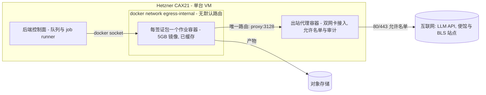
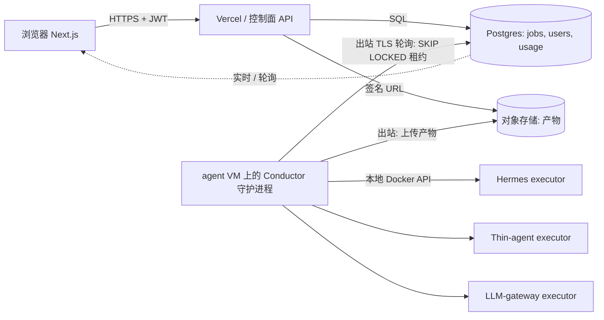
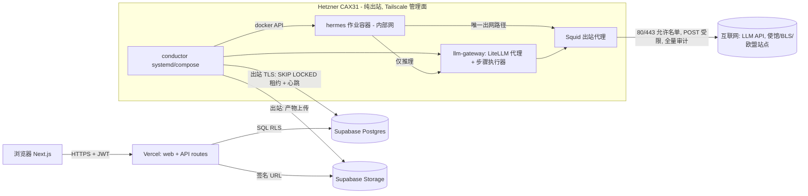

# 平台选型与开发计划（v0.4 配套文档）

**状态：** 提案
**配套文档：** [architecture-v0.4](../architecture-v0.4-zh.md) —— 本文档是平台相关的那一半：架构跑在哪里，以及具体的构建计划。

> 英文原件：[platform-and-dev-plan (English)](platform-and-dev-plan-en.md)

## 执行摘要

**建议：采用双面（two-plane）部署。**

| 面 | 选型 | 每月成本 |
|---|---|---|
| **可信控制面** —— 前端、API、Postgres、认证、存储、实时 | **Vercel (Next.js) + Supabase**（Postgres + Auth + Storage + Realtime，一个供应商替掉四个） | ~$45 + ~$10 PITR |
| **Agent 执行面** —— conductor（编排守护进程，即工作流引擎）、Hermes executor、LLM gateway、出站代理 | **一台 Hetzner CAX31 arm64 VM**（8 vCPU / 16 GB,docker compose —— 约 5 GB 的 arm64 镜像无需改动即可运行，已缓存在磁盘上，每作业零拉取） | ~$19 |

两者通过 **“DB 即接口、纯出站 VM”** 模式衔接：VM 上的 conductor 通过 TLS 轮询 `jobs` 表（`FOR UPDATE SKIP LOCKED`），并把产物上传到存储 —— 该 VM **完全不暴露任何入站端口**（管理走 Tailscale）。固定基础设施成本落在 **~$75/月**;LLM 用量是全部的可变成本项（每个签证包约 $0.60–4.00，取决于模型档次）。

为什么不选那些显而易见的替代方案，每个一句话：

- **只用 Vercel** —— serverless 函数的时限远低于约 10 分钟的 agent 作业，且没有 Docker；拆分是架构决定，不是权宜之计。
- **全押 AWS / GCP / Azure** —— 在产出第一个签证包之前，要先花 1–2 周做 VPC/IAM/Cognito 的管道搭建，还要背上 NAT 网关账单；这是规模放大 50× 时的正确答案，现在推迟（可移植的 Postgres schema + S3 兼容存储保证退出路径干净）。
- **Fly.io Machines** —— 最好的每作业原语（停机实例池、微虚拟机隔离），也是指定的**扩容目标**，但其出站管控在 guest 内实现（没有平台级防火墙），因此它是继承而非解决了 v0.3 中最难的那条要求。
- **Railway / Render** —— 完全没有出站网络管控：在 agent 面上直接不满足 v0.3。
- **全部自建** —— 把护照和银行流水这类 PII 放在 DIY 备份上，对单人创始人来说是错误的风险取舍；而且把可信 DB 与不可信 agent 容器放在一起违反了 v0.3 的信任拆分。

本文档分三部分：**第一部分** 比较容器/agent 面平台，**第二部分** 比较可信区技术栈，**第三部分** 给出调和后的技术栈和 8 周开发计划。价格声明标注为 **[V]**（2026 年 8 月经网络核实）或 **[T]**（训练知识 —— 落定前需重新核实）。


## 第一部分 — Agent 面的容器平台

### A.1 工作负载画像（平台必须匹配的条件）

| 约束 | 取值 |
|---|---|
| 镜像 | `visa-master-hermes:latest`，约 5 GB，目前**只在 arm64 上验证过**（在 Apple Silicon 上构建）;amd64 需要用 `buildx` 做多架构重建 |
| 作业形态 | 每个签证包起完即毁；典型约 10 分钟，硬上限 60 分钟；大量串行 LLM 往返 + 实时网页浏览 + LibreOffice/Python 渲染 |
| 镜像经济性 | **每作业**从 registry 拉取 5 GB 是一票否决；镜像必须缓存在执行主机上（或平台必须让镜像大小变得无关紧要） |
| 出站 | 作业容器必须**无默认路由**；唯一出口是出站代理（按 v0.3，封禁 RFC1918 + 169.254.0.0/16，仅放行 80/443） |
| 完成判定 | **按产物判定**（`qa-report.json` + 交付目录），绝不按进程退出判定 —— 最后的“打开工作区”步骤会启动一个前台服务器。在任何每作业拉起的平台上，entrypoint 包装脚本都**必须**做到：监听产物 → 上传到对象存储 → `exit 0`，否则作业会一直烧预算直到超时。这个包装脚本是方案 2–6 的前置条件，不是锦上添花。 |
| 规模 | MVP = 1 个并发作业，每天约 5–30 个签证包；单人创始人；成本敏感 |

下文的成本数字统一归一化到 **4 vCPU / 8 GB、10 分钟作业**;60 分钟最坏情况乘以 6。置信度标签：**[V]** = 本次会话已对照 2026 年来源核实；**[T]** = 训练知识，落定前需重新核实。

### A.2 逐方案评估

#### 1. 普通 VM + docker compose（Hetzner;EC2/Lightsail 作对比）

- **每作业拉起契合度：优秀。** “每作业一个容器” = `docker run --rm --network egress-internal ...`（或 `docker compose run`），由后端的 job runner 通过本地 Docker socket 驱动。compose 文件已经存在，而且这正是本地验证过的拓扑。每作业一个全新可写层，完成后 `docker rm` —— 就是 v0.3 的即抛暂存模型，只是少了微虚拟机级加固。
- **5 GB 镜像：构造上即已解决。** 每个*发布版本*拉取一次（从 GHCR/registry），之后永久缓存在 VM 磁盘上。每作业容器启动 < 5 秒。唯一一个每作业镜像成本字面意义为零的方案。
- **出站管控：所有方案中最强，且已验证。** Docker 的 `internal: true` 网络让作业容器**完全没有默认路由**；代理容器是双网卡接入（internal + external）。Hetzner 的元数据服务（169.254.169.254）从 internal 网络不可达。这就是 v0.3 的出站设计，用约 15 行 compose 实现。



- **定价 [V]:** Hetzner **CAX21（4 vCPU Ampere arm64,8 GB,80 GB,20 TB 流量）= €7.99/月 + €0.50 IPv4 ≈ €8.50(~$10)**。经 arm64 验证的镜像**无需改动**即可运行 —— 不用 amd64 重建，而且和创始人的 Apple Silicon 开发环路一致。amd64 备选：CX33(4 vCPU/8 GB)€6.49+€0.50。再上一档 CAX31(8 vCPU/16 GB)€15.99。（2026 年 4 月后价格；成本优化机型在欧盟 + 新加坡区域。）AWS 对比 [T, 高]:t4g.large(2 vCPU/8 GB)按需约 $49/月，Lightsail 8 GB 约 $44/月，外加 $0.09/GB 出站流量 —— **是 Hetzner 的 4–6 倍，机器还更小**；只有在第一天整个技术栈就必须在 AWS 上时才选 EC2。
- **运维负担：低且熟悉。** 一台机器、compose、一个 systemd unit、unattended-upgrades。诚实的弱点：(a) 隔离靠共享 Docker 守护进程 —— 容器逃逸就拿下整台 VM，如果控制面同机部署也一并沦陷（廉价加固：给作业容器用 `runsc`/gVisor runtime，在 arm64 上可用 [T, 中高];no-new-privileges、非 root、seccomp）;(b) 容量是固定的 —— 在最坏情况的 60 分钟作业下，并发为 1 时每天 30 个签证包超出单台 VM 一天的能力，因此 runner 需要并发 2 或者第二台 VM;(c) 内核/docker 打补丁由你自己负责。

#### 2. Fly.io Machines

- **每作业拉起契合度：优秀 —— 这就是该产品的设计中心。** Machines REST API 可以创建/启动/停止/销毁 Firecracker 微虚拟机；**通过 Machines API 创建的 app 默认没有公网 IP** [V]。Hermes 镜像的 entrypoint 已经支持 Fly 的非 PID-1 模式（FACTS），所以无需改动即可运行。每个 VM 独立（而非共享内核）的隔离相对方案 1 是严格的升级。
- **5 GB 镜像：靠停机实例池模式解决。** Fly 官方的建议：预先创建 Machines 并保持**停机**状态（$0.15/GB-月 rootfs → **每台池中 5 GB 实例 $0.75/月** [V]），作业到来时 `start`（秒级，无需拉取），产物上传后 `stop`；发布新版本时通过 `machine update` 给池换镜像。5 GB 镜像从 registry 冷 `create` 可能耗时数分钟，且随主机缓存情况波动 —— 所以停机池应视为必需项，而非可选项。
- **出站管控：薄弱环节。** Fly **没有平台级出站防火墙 / 无法删除默认路由**；每台实例都有出站 NAT [V 支持]。可用的缓解手段：通过 6PN 私有网络连到代理实例 + 由（可信的、创始人自建的）entrypoint 在降权到非 root agent 用户之前安装的 **guest 内 nftables**、HTTP(S)_PROXY 环境变量，以及在使馆/BLS 站点需要 IP 稳定性时使用 $3.60/月的静态出站 IP [V]。这是在不可信 guest *内部*做强制 —— 明显弱于无路由网络。作为过渡姿态可以接受；但在严格的安全评审面前站不住脚。
- **定价 [V]:** 按秒计费，仅运行期间计费。performance-2x/4GB = $0.00002484/s → **每个 10 分钟作业 $0.015**;shared-cpu-4x/8GB ≈ $0.007 [T, 中]。每天 30 个签证包 ≈ **$5–15/月计算 + 2 台停机池实例约 $1.50** + 出站 $0.02/GB（北美/欧洲）。空闲成本接近于零。
- **运维负担：低。** 无需 VPC/IAM 管道搭建；后端里加一个小的池管理循环（create/start/stop/回收 + 硬截止期限销毁）。已知长尾风险：偶发的主机容量/调度不稳定 [T, 中] —— 用硬墙钟截止期限 + 在新实例上重试的策略即可覆盖。

#### 3. Railway / Render —— **排除**

完全没有出站网络原语（无法移除默认路由，没有 VPC/防火墙控制）—— 仅此一条就不满足 v0.3 的硬性要求。两者都没有一等的“每作业拉起一个使用本地缓存镜像的临时容器”API；它们的模型是长驻 worker + cron（Render 的一次性作业会复用某个 service 的镜像，但同样不提供网络管控）[V]。这里没有任何一点能在价格上胜过方案 1，或在原语契合度上胜过方案 2。不值得进一步分析。

#### 4. GCP Cloud Run Jobs

- **每作业拉起契合度：良好。** 每个签证包一次 `jobs.run`；任务超时可达 **168 小时**（默认 10 分钟 —— 需调高）；容器启动期限 4 分钟（没问题）[V]。
- **5 GB 镜像：设计上就不是问题。** 镜像大小**“没有直接限制”**，且冷启动**与镜像大小无关**（Cloud Run 从其在部署时生成的自有副本流式加载）[V]。是超大规模云厂商里对大镜像最友好的方案。**需要先扫清的阻碍：** manifest **必须包含 linux/amd64** [V] —— 仅 arm64 的镜像需要多架构重建，而且 `nousresearch/hermes-agent` 基础镜像必须存在 amd64 版本（待核实）。可写文件系统是**在内存中**的（计入 32 GiB 上限）—— 在 8–16 GiB 内存下，工作区写入几百 MB 没问题 [V]。
- **出站管控：确实很强。** Direct VPC egress 配 `all-traffic` + **不配 Cloud NAT** = 没有互联网路由；VPC 防火墙只允许 proxy-VM:3128。平台级强制，等价于 v0.3 的设计 [T, 高]。
- **定价 [T, 高]:** Tier-1 区域：4 vCPU × $0.000024/vCPU-s + 8 GiB × $0.0000025/GiB-s → **每个 10 分钟作业约 $0.07**；每天 30 个 ≈ $63/月，再加代理 e2-micro 约 $7 和 Artifact Registry 约 $0.50。注意 Cloud Run 的 vCPU($0.0864/vCPU-h)约为 Fargate 的 2 倍。
- **运维负担：中等。** VPC + 防火墙 + AR + IAM + amd64 重建/CI。比 AWS 少些管道活，比 Fly/Hetzner 多。

#### 5. AWS ECS Fargate

- **每作业拉起契合度：良好。** 每个签证包一次 `RunTask`；原生运行 arm64（Graviton，便宜 20%）[V] —— 无需重建。
- **5 GB 镜像：痛点所在。** **任务之间没有镜像缓存 —— 每个任务都要从 ECR 完整拉取镜像** [V];5 GB 预计拉取 3–7 分钟，而且**从拉取开始就计费** [T, 高]。SOCI 惰性加载索引（在 CI 中构建）能显著缩短拉取到启动的时间（大镜像上有 50–60% 的报告）[V]。在 60 分钟预算内可以忍受；但在作业延迟上永远比方案 1/2/4 差。
- **出站管控：优秀且教科书式。** 任务 ENI 位于私有子网，**没有 NAT GW / 没有 IGW 路由** → 构造上无默认路由；SG 只放行 proxy:3128。元数据只能通过任务作用域的 ECS endpoint 访问（相对 EC2 凭证而言无害）[T, 高]。无 NAT 设计的隐藏成本：镜像拉取需要 VPC endpoint（ecr.api、ecr.dkr 各约 $7.3/月 + 免费的 S3 gateway），或者在拉取时走代理路由 —— 预算 **约 $15–25/月固定成本** [T, 中高]。
- **定价 [V]:** arm64 $0.032384/vCPU-h + $0.003556/GB-h → 4 vCPU/8 GB ≈ $0.158/h → **每个 10 分钟作业约 $0.026**（外加拉取分钟数）；每天 30 个 ≈ $24/月 + 固定的 endpoint/代理成本。20 GB 临时存储免费 [V]。
- **运维负担：对单人而言是所有认真候选中最高的** —— VPC/子网/SG/IAM/ECR/SOCI-CI/task-def。当安全评审要求 AWS 原生、可审计的隔离时，这个代价是值得的。

#### 6. Azure Container Apps Jobs —— **对本团队排除**

手动触发作业是存在的，而且只在运行时计费（4 vCPU/8 GiB 的 10 分钟作业约 $0.072 [T, 中]）。但是：镜像按每次执行拉取，只有尽力而为的节点缓存 [V]；硬性出站管控（UDR）需要 workload-profiles 环境，现实中还要 Azure Firewall（约 $290/月）或自管 NVA [T, 中]；而且它带来第三朵云的学习曲线，相对方案 4/5 却毫无独有优势。跳过。

#### 7. Kubernetes —— **MVP 阶段排除；记为最终的规模化形态**

K8s Jobs + NetworkPolicy(default-deny) + 节点缓存镜像 + gVisor/Kata 在架构上是*正确*的长期原语 —— 但 EKS/GKE 在还没有任何节点之前控制面就要约 $73–75/月，而且对单人创始人来说运维面积远超其他方案。在每天约 50–100 个作业或第二位工程师加入之前不要动。在 2–3 台 Hetzner 节点上跑 k3s 集群（约 €25–35/月）是单 VM runner 撑不住时的廉价中间步骤。

### A.3 对比矩阵

| | 每作业拉起 | 5 GB 镜像 | 出站“无默认路由” | ~$/10 分钟作业（4c/8GB） | 固定 $/月（MVP） | 运维（单人） |
|---|---|---|---|---|---|---|
| **Hetzner VM + compose** | 每作业 docker run | 缓存在磁盘，每作业 0 | **原生（internal 网络）** | ~$0（固定） | **~$10** | **最低** |
| **Fly Machines** | 原生 API，微虚拟机 | 停机池，$0.75/月/实例 | **无平台防火墙** —— 仅 guest 内 nftables | $0.007–0.03 | ~$2–5 | 低 |
| Railway/Render | 弱 | 还凑合 | **无 —— 一票否决** | — | — | 低 |
| **Cloud Run Jobs** | jobs.run | 流式加载，与大小无关；**需 amd64 重建** | VPC egress + 无 NAT（强） | ~$0.07 | ~$8 | 中等 |
| **ECS Fargate (arm64)** | RunTask | **每作业完整拉取**;SOCI 可缓解 | 私有子网，无 NAT（强） | ~$0.03 + 拉取 | ~$15–25 | 高 |
| ACA Jobs | 手动作业 | 每作业拉取 | 需 WP 环境 + 防火墙（$$$） | ~$0.07 | 高 | 高 |
| K8s | Jobs（理想） | 节点缓存（理想） | NetworkPolicy（理想） | 不适用 | $75+ 节点 | 最高 |

### A.4 建议（排序）

**MVP（当下）:Hetzner CAX21 + docker compose —— 约 €8.50/月。** 它是唯一同时做到以下几点的方案：无需改动即可运行 arm64 镜像、彻底消除每作业镜像成本、用已经存在的 compose 文件*精确*实现 v0.3 的出站边界（internal 网络 + 双网卡接入代理），并且在每天最多约 15–30 个签证包的任何量级下都只花固定的约 $10/月。廉价加固：作业容器用 gVisor runtime、非 root agent 用户、每作业暂存目录在回收时清除、后端强制墙钟截止期限和按产物判定完成。接受已记录在案的隔离取舍（共享守护进程），作为 MVP 阶段的权衡写进 ADR。**规格说明：** 第三部分把此处上调为 CAX31（8 vCPU / 16 GB），以便 conductor、出站代理与 Docker 守护进程能与一个满配作业容器共处一台机器 —— CAX21 只核算了作业容器本身。

**扩容（下一步）:Fly.io Machines** —— 预先创建的停机实例池（rootfs $0.15/GB-月）,`start`→运行→上传产物→`stop`，发布时销毁/重建。每作业原语契合度最佳、隔离升级到每 VM 级别、空闲成本接近于零、镜像无需改动即可运行（非 PID-1 模式已支持）。**明确把这条告诫带过去：**出站强制在 guest 内，不是平台级的。

**规模化时的严格边界备选：Graviton 上的 ECS Fargate（配 SOCI）** —— 当客户/安全评审要求平台强制的无路由网络和 AWS 原生审计时，选它而非 Fly，并接受拉取延迟 + AWS 管道税。（Cloud Run Jobs 是 GCP 侧的等价答案，在镜像处理上胜过 Fargate，但需要 amd64 重建 —— 把它列入候选前请先核实 Hermes 基础镜像是否有 amd64 版本。）

**迁移触发条件（VM → Fly/Fargate）:**
1. 峰值时队列 p95 等待 > 30 分钟，或持续需要 >2 个并发作业（第一反应：升一档 / 加第二台 VM；当 VM 池管理本身变成一份工作时再迁移）。
2. 第一个 B2B/付费客户的评审要求强于共享守护进程的隔离 → 视出站要求被追问的力度，选 Fly（微虚拟机）或 Fargate（微虚拟机 + 网络边界）。
3. \>50 个签证包/天，或单台 VM 上最坏时长利用率 >60%。
4. 出现多区域执行需求（面向中国邻近用户的延迟）—— 每作业拉起的平台免费提供多区域。
5. 第二位工程师加入 → AWS 运维税变得可以支付；Fargate/K8s 进入视野。

**来源：** [Fly.io resource pricing](https://fly.io/docs/about/pricing/) · [Fly Machines API](https://fly.io/docs/machines/api/working-with-machines-api/) · [Fly private networking](https://fly.io/docs/networking/private-networking/) · [Cloud Run quotas](https://docs.cloud.google.com/run/quotas) · [Cloud Run container contract](https://docs.cloud.google.com/run/docs/container-contract) · [Cloud Run task timeout](https://docs.cloud.google.com/run/docs/configuring/task-timeout) · [ahmetb Cloud Run FAQ (image size vs cold start)](https://github.com/ahmetb/cloud-run-faq) · [Hetzner 2026 pricing breakdown](https://www.bitdoze.com/hetzner-cloud-cost-optimized-plans/) · [Hetzner price-increase analysis](https://northflank.com/blog/hetzner-cloud-server-price-increases) · [AWS Fargate pricing](https://aws.amazon.com/fargate/pricing/) · [AWS SOCI lazy loading](https://aws.amazon.com/blogs/containers/under-the-hood-lazy-loading-container-images-with-seekable-oci-and-aws-fargate) · [Azure Container Apps Jobs](https://learn.microsoft.com/en-us/azure/container-apps/jobs) · [ACA pricing](https://azure.microsoft.com/en-us/pricing/details/container-apps/)

## 第二部分 — 可信区技术栈（前端 · API · Postgres · 认证 · 存储 · 实时）

### B.0 定调：这个拆分是架构性的，不是偶然的

一个签证包作业要跑约 10 分钟墙钟时间，包含数十次串行 LLM 调用、Docker、LibreOffice 和实时的网页出站访问。本次对比中没有任何 serverless 平台能承载它：Vercel 函数上限约 10–60 秒（Hobby）/ 约 300 秒，启用 Fluid compute(Pro)最多约 800 秒 —— 勉强够一次典型运行，远远达不到 60 分钟的最坏情况预算 —— 而且 serverless 没有 Docker socket、没有守护进程定时器、也没有 agent 面所需的基于产物判定完成的文件系统监听。因此每个候选方案都按 **可信控制面（本次调研）+ 独立的 Docker VM agent 面（固定，约 $25–40/月 Hetzner/OVH 档次，是方案 1–5 的共同成本）** 来评估。

最干净的集成模式 —— 也是应当作为选型标准的那个 —— 是 **“DB 即接口、纯出站 VM”**:



agent VM **只发起出站连接**（通过连接池以 TLS 访问 Postgres、上传存储、经出站代理访问 LLM API）。v1 不需要入站端口、不需要 mTLS、不需要 VPN；仅为 SSH/管理加上 Tailscale。这个模式在 Supabase、Neon、Railway-Postgres 或自建上表现完全一致 —— 只有当 Postgres 没有合理的公网 TLS 端点时才会失效（VPC 内的 RDS 要求 VM 也在 VPC 里）。

### B.1 作业契约（两个面共同认可的那张表）

> *示意性的最小草图。* 权威的物理 DDL 见 [architecture v0.4](../architecture-v0.4-zh.md) Chapter B §2 —— 同一份契约，但采用 Chapter A 的状态词汇和完整列集（`attempt`/`max_attempts`、`idempotency_key`、预算列）。第三部分 第 2 周构建 Chapter B 的形态。

```sql
create table jobs (
  id               uuid primary key default gen_random_uuid(),
  user_id          uuid not null,
  kind             text not null,                  -- 'pack.schengen.v1'
  executor         text,                           -- 'hermes' | 'thin-agent' | 'llm-gateway'(路由决策)
  status           text not null default 'queued', -- queued|leased|running|awaiting_review|delivered|failed|expired
  input            jsonb not null,
  progress         jsonb,                          -- {stage, pct, note, updated_at},由 conductor 写入
  lease_owner      text,
  lease_expires_at timestamptz,                    -- conductor 发送心跳;租约过期 => 重新入队或失败
  deadline_at      timestamptz not null,           -- 硬性墙钟兜底(v0.3)
  artifact_prefix  text,                           -- 交付目录的存储路径,含 qa-report.json
  qa_report        jsonb,
  created_at       timestamptz not null default now(),
  updated_at       timestamptz not null default now()
);
-- 认领: UPDATE jobs SET status='leased', lease_owner=$1, lease_expires_at=now()+'2 min'
--   WHERE id = (SELECT id FROM jobs WHERE status='queued'
--               ORDER BY created_at FOR UPDATE SKIP LOCKED LIMIT 1) RETURNING *;
```

MVP 是单并发（v0.3），所以这个 Postgres 队列绰绰有余；不需要 Redis/SQS。

### B.2 技术栈对比

除标注*（训练知识）*外，定价均通过 2026 年 8 月的网络搜索核实。MVP 负载：约 100 用户，每天 5–30 个签证包，每包约 20–50 MB → 每月约 45 GB 新增产物，每月约 45 GB 下载出站流量。

| 评估维度 | 1. Vercel + Supabase | 2. Vercel + Neon + Clerk + R2 | 3. 全押 Railway | 4. AWS(Amplify/ECS + RDS + Cognito + S3) | 5. GCP(Cloud Run + Cloud SQL + Firebase Auth + GCS) | 6. 自建 Coolify(Next.js + Postgres + MinIO + Better-Auth) |
|---|---|---|---|---|---|---|
| 首次部署耗时（单人） | 约 0.5 天 | 约 1 天（要打通 3 个控制台） | 约 0.5 天（仅控制面） | 认真做要 1–2 周（VPC、IAM、Cognito） | 2–4 天 | 1–2 天，含 TLS、备份、SMTP |
| MVP 每月成本（不含 agent VM） | ~$45(Vercel Pro $20 + Supabase Pro $25) | ~$25–40（Vercel $20 + Neon 用量约 $5–15 + Clerk $0 + R2 约 $2） | ~$25–45 按用量；**VM 仍需另找地方** | ~$60–120（RDS ~$15+,NAT 网关约 $32 的坑，Amplify） | ~$15–40（Cloud SQL micro $7–10 无 SLA,Cloud Run 在免费档内 ≈$0） | 同机部署额外成本约 $0；单独 VM 约 $25（推荐） |
| Postgres 质量 | Pro：每日备份（保留 7 天）,PITR 为付费附加项；分支按分支计量*（附加项细节：训练知识）* | 同类最佳：即时写时复制分支、缩容到零、PITR（6 小时免费，更长需付费），存储 $0.35/GB | 容器+卷的 Postgres；每日卷备份，无 PITR *（训练知识）* —— 本表中最弱的托管方案 | RDS = 黄金标准：35 天 PITR、Multi-AZ；无分支 | Cloud SQL 备份/PITR 扎实；最便宜档次不在 SLA 覆盖内 | 你自己搭什么就是什么：pgBackRest→R2 + 经过演练的恢复，否则等于没有 |
| 认证（邮箱 OTP + OAuth、RBAC） | 内置：邮箱 OTP/magic link、OAuth providers、通过 JWT claims + RLS 实现 RBAC；免费档 50K MAU | Clerk：最佳 DX、预制 Next.js 组件、内置组织/RBAC;50K 月留存用户以内免费（2026 年 2 月变更）,Pro $25/月 | 自备（自己跑 Better-Auth 或付费用 Clerk） | Cognito：功能完备但 DX 极不友好；2025 年新档位 —— Lite $0.0055/MAU、Essentials $0.015/MAU,10K MAU 免费 | Firebase Auth：扎实，约 50K MAU 免费 *（训练知识）*；从非 Google 后端做 JWKS 校验没问题 | Better-Auth 1.5:email-OTP 与 organization 插件已可用于生产；升级和安全由你自己负责 |
| 存储 + 签名 URL | Supabase Storage、签名 URL、S3 兼容 API;Pro 含 100 GB + 250 GB 出站 | R2:$0.015/GB-月，**出站 $0**,S3 API，签名 URL;MVP 阶段约 $2/月 | Railway 的卷不是对象存储 → 反正还得加 R2 | S3：教科书方案，出站约 $0.09/GB | GCS：够用，出站约 $0.12/GB | MinIO:S3 API，但补丁和监控归你，而且它存的是护照扫描件 |
| 实时作业进度 | **最佳**：通过 Supabase Realtime 订阅 `jobs` 行（Pro:500 并发连接）；可回退到轮询 | 无原生实时：轮询 `GET /jobs/:id` 或由 conductor 推 SSE | 轮询或由某个 Railway service 推 SSE | API GW WebSockets/AppSync —— 太重 | Firestore listener（第二个数据库）或轮询 | 由 conductor 推 SSE（需要 VM 上开入站端口 + 认证） |
| 供应商风险 / 出站 | 纯 Postgres + S3 兼容存储 → 退出干净；超出配额的出站 $0.09/GB *（训练知识）* | 托管方案中锁定最低：Neon=纯 PG,R2=S3 API + 零出站费；Clerk 的用户库迁移是唯一的粘手点 | 中等；出站计量 *（训练知识）* | 复杂度锁定最高；出站 + NAT 成本 | 中等；有出站费 | 零供应商风险，创始人时间风险最大 |
| 与 agent VM 的契合 | 纯出站 conductor 对接池化 PG + Storage：理想 | 同一模式，同样干净 | Railway **无法承载 agent 面**（不支持特权/DinD 容器）→ 得拆到 3 个平台上 | *如果* agent VM = 同一 VPC 内的 EC2（私有子网、SG），网络最干净；但现在是过度设计 | VM = GCE + Cloud SQL connector/公网 IP 允许名单：没问题 | 把可信 DB 与**不可信**的 agent 容器放在同一内核上，与 v0.3 的信任分离相矛盾 —— 只能用独立 VM，而这又侵蚀了成本优势 |

关于承重事实的说明：Vercel 的 **Hobby 档不可商用** —— 从第一天起就按 Pro（$20/席位）预算。Supabase Free 档会在闲置 7 天后暂停项目且没有备份 —— 从第一天起就用 Pro。Cognito 在 2025 年重新定价为 Lite/Essentials/Plus，超过 10K MAU 后成本显著。Clerk 在 2026 年 2 月改为 50K 月留存用户免费。

### B.3 实时进度：先选无聊的方案

对于每天 5–30 个签证包、每个 10 分钟的作业而言，**轮询是合格的 v1**：每 3 秒一次 `GET /api/jobs/:id`，每个签证包约 200 个请求 —— 可以忽略不计。它对中国用户还能优雅降级：在那里，与境外端点保持的长连 WebSocket 不如普通 HTTPS 轮询可靠。推荐的演进阶梯：

1. **v1**:conductor 写入 `progress` JSONB（阶段机：`intake → research → documents → qa → awaiting_review`）；前端每 3 秒轮询一次。
2. **v1.1（仅方案 1）**：用 Supabase Realtime 订阅作业行作为渐进增强，轮询作为回退。后端零工作量 —— conductor 的 UPDATE 就是事件。
3. 从 VM 推 SSE：只有在你离开 Supabase 时才考虑；它会强制在 agent VM 上开一个带认证的入站端点，而纯出站模型正是要刻意避免这一点。

### B.4 工作流引擎放在哪里？

沿着请求/响应 vs. 长时运行的边界来拆分：

| 组件 | 放置位置 | 理由 |
|---|---|---|
| 认证、用户 CRUD、签证包提交（插入 `jobs` 行）、签名下载 URL、审核门的 UI 操作 | **Vercel 上的 Next.js API routes / server actions** | 纯请求/响应，契合 serverless，零额外基础设施 |
| 编排器（“conductor”）：队列租约、executor 路由（按适配器契约在 hermes / thin-agent / llm-gateway 之间选择）、通过 Docker API 管理容器生命周期、按产物判定完成（`qa-report.json` + 交付目录）、墙钟看门狗、重试、token 预算核算 | **与 agent VM 同机的常驻 Node 服务**（systemd 或 compose service） | 需要 Docker socket、文件系统监听，以及生命周期长于任何 serverless 调用的定时器；ADR-002 中确定性的工作流引擎正是这个进程 |
| 确定性的业务规则（“西班牙旅游签需要护照 + 银行流水 + 在职证明”） | **由两侧共同引入的共享 TypeScript 包** | UI 里即时表单校验，conductor 里权威强制 —— 单一事实来源，符合 ADR-002 |

**不要**把引擎只放在 Next.js routes 里（没有守护进程、有时长上限，Vercel 的 cron/队列同样受函数时限约束），也不要把它做成第三个托管位置 —— 与 agent VM 同机部署可以让 Docker 控制保持在本地，且不新增网络暴露面。

### B.5 排序建议

1. **Vercel + Supabase** —— 一个供应商替掉四个（Postgres + Auth + Storage + Realtime）,jobs 表模式让 agent VM 保持纯出站，约 $45/月 + VM 是单人可信赖的最快路径。
2. **Vercel + Neon + Clerk + R2** —— 略便宜，最好的 Postgres 分支能力和零出站费存储，最好的认证 DX；代价是第三、第四个控制台和失去原生实时。如果 Supabase 让人失望，这就是指定的逃生舱。
3. **全押 Railway** —— 控制面的 DX 很舒服，但它无法承载 agent 面，于是你要跑三个平台而不是两个，而且用的是本表中最弱的托管 Postgres。
4. **自建 Coolify** —— 最便宜、零锁定，但签证包里是护照和银行流水这类 PII：在单人创始人的注意力预算下做 DIY 备份/MinIO 是错误的风险取舍，而且与不可信 agent 同机部署会破坏 v0.3 的隔离。
5. **GCP** —— 是个不错的平台，但其最便宜的可信 Cloud SQL 档次不在 SLA 覆盖内；IAM 管道活多于 MVP 阶段的回报。
6. **AWS** —— 规模放大 50× 时的正确答案；在 MVP 阶段它意味着一张 NAT 网关账单和两周你没有的 VPC/Cognito 工作。

*（Azure 被刻意排除在这份控制面候选名单之外：没有 Vercel 级别的 Next.js 托管 DX,Entra External ID 是 Cognito 量级的认证负担，而且它会引入第三朵云却没有独有的控制面优势 —— 它的 agent 面变体已在 第一部分 §6 被排除。）*

**迁移舒适度**：上面这条线以上的一切都是可移植的 —— 纯 Postgres schema、S3 兼容存储、JWT 认证。从 1 迁到 2（或规模化后迁到 4/AWS）是一次数据迁移，不是重写。

来源：[Supabase pricing breakdown](https://uibakery.io/blog/supabase-pricing), [Supabase real-world costs](https://makerkit.dev/blog/saas/supabase-pricing), [Vercel free-tier limits](https://www.promptstoproduct.com/vercel-free-tier-limits), [Vercel function limits](https://vercel.com/docs/functions/limitations), [Neon plans](https://neon.com/docs/introduction/plans), [Neon 2026 pricing changes](https://vela.simplyblock.io/articles/neon-serverless-postgres-pricing-2026/), [Clerk pricing / 50K free change](https://clerk.com/pricing), [Clerk free-plan change note](https://saasprices.net/blog/clerk-free-plan-changes), [Railway pricing](https://www.srvrlss.io/provider/railway/), [Cloudflare R2 pricing](https://www.budgetforge.dev/tools/cloudflare-r2-pricing-2026), [Cognito pricing](https://aws.amazon.com/cognito/pricing/), [Cognito repricing analysis](https://www.thestack.technology/awss-new-cognito-pricing-complicated-potentially-costly/), [Cloud SQL pricing](https://www.usage.ai/blogs/gcp/cloud-sql/pricing/), [Cloud Run pricing](https://cloud.google.com/run/pricing), [Better Auth 1.5](https://better-auth.com/blog/1-5), [Better Auth email OTP plugin](https://better-auth.com/docs/plugins/email-otp)。

## 第三部分 — 选定技术栈与 8 周开发计划

### 1. 最终选定的技术栈

两位研究者各自的首选方案能够干净地组合在一起，并按其排名予以采纳：控制面采用 **Vercel + Supabase**，Agent 面采用**一台运行 docker compose 的 Hetzner arm64 VM**，两者通过 **"DB 即接口、纯出站 VM"** 模式衔接 —— VM 上的 conductor（编排守护进程） 通过 TLS 轮询 `jobs` 表，并把产物上传到 Supabase Storage；VM **不暴露任何入站端口**。有一处需要调和：Research A 把 VM 按 **CAX21（4 vCPU / 8 GB，约 €8.50/月）** 定价，其规格只考虑了作业容器本身，而 Research B 为一台同时承载 conductor 和出站代理的 VM 预算了 "$25–40/月"。我们在规格上采纳 B 的方向，在供应商上采纳 A 的方向：**Hetzner CAX31（8 vCPU / 16 GB arm64，€15.99 + €0.50 IPv4 ≈ $19/月）**，这样 Hermes 作业容器可以保留完整的 4 vCPU / 8 GB(`--cpus 4 --memory 8g`)，同时为 Docker daemon、Squid 代理、conductor 以及 LibreOffice 渲染尖峰留出真正的余量。经过 arm64 测试的 `visa-master-hermes:latest` 镜像无需修改即可运行，并与 Apple-Silicon 的开发循环保持一致。依据 ADR-002，**conductor 就是那个确定性的工作流引擎** —— 控制面中长时间运行的那一半 —— 而创始人需求中的三种服务器类型（Hermes、thin agent、LLM 网关）是它内部**位于同一套适配器契约之后的可插拔执行器**；在 V1 中，这些"服务器"只是这一台 VM 上的进程/容器，而该契约正是让它们日后能够变成独立服务器、且无需改动 schema 或前端的原因。

| 组件 | 运行位置 | 由谁提供 | 备注 |
|---|---|---|---|
| 前端（Next.js App Router，zh-CN 为主） | Vercel Pro | `apps/web` | 每个 PR 一个预览；`main` 上为生产 |
| 请求/响应 API（鉴权后的 CRUD、作业提交、签名 URL、复核操作） | Vercel serverless(route handlers / server actions) | `apps/web` | 永不接触 Docker 或 LLM 密钥 |
| 工作流引擎 / 编排器（"conductor"） | Hetzner CAX31，由 systemd 管理的 compose 服务 | `apps/conductor`(Node 22, TS) | 队列租约、执行器路由、容器生命周期、产物监视、看门狗、token 记账 |
| 执行器：**hermes**（完整签证包生产者，今天就能用） | VM 上每个作业一个临时容器，`internal: true` 网络 | `packages/executors/hermes` + `visa-master-hermes:latest` | 第 3 周上线 |
| 执行器：**llm-gateway**（无状态步骤：求职信、清单、翻译） | conductor 中的适配器 + **版本锁定的 LiteLLM 代理容器**（compose 服务 `gateway`，第 3 周上线） | `packages/executors/llm-gateway` | 步骤库第 5 周上线；从第 3 周起该网关容器就是唯一的推理收敛点 —— Hermes 的供应商配置指向它，因此**供应商密钥永远不会进入作业容器**(architecture C §3.2) |
| 执行器：**thin-agent**（Discussion-01 的迁移目标） | 同一契约下的未来容器 | `packages/executors/thin-agent` | **延后 —— 见 §6** |
| 出站代理 | Squid 容器，双网卡（内部网 + 外部网） | `infra/compose.vm.yml` | v0.3 §5.2 规则 1–3 + 审计日志；作业容器唯一的出网路径 |
| Postgres（作业、用户、用量、案件） | Supabase Pro | `packages/db` 迁移 | conductor 通过 Supavisor 连接池经 TLS 连接，纯出站 |
| Auth（邮箱 OTP + 可选 OAuth，RLS） | Supabase Auth | — | 在 Next.js 中校验 JWT；所有面向用户的表都启用 RLS |
| 对象存储（上传件 + 产物包） | Supabase Storage，私有存储桶 `uploads`、`artifacts` | — | 由 API 签发签名上传/下载 URL；conductor 使用 service-role 密钥 |
| 实时进度 | 每 3 s 轮询 `GET /api/jobs/:id`(v1)；后续增强可改用作业行上的 Supabase Realtime | — | 轮询对中国用户能够优雅降级（B.3） |
| 业务规则（例如西班牙旅游签材料要求） | 由 web **和** conductor 共同引入的共享包 | `packages/core`(zod schema + `rules/`) | ADR-002：规则是代码，不是 LLM 的判断 |
| 对 VM 的管理/SSH 访问 | Tailscale（仅通过 tailnet 的 SSH；公网入站一律 deny） | — | 数据通路无需 VPN —— 它本来就是纯出站的 |
| 密钥 | Vercel 环境变量（web：anon key、Sentry DSN）；VM：root 所有的 `/etc/visa-master/{conductor,gateway,proxy}.env`，权限 0600 | 以 1Password 为唯一可信来源；由部署脚本下发 | **供应商 LLM 密钥只存在于 gateway 容器的环境变量中；`service_role` 密钥只存在于 conductor 的环境变量中。** 作业容器完全不持有任何供应商密钥 —— 它们唯一的推理通路是内部网络上的网关端点（architecture C §3.2，取代 v0.3 §6 中"密钥放在容器内"的姿态） |



Monorepo(`pnpm` + Turborepo)：`apps/web`、`apps/conductor`、`packages/core`、`packages/db`、`packages/executors`、`infra/`（compose 文件、Squid 配置、systemd unit、部署脚本）。

#### 执行器适配器契约（承重的那个接口）

```ts
// packages/executors/contract.ts
export interface Executor {
  kind: 'hermes' | 'llm-gateway' | 'thin-agent';
  start(job: JobRow, ctx: RunContext): Promise<RunHandle>;      // 启动容器 / 开始一个步骤
  poll(h: RunHandle): Promise<'running' | 'artifact_ready' | 'failed'>; // hermes: 产物监视, 绝不看进程退出
  collect(h: RunHandle): Promise<{ artifactPrefix: string; qaReport: unknown }>; // 上传到 Storage
  destroy(h: RunHandle): Promise<void>;                          // 容器 + 暂存卷, 始终执行
}
```

路由在 conductor 中是一个纯函数：`pack.schengen.v1 → hermes`，`step.cover_letter.v1 | step.checklist.v1 | step.translate.v1 → llm-gateway`。前端和 schema 永远不会知道是哪个执行器跑的。

> 这个 4 方法接口是架构中适配器契约（v0.4 Chapter C §1）的 **V1 进程内实现**：`running`→`running`，`artifact_ready`→`completed`(+manifest)，`failed`→`failed`。`awaiting_user`、`/answers`、`cancel` 以及 webhook 事件流在 V1 中被刻意不实现 —— 结构化信息采集把所有问题都前置了，因此不存在需要表达的运行中交互。C §1 的 HTTP 接口面（以及一个 `awaiting_input` 轮询状态）将在第一个执行器搬离这台 VM 的那一刻实现 —— 例如 §6 中的 Fly.io 触发条件。

### 2. 逐周计划（8 周，单人创始人，直到可收费的 beta）

排序原则：结构化信息采集优先（v1 中没有运行中交互 —— 表单一次性采集 agent 所需的一切），Hermes 执行器尽早上线，因为它是今天唯一能产出可售签证包的东西，LLM-gateway 紧随其后作为廉价步骤的主力，thin agent 延后。

#### 第 1 周 —— 地基：仓库、鉴权、VM
- **目标：** 所有账号和骨架都就位；用户可以注册。
- **任务：** 搭建 monorepo 骨架；创建 Supabase 项目 `visa-master-staging` 与 `visa-master-prod`；Vercel 项目关联到 GitHub；迁移 `0001_profiles.sql`（`auth.users` 的镜像 + 角色枚举 `user|operator|admin`）、`0002_jobs.sql`（架构 Chapter B 的 `jobs` 表 —— 上文 B.1 只是它的最小草图；保留 Chapter B 的状态名以及 `attempt`/`max_attempts`、`idempotency_key`、预算列，并补充 `failure_reason text`、`tokens_in bigint`、`tokens_out bigint`）、`0003_usage_events.sql`；配置 Supabase Auth 邮箱 OTP；`apps/web` 登录/登出 + RLS 保护下的空白仪表盘。`apps/web` 脚手架**随第一个页面一起交付 i18n 骨架**（2026-08-10 修订，源自设计阶段审计 —— [design/product/04](../../design/product/04_MVP_Scope_V1_V2.md)）：经 `next-intl` 的语言前缀路由（`/zh/…`、`/en/…`）、承载两种语言的 ICU 词条表，以及一道构建检查 —— 出现硬编码的用户可见字符串、或任一语言缺少某个 key 时构建失败。登录页和仪表盘本身就带用户可见文案，所以词条表必须先于任何页面存在；在长大的代码库下事后补装等于重写（[国际化](../../design/guidelines/internationalization-zh.md) §3、§8）。开通 CAX31：Ubuntu 24.04 LTS，`ufw` 拒绝一切入站，Tailscale SSH，unattended-upgrades，Docker + compose 插件，0600 权限的 env 文件。
- **完成标准（DoD）:** 在 Vercel 生产 URL 上完成 注册 → OTP → 仪表盘 的流程，**`/zh` 与 `/en` 两个路径都可用，每个字符串都从词条表解析**；任一语言缺 key 时构建失败；从 VM 用 `psql` 连接 Supabase 连接池成功；VM 上没有任何公网端口开放（从外部 `nmap` 扫不到任何东西）。
- **演示：** 在手机上注册；展示空白仪表盘和已封闭的 VM。

#### 第 2 周 —— 结构化信息采集 + 上传
- **目标：** 在任何 agent 存在之前，就把完整的申根旅游签信息采集为经过校验的结构化数据。
- **任务：** `packages/core`：`IntakeSchengenTourismV1` zod schema（申请人、护照、就业、行程日期/路线、财务、既往签证） + `rules/schengen-spain.ts`（确定性的必备材料计算 —— 即 ADR-002 中的代码校验）。**校验问题携带消息 key 加参数**（如 `passport.expiry.tooSoon` + `{monthsRequired: 3}`），绝不携带句子 —— 由前端按当前语言解析（[国际化](../../design/guidelines/internationalization-zh.md) §3）；这条规则从第一个 schema 起就生效，因为它是整套 i18n 里唯一无法低成本事后补救的部分。`apps/web` 中的多步表单，客户端校验复用同一 schema，并落地**草稿持久化**（2026-08-10 修订，源自设计阶段审计 —— [design/product/04](../../design/product/04_MVP_Scope_V1_V2.md)）：草稿行（`jobs.status='draft'` 或独立的 drafts 表）+ 基于共享 schema partial 的逐步自动保存 + 登录后精确恢复到最后一个未完成步骤 —— 在微信 webview 里被打断才是中位数会话，没有服务端草稿的 intake 会弄丢它的用户（[移动端平权](../../design/guidelines/mobile-parity-zh.md) §3.3）。`POST /api/uploads/sign` → 指向私有 `uploads/{user_id}/{upload_id}` 的签名上传 URL（护照扫描件、银行流水、在职证明）；`POST /api/jobs` 在服务端校验、快照经过脱敏的 `input`（payload 内不含 user_id/email —— v0.3 §11），插入 `status='queued'`、`kind='pack.schengen.v1'`（墙钟 `deadline_at` 在**租约时刻**设置，而不是入队时 —— 排队等待绝不能消耗运行预算）；`GET /api/jobs/:id`（受 RLS 约束）用于轮询。
- **完成标准（DoD）:** 非法采集数据会被拒绝，并给出来自共享 schema 的字段级错误，**且错误在两种语言下都由消息 key 渲染**；填到一半中途放弃的采集，在登出/登录后能在同一步骤恢复且数据完好；一次完成的采集会产生一条 `queued` 作业行以及 Storage 中的文件；此时还没有任何东西消费队列。
- **演示：** 在移动端端到端完成信息采集 —— 包括中途杀掉标签页、登录后续填；展示 `jobs` 行和已上传的对象。

#### 第 3 周 —— conductor + Hermes 执行器：第一个云端产出的签证包
这是成败攸关的一周；这里的一切都已在本地验证过，现在是把它们换个家。
- **目标：** 一个排队中的作业最终变成 Storage 里已交付的产物文件夹，全程无人接触 VM。
- **任务：** `apps/conductor` 各模块：`lease.ts`（B.1 的 `FOR UPDATE SKIP LOCKED` 认领 + 2 分钟心跳）、`router.ts`、`executors/hermes.ts`（`docker run --rm --cpus 4 --memory 8g --pids-limit 512 --security-opt no-new-privileges --network egress-internal`，每个作业一个全新的暂存卷，按 v0.3 §4a 只读挂载 profile/venv，模型密钥以只读方式注入）、`artifact-watch.ts`（轮询暂存区中的 `qa-report.json` + 交付文件夹 —— **绝不**等待进程退出；`workspace open` 这一步会让无头运行卡死）、`collect.ts`（上传到 `artifacts/{job_id}/`，写入 `qa_report` + `artifact_prefix`，置为 `awaiting_review`），`lease.ts` 设置 `deadline_at = leased_at + 60 min`（beta 期的上限；随着方差数据积累，逐步收紧到 20 分钟的路由默认值），`watchdog.ts` 超时后强制销毁（同时让失效租约过期）。`infra/compose.vm.yml`：`egress-internal`(`internal: true`) + 双网卡的 Squid，实施 v0.3 §5.2 规则 1–3（封禁 RFC1918 + 169.254.0.0/16 + 非 80/443；对不在允许名单内的主机的 POST 一律拒绝；开启访问日志） + 一个**版本锁定的 LiteLLM `gateway` 容器**(architecture C §2.1)，同样双网卡：作业容器通过内部网络访问它，供应商密钥只存在于 `/etc/visa-master/gateway.env` 中，Squid 的 LLM 主机允许名单因此收敛为网关自身。**关键路径：把 Codex 的 device-code OAuth 换成真正的 API key**（先接 Anthropic 或 OpenAI，放在 gateway 的环境变量里），并把 Hermes 的供应商配置指向网关的 OpenAI 兼容端点；验证一次完整的签证包运行。`tokens_in/out` 和每个作业的成本来自网关按作业维度的虚拟密钥花费日志 —— 调用时的预算强制执行按 architecture A §2.2 执行。
- **完成标准（DoD）:** 在浏览器提交采集信息 → 约 10 min 后 `status='awaiting_review'`，产物落在 Storage 中，容器和暂存卷被销毁（`docker ps -a` 干净）；一个被强制拖过截止期限的作业会被杀掉并标记为 `expired`；在作业容器内执行 `curl http://169.254.169.254` 失败；在作业容器内执行 `env` 显示**没有任何供应商密钥**（推理只能经由网关）。
- **演示：** 从浏览器实时提交，一直到 Storage 中的 `qa-report.json`；展示该次运行的 Squid 审计日志。

#### 第 4 周 —— 进度、复核门、交付
- **目标：** 打通人工环节：用户看进度，运营人员审批，用户下载。
- **任务：** conductor 写入 `progress` JSONB 阶段机（`intake → research → documents → qa → awaiting_review`），由 workbench 文件系统标记推断得出；作业页面每 3 s 轮询并渲染阶段时间线；运营人员界面 `/admin/review`（按角色鉴权）：`awaiting_review` 队列、内联 QA 报告、通过短时效签名 URL 预览 PDF，**批准 → `delivered`**（通知用户），**驳回 → `failed` + `failure_reason`**；带 7 天有效签名下载链接的用户交付页；`POST /api/admin/jobs/:id/approve|reject`；迁移 `0004_packs_reviews_audit.sql`（按架构 Chapter B 的 `packs`、`reviews`、`audit_log`） —— 批准/驳回会写入一条 `reviews` 行 + 一条 `audit_log` 记录，遵守"交付必须以一次已批准的复核为前提"这一不变量。在作业进入 `awaiting_review` 之前，`collect.ts` 会运行最小校验器 —— architecture A §3.3 的第 1–4 步（manifest 角色完整性对照 `packages/core` 规则、文件存在性 + sha256 重算、格式合理性、qa-report 解析）；第 5 步（预算/截止期限对账）使用第 3 周的网关计量数据。人工复核门是强制的 —— 没有任何东西会自动交付（v0.3 §8）。
- **完成标准（DoD）:** 由创始人担任运营人员时，整条旅程可以走通；被驳回的作业会把原因呈现给用户；签名 URL 会过期。
- **演示：** 完整的用户旅程，两个浏览器窗口（用户 + 运营人员）。

#### 第 5 周 —— LLM-gateway 执行器 + 预算 + 缓存
- **目标：** 第二种执行器上线；廉价步骤不再需要一个 10 分钟的容器。
- **任务：** `packages/executors/llm-gateway`：构建在**第 3 周的 LiteLLM 网关**之上的步骤库 —— 不自己手写供应商层；模型路由、回退和按密钥的预算都是 LiteLLM 配置（前沿模型负责起草，小模型负责翻译/排版），依据架构 C §2.1 的决定；步骤类型 `step.cover_letter.v1`、`step.checklist.v1`、`step.translate.v1` 在 conductor 中进程内执行（同一张 jobs 表、同一个租约循环 —— 一个 20–60 s 的作业配 3 s 的轮询延迟完全可以接受，而且把每一次 LLM 调用都留在 VM 上，可以保住单一的出站/审计/计量点）；按用户的 token 预算在租约前依据 `usage_events` 强制执行；迁移 `0005_requirements_cache.sql`（使馆材料要求快照 + 模板，以路线+签证类型为键，TTL 30 天 —— ADR-002 中的缓存杠杆）；交付页上的"重新生成求职信"按钮，作为第一个面向用户的网关功能；重试策略 + 错误分类学（`retryable_provider`、`budget_exceeded`、`deadline`、`qa_failed`）。
- **完成标准（DoD）:** 一次求职信重生成在 60 s 内完成，且不启动任何容器；超预算的用户会得到一次干净的拒绝；第二次相同路线的请求会命中材料要求缓存。
- **演示：** 现场重新生成一封求职信；展示 `usage_events` 的累积以及路由表把翻译分派给小模型。

#### 第 6 周 —— CI/CD、staging/生产、加固、可观测性
- **目标：** 部署变得无聊；出故障会呼你。
- **任务：** 下文 §3 的全部内容；容器加固回合（非 root 的 agent 用户，除暂存区外根文件系统只读，丢弃 capabilities；在 arm64 上评估 gVisor `runsc`，无论结论如何都写进一份 ADR）；web + conductor 接入 Sentry（每个事件都打上 `job_id` 标签）；Better Stack 心跳（conductor 每 60 s ping 一次；漏掉即告警）；看门狗告警规则（§5）；每晚 `pg_dump` 的双保险任务。
- **完成标准（DoD）:** PR → 预览 → 合并 → 两个面都完成部署，全程无需手工 SSH；杀掉 conductor 进程会在 3 min 内呼叫创始人；一个刻意卡死的作业会在 5 min 内触发告警。
- **演示：** 让一行改动走完整条流水线；拔掉网线（停掉 conductor）并展示告警。

#### 第 7 周 —— Beta 打磨：本地化、通知、PII 生命周期、恢复演练
- **目标：** 能拿给陌生人看；数据处理站得住脚。
- **任务：** 通过 `next-intl` 把 zh-CN 作为主语言（en 为次要）；通过 Resend 发送事务性邮件（"签证包已就绪"、"签证包被驳回"）；ToS/隐私页面说明留存策略；按架构 Chapter B §3 在 conductor 的每日扫荡任务中执行留存 —— 上传件在案件关闭后 90 天，作业中间产物 30 天，已交付签证包 180 天；暂存卷已经按作业销毁；启用 Supabase PITR 附加服务并**向 staging 做一次恢复演练**（记录 RTO）；连续跑 3 个签证包以确认串行队列行为，并把实测的每包 token 数与 §4 的估算作对比；修掉自测中最扎手的 5 个 UX 小毛病。
- **完成标准（DoD）:** 一位中文用户可以全程不接触英文完成整条旅程；恢复演练笔记已提交；实测的每包成本数字取代估算值。
- **演示：** 中文的完整旅程，含"签证包已就绪"邮件；展示恢复演练日志。

#### 第 8 周 —— 可收费的 beta 上线
- **目标：** 收到钱，来第一批外部用户。
- **任务：** 最小化支付 —— **启用了 Alipay + 银行卡的 Stripe Payment Link**，一个商品（"申根签证包审核 —— ¥X"）；一条 20 行的 webhook 路由翻转 `profiles` 上的 `pack_credits`（完整的自助计费延后，§6）；定价页；接入 5–10 位精挑细选的 beta 用户（成都→西班牙画像）；创始人每天做运营复核；在 `doc/runbook.md` 中定稿运维手册（§5）。
- **完成标准（DoD）:** 一位陌生人可以付款、提交并收到一份已批准的签证包，除复核门外无需创始人任何介入；§5 中的每条告警都有经过验证的响应方式。
- **演示：** 第一个付费签证包。

**缓冲说明：** 第 3 周承担了进度风险（API key 迁移 + 代理 + 首次云端运行）。如果它延期，第 5 周和第 7 周将被压缩 —— 网关执行器和本地化是可伸缩项；复核门和加固不是。

### 3. CI/CD + 环境

**环境。**

| | Web | DB/Auth/Storage | conductor + Agent 面 |
|---|---|---|---|
| 预览 | 每个 PR 一个 Vercel 预览 | staging Supabase | 不参与（通过种子数据模拟作业状态） |
| Staging | Vercel 预览提升 / `staging` 分支 | `visa-master-staging` 项目 | 同一台 VM 上的第二个 conductor systemd unit，独立 env 文件，指向 staging DB，共用 Docker daemon 和代理（单租户创始人阶段可接受的取舍；已记录以备后续处理） |
| 生产 | `main` → Vercel 生产 | `visa-master-prod` | 生产 conductor unit |

**流水线（GitHub Actions）。**
- `ci.yml`（每个 PR）：`pnpm turbo lint typecheck test` + `supabase db diff` 检查迁移已提交且是线性的。
- Web：由 Vercel 的 Git 集成负责预览 + 生产部署；不需要自定义 action。
- `db.yml`：合并到 `main` 时自动 `supabase db push` 到 staging；生产迁移置于一道人工环境审批门之后。**只做扩展-收缩式迁移**（先加列/加表，回填，之后再删除），这样 web 与 conductor 的版本在部署期间可以错位。
- `conductor.yml`：`docker buildx build --platform linux/arm64` → 推送 `ghcr.io/…/conductor:{gitsha}` → 通过 Tailscale 用 `appleboy/ssh-action` 执行：`docker compose pull conductor && docker compose up -d conductor`。compose 文件锁定 sha 标签；保留最近 5 个标签。
- `agent-image.yml`：`visa-master-hermes` 仅在发布 tag 时重建（它很少变）；推送到 GHCR，VM 上每个发布拉取一次 —— 绝不按作业拉取。
- **Watchtower 被明确拒绝**用于 Agent 面：对一个安全边界镜像做无人值守的自动拉取，是拿可审计性换便利。部署必须是显式的、有日志的 Actions 运行。

**回滚。** Web：Vercel 即时回滚（一键）。conductor：用上一个 sha 标签执行 `compose up -d`（VM 上有一个 `deploy.sh --rollback` 包装脚本）。Agent 镜像：把 compose 标签指回去。DB：绝不原地回滚迁移 —— 只向前滚；Supabase PITR 只是灾难通路。回滚演练是第 6 周 DoD 的一部分。

### 4. MVP 月度成本

固定平台成本：

| 服务 | $/月 |
|---|---|
| Vercel Pro（1 个席位） | 20 |
| Supabase Pro（含每日备份、100 GB 存储、250 GB 出站流量） | 25 |
| Supabase PITR 附加服务（从第 7 周起） | ~10 |
| Hetzner CAX31(8 vCPU / 16 GB arm64) + IPv4 | ~19 |
| Sentry（dev 档） / Better Stack / Tailscale / Resend / GHCR | 0（免费档） |
| 域名 | ~1 |
| **固定合计** | **~$75** |

**每包 LLM 成本 —— 算术（以第 3 周的计量数据核对）。** 一次签证包运行约 10 min，主要由串行往返构成：假设约 50 次 LLM 调用，每次平均约 15k 输入 token 的上下文（skills + workbench 摘要），约 1k 输出 → **每包约 750k 输入 / 50k 输出 token**。

| 模型档位 | $/M 输入 / 输出 | 每包成本 |
|---|---|---|
| 前沿模型（Claude Sonnet 级） | ~3 / 15 | 750k×$3 + 50k×$15 ≈ **$3.00** |
| 前沿模型 + 提示词缓存（重复的 skill/system 前缀） | — | ~**$1.80–2.20** |
| Kimi 级经济型模型 | ~0.6 / 2.5 | ≈ **$0.60** |
| 最坏情况（60-min 运行，6×） | — | ~**$18** 上限 → 这就是 token 预算存在的理由 |

规划取值：**每包 $1–4，保守取 $3**。网关步骤（重生成求职信等）约 20k 输入 / 2k 输出 ≈ 每次 **$0.09** —— 属于舍入误差。

| 规模 | 包/月 | LLM $/月（$0.6–4/包） | 全包含 $/月 | 全包含每包成本 |
|---|---|---|---|---|
| 5/天 | 150 | 90–600 | **165–675** | $1.10–4.50 |
| 15/天 | 450 | 270–1,800 | 345–1,875 | $0.77–4.17 |
| 30/天 | 900 | 540–3,600 | 615–3,675 | $0.68–4.08 |

解读：基础设施只是噪声；**LLM 花费才是全部的可变成本项**，这正是 token 计量落在第 3 周、模型路由落在第 5 周、且每包定价必须带着毛利跨过 ~$5 的原因。在一个合理的 ¥199–399(~$28–55)的签证包价格下，即便按保守的 token 估算，毛利率也 >85%。

### 5. 运维 / 运维手册基础

**监控与告警。**
- Sentry：`apps/web`（浏览器 + 服务端）和 `apps/conductor`，conductor 的每个事件都打上 `job_id` / `executor` / `stage` 标签。
- Better Stack：对 web 应用做 HTTPS 检查 + conductor 循环每 60 s 发出的**心跳**（连漏 3 次 → 呼人）。由于没有任何东西能从入站方向探测它，这就是"这台纯出站 VM 还活着吗"的信号。
- 作业级看门狗（在 conductor 内，每 60 s 一次，告警到 Telegram + Sentry）：
  - conductor 空闲期间 `queued` 超过 15 min → 租约循环坏了；
  - `leased` 且 `lease_expires_at < now()` → 认领中途崩溃；重新入队一次，再失败就判定失败；
  - `running` 超过 `deadline_at` → 强制销毁，标记 `expired`，告警；
  - `awaiting_review` 超过 12 h → 催促运营人员（就是你）；
  - Squid 审计日志：某个作业出现任何被拒绝的 POST 突发 → 带 `job_id` 告警（提示词注入的早期触发警报的信号）。

**备份与数据生命周期。**
- Postgres：从第 1 天起就有 Supabase Pro 的每日备份（保留 7 天）；从第 7 周起加 PITR 附加服务；通过 GitHub Actions 定时任务每晚 `pg_dump` 到一个独立的私有存储桶作为双保险；**第 7 周做一次恢复演练，之后每季度一次**。
- Storage：按架构 Chapter B §3 的留存策略 —— 上传件（护照/银行 PII）在案件关闭后 90 天，作业中间产物 30 天，已交付签证包 180 天；由 conductor 的每日扫荡任务执行，并在隐私页面中明示。按作业的暂存卷在作业结束时销毁（v0.3 §4b） —— 两次作业之间，VM 上不静态存留任何 PII。
- VM：可从 `infra/` 完全复现（compose + 来自 1Password 的 env）；按设计不需要 VM 磁盘备份 —— 把它当牲口而不是宠物。

**事故处理基础。**
- Sev1 = 签证包无法完成，或怀疑 PII 泄露；Sev2 = 降级（复核受阻、某个供应商挂了）；Sev3 = 小毛病。
- 前 15 分钟检查清单：Better Stack 仪表盘 → Supabase 状态页 → `journalctl -u conductor` → `docker ps -a` + 暂存卷数量 → jobs 表状态直方图 → Squid 访问日志 tail。
- 常用打法：供应商中断 → 把路由表切到备用供应商（改环境变量，重新部署 conductor）；作业卡死 → 看门狗已经杀掉它了，通过 admin 重新入队；VM 挂了 → 在一台全新的 CAX31 上从 `infra/` 重建（约 30 min，演练一次）。
- 疑似数据外泄（Sev1）：停掉 conductor，保全 Squid 日志 + 容器，轮换 LLM 密钥，在做任何对外沟通之前先审查该作业的出站审计日志。
- 每一起 Sev1/Sev2 都要在 `doc/incidents/` 里写一份半页的复盘。

### 6. 明确延后 —— 附带触发条件

| 事项 | 启动的触发条件 |
|---|---|
| **Stripe 自助计费**（订阅/额度、发票、退款流程 —— 取代 Payment Link + webhook） | 付费用户 >10 人，或人工处理权益的时间超过约 30 min/周 |
| **账号删除 / PII 清除流水线**（架构 B §4：`pending_deletion`、清除 worker、S3 前缀删除；PIPL 的删除权） | 在把注册开放到精挑细选的 beta 用户之外以前；过渡方案：运维手册里的人工清除条目 |
| **并发 > 1**（conductor 信号量 → 2–3 个作业槽位；VM 升一档或加第二台 VM） | 高峰期队列 p95 等待 > 30 min，或 VM 上按最坏情况时长计算的利用率 > 60%（Research A 的触发条件集） |
| **迁移到 Fly.io Machines**（停机机器池，按 VM 隔离） | 与并发相同的触发条件，外加：第一次客户/安全审查要求比共享 daemon 更强的隔离；同时要延续那条已记录的注意事项 —— Fly 的出站管控是在 guest 内部执行的 |
| **出站 DLP**（TLS 拦截的 mitmproxy，扫描出站报文体中该作业的 PII token —— v0.3 §5.2 规则 4） | 第一次 B2B/安全审查，或任何 Squid 审计中出现可疑 POST 尝试的事故 |
| **轻量自研 agent 服务器**（在现有执行器契约上实现 Discussion-01 的中间路线） | LLM-gateway 步骤库覆盖了 >50% 的签证包内容 **且**（在用过路由/缓存这些杠杆之后每包成本或延迟仍未达标），或者 Hermes 的升级折腾变成了一种税负 —— 依据 ADR-002，这是 V5 的重新评估，只有在配得上时才会提前到来 |
| **`VISA_MASTER_SERVER_MODE`** 干净地跳过 `workspace open`（需改镜像） | 下一次计划中的 agent 镜像重建；产物监视 + 截止期限已经让它不再是阻塞项 |
| **Supabase Realtime 进度**（作为渐进增强取代轮询） | 出现轮询成本或 UX 抱怨 —— 在 MVP 量级下大概率永远不会 |
| **多区域执行**（靠近中国的区域以降低延迟；按作业计费的平台白送这个能力） | 中国用户持续抱怨延迟，或某个合作方要求区域内处理 |
| **类 SOC2 加固**（访问评审、审计轨迹、供应商 DPA、渗透测试） | 第一个提出此要求的企业/B2B 合同；在那之前，v0.3 的控制措施 + 运维手册就是安全叙事 |
| **在 2–3 个 Hetzner 节点上跑 k3s** | 持续 >50 包/天，或第二位工程师加入（Research A 的 K8s 门槛） |


---

## 结语

第三部分的技术栈，是第一部分和第二部分各自排名最高的选项的组合，只做了一处明确的调和（VM 升配到 CAX31，好让作业容器保住完整的 4 vCPU / 8 GB）。每一项延后的事项都带有触发条件（第三部分 §6）；每一条迁移路径 —— Agent 面迁到 Fly Machines，控制面迁到 Neon/Clerk 或 AWS —— 的选择标准都是让它成为一次数据搬迁，而不是一次重写。墙钟预算（beta 期 60 min 上限 vs 稳态 20 min 的路由默认值）属于按任务的配置；参见 [architecture-v0.4](../architecture-v0.4-zh.md) 第二部分中的调和说明。

*平台选型与开发计划完。*
