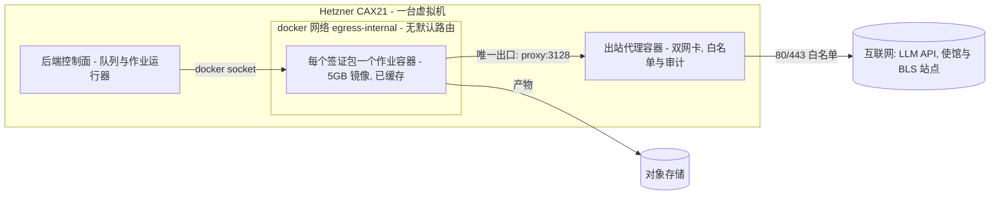
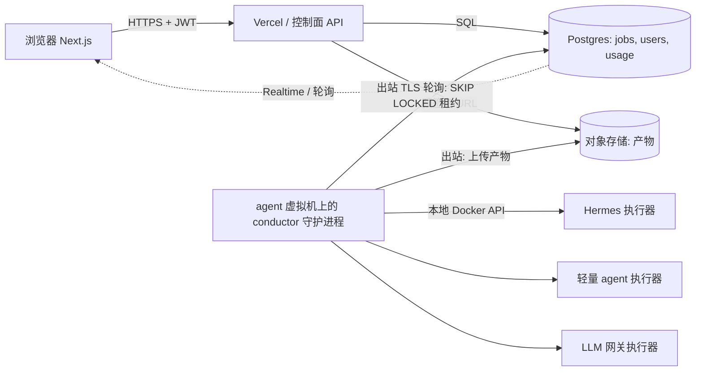
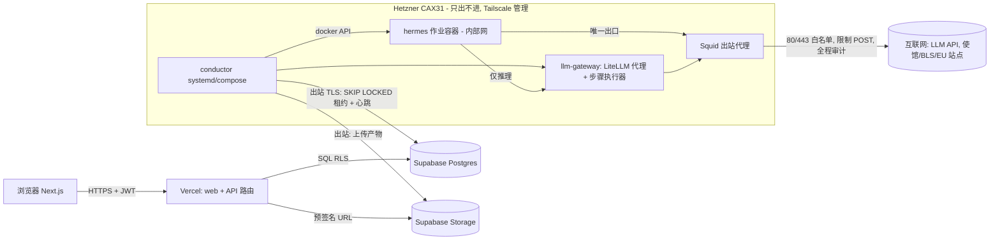

# 平台选型与开发计划 v2（v0.4 配套文档）

**状态：** 生效中 —— 依据 [ADR-004](../discussion/ADR-004-api-first-control-plane.md)（2026-08-12）取代 [platform-and-dev-plan-zh.md](archive/platform-and-dev-plan-zh.md)
**v2 改了什么：** 控制面采纳 API-first 纪律 —— 每一项核心业务能力都放在 `/api/v1/**` 路由处理器之后、由服务层承载，Web UI 只是这份契约的一个客户端；Server Actions 不再承载任何核心业务操作。落位、周计划与 monorepo 说明相应更新。
**配套文档：** [architecture-v0.4](architecture-v0.4-zh.md) —— 本文档是平台相关的那一半：架构跑在哪里，以及具体的构建计划。

> 英文原件：[platform-and-dev-plan-v2 (English)](platform-and-dev-plan-v2-en.md)

<!-- toc -->
## 目录

- [执行摘要](#执行摘要)
- [第一部分 —— Agent 面的容器平台](#第一部分--agent-面的容器平台)
  - [A.1 工作负载画像（平台必须容得下什么）](#a1-工作负载画像平台必须容得下什么)
  - [A.2 逐个方案评估](#a2-逐个方案评估)
  - [A.3 对比矩阵](#a3-对比矩阵)
  - [A.4 建议（按优先级）](#a4-建议按优先级)
- [第二部分 —— 可信区技术栈（前端 · API · Postgres · 认证 · 存储 · 实时推送）](#第二部分--可信区技术栈前端--api--postgres--认证--存储--实时推送)
  - [B.0 立论：这个切分是架构性的，不是偶然的](#b0-立论这个切分是架构性的不是偶然的)
  - [B.1 作业契约（两个面都认的那张表）](#b1-作业契约两个面都认的那张表)
  - [B.2 技术栈对比](#b2-技术栈对比)
  - [B.3 实时进度：先选无聊的方案](#b3-实时进度先选无聊的方案)
  - [B.4 工作流引擎放在哪里？](#b4-工作流引擎放在哪里)
  - [B.5 排序后的建议](#b5-排序后的建议)
- [第三部分 —— 最终选型与 8 周开发计划](#第三部分--最终选型与-8-周开发计划)
  - [1. 最终选型](#1-最终选型)
  - [2. 逐周计划（8 周，单人，做到可收费的 beta）](#2-逐周计划8-周单人做到可收费的-beta)
  - [3. CI/CD 与环境](#3-cicd-与环境)
  - [4. MVP 每月成本](#4-mvp-每月成本)
  - [5. 运维 / 运行手册基础](#5-运维--运行手册基础)
  - [6. 明确推迟的事项 —— 附触发条件](#6-明确推迟的事项--附触发条件)
- [结语](#结语)
<!-- /toc -->

## 执行摘要

**建议：采用双面（two-plane）部署。**

| 面 | 选型 | 每月成本 |
|---|---|---|
| **可信控制面** —— 前端、API、Postgres、认证、存储、实时推送 | **Vercel (Next.js) + Supabase**（Postgres + Auth + Storage + Realtime，一家供应商替掉四家） | 约 $45 + 约 $10 PITR |
| **Agent 执行面** —— conductor（工作流引擎）、Hermes 执行器、LLM 网关、出站代理 | **一台 Hetzner CAX31 arm64 虚拟机**（8 vCPU / 16 GB，docker compose —— 那个约 5 GB 的 arm64 镜像原样就能跑，缓存在磁盘上，每个作业零拉取） | 约 $19 |

两者用「**数据库即接口，虚拟机只出不进**」的模式衔接：虚拟机上的 conductor 通过 TLS 轮询 `jobs` 表（`FOR UPDATE SKIP LOCKED`）并把产物上传到对象存储 —— 虚拟机**不开放任何入站端口**（管理通道走 Tailscale）。固定基础设施落在**约 $75/月**；LLM 用量是唯一的可变成本项（每个签证包约 $0.60–4.00，取决于模型档次）。

那些看起来更显然的替代方案为什么不行，各用一句话：

- **只用 Vercel** —— serverless 函数的时长上限远低于约 10 分钟的 agent 作业，而且没有 Docker；拆成两面是架构使然，不是权宜之计。
- **全用 AWS / GCP / Azure** —— 在产出第一个签证包之前，先要花 1–2 周做 VPC/IAM/Cognito 的管线活，还要付 NAT 网关的账单；这是规模放大 50 倍之后的正确答案，现在推迟（可移植的 Postgres schema + S3 兼容存储保证了退出通道干净）。
- **Fly.io Machines** —— 单作业原语最好（停机实例池、microVM 隔离），也是指定的**扩容目标**，但它的出站管控是在客户机内部执行的（平台层没有防火墙），因此它是继承而不是解决了 v0.3 里最难的那条要求。
- **Railway / Render** —— 完全没有出站网络管控：在 agent 面上直接不满足 v0.3。
- **全部自建** —— 把护照和银行流水这类 PII 放在自己手搓的备份上，对一个单人创始人来说是错误的风险取舍；而把可信数据库与不可信 agent 容器放在同一台机器上，违反 v0.3 的信任切分。

全文分三部分：**第一部分**比较 agent 面的容器/执行平台，**第二部分**比较可信区技术栈，**第三部分**是调和后的最终选型与 8 周开发计划。价格声明打了标签：**[V]** 表示经网络核实（2026 年 8 月），**[T]** 表示来自训练知识（下决心前请重新核实）。


## 第一部分 —— Agent 面的容器平台

### A.1 工作负载画像（平台必须容得下什么）

| 约束 | 取值 |
|---|---|
| 镜像 | `visa-master-hermes:latest`，约 5 GB，目前**只在 arm64 上验证过**（在 Apple Silicon 上构建）；要上 amd64 需要用 `buildx` 做多架构重建 |
| 作业形态 | 每个签证包起一个、用完即毁；典型约 10 分钟，硬上限 60 分钟；大量串行 LLM 往返 + 实时网页浏览 + LibreOffice/Python 渲染 |
| 镜像经济性 | **每个作业**都从镜像仓库拉 5 GB 是不可接受的；镜像必须缓存在执行主机上（或者平台让镜像大小变得无关紧要） |
| 出站 | 作业容器**不能有默认路由**；唯一的出口是出站代理（按 v0.3：封禁 RFC1918 与 169.254.0.0/16，只放行 80/443） |
| 完成判定 | **按产物**判定（`qa-report.json` + 交付目录），绝不按进程退出 —— 最后那步 "workspace open" 会起一个前台服务。在任何按作业计费的平台上，入口封装脚本都**必须**做到「守候产物 → 上传对象存储 → `exit 0`」，否则作业会一直烧预算直到超时。这个封装是方案 2–6 的前置条件，不是可有可无的润色。 |
| 规模 | MVP = 单并发，每天约 5–30 个签证包；单人创始人；对成本敏感 |

下文的成本数字统一归一到**4 vCPU / 8 GB、10 分钟一个作业**；60 分钟最坏情况乘以 6。可信度标签：**[V]** = 本次已对 2026 年的资料核实；**[T]** = 训练知识，下决心前请重新核实。

### A.2 逐个方案评估

#### 1. 普通虚拟机 + docker compose（Hetzner；EC2/Lightsail 作对照）

- **单作业启停契合度：优秀。**「每作业一个容器」就是由后端的作业运行器通过本地 Docker socket 执行 `docker run --rm --network egress-internal ...`（或 `docker compose run`）。compose 文件已经存在，而且这正是本地已验证过的拓扑。每个作业一层全新可写层，结束时 `docker rm` —— 就是 v0.3 的即抛暂存模型，只是少了 microVM 级的加固。
- **5 GB 镜像：结构上就没有这个问题。** 每个*版本*拉一次（从 GHCR/仓库），之后永久缓存在虚拟机磁盘上。每作业容器启动 < 5 秒。这是唯一一个每作业镜像成本严格为零的方案。
- **出站管控：所有方案里最强的，而且已经验证过。** Docker 的 `internal: true` 网络让作业容器**完全没有默认路由**；代理容器是双网卡的（内部网 + 外部网）。Hetzner 的元数据服务（169.254.169.254）从内部网络不可达。这就是 v0.3 的出站设计，用大约 15 行 compose 实现。



- **价格 [V]：** Hetzner **CAX21（4 vCPU Ampere arm64，8 GB，80 GB 盘，20 TB 流量）= €7.99/月 + €0.50 IPv4 ≈ €8.50（约 $10）**。已在 arm64 验证过的镜像**原样就能跑** —— 不用重建 amd64，而且与创始人的 Apple Silicon 开发环路一致。amd64 替代品：CX33（4 vCPU/8 GB）€6.49+€0.50。再上一档 CAX31（8 vCPU/16 GB）€15.99。（2026 年 4 月后的价格；成本优化机型限 EU 与新加坡区域。）AWS 对照 [T，高]：t4g.large（2 vCPU/8 GB）按需约 $49/月，Lightsail 8 GB 约 $44/月，外加 $0.09/GB 出流量 —— **配置更差，价格是 Hetzner 的 4–6 倍**；只有当整套技术栈第一天就必须在 AWS 上时才选 EC2。
- **运维负担：低，且熟悉。** 一台机器、compose、一个 systemd unit、unattended-upgrades。诚实地说说弱点：(a) 隔离靠的是共享的 Docker daemon —— 一次容器逃逸就拿下整台虚拟机，如果控制面也同机就连控制面一起（便宜的加固手段：给作业容器用 `runsc`/gVisor 运行时，arm64 上可用 [T，中高]；no-new-privileges、非 root、seccomp）；(b) 容量是固定的 —— 若按最坏情况 60 分钟一个作业算，单并发下每天 30 个签证包超出一台机器一天的能力，所以运行器需要并发 2 或者第二台虚拟机；(c) 内核与 docker 的补丁得自己打。

#### 2. Fly.io Machines

- **单作业启停契合度：优秀 —— 这就是该产品的设计初衷。** Machines REST API 负责创建/启动/停止/销毁 Firecracker microVM；**通过 Machines API 创建的应用默认不分配公网 IP** [V]。Hermes 镜像的入口已经支持 Fly 的非 PID-1 模式（FACTS），因此原样就能跑。每虚拟机（而非共享内核）的隔离，相对方案 1 是严格的升级。
- **5 GB 镜像：用「停机实例池」模式解决。** 这是 Fly 自己的建议：预先创建 Machine 并让它们保持**停机**状态（rootfs $0.15/GB-月 → 池中每台 5 GB 实例 **$0.75/月** [V]），作业到达时 `start`（几秒，无需拉取），产物上传完成后 `stop`；发版时用 `machine update` 重做整个池。从镜像仓库冷 `create` 一个 5 GB 镜像可能要几分钟，且随宿主机缓存状况波动 —— 所以「停机池」是必须，不是可选。
- **出站管控：短板所在。** Fly **没有平台级的出站防火墙，也无法删除默认路由**；每台机器都有出站 NAT [V 支持]。可用的缓解手段：6PN 私有网络接到一台代理机 + 由（可信的、创始人自建的）入口脚本在降权到非 root agent 用户之前装好的**客户机内 nftables**、HTTP(S)_PROXY 环境变量、如果使馆/BLS 站点需要 IP 稳定则加 $3.60/月的静态出口 IP [V]。这是在*不可信客户机内部*执行的管控 —— 明显弱于「没有路由」的网络。作为过渡姿态可以接受；在严格的安全评审面前站不住。
- **价格 [V]：** 按秒计费，只在运行时计。performance-2x/4GB = $0.00002484/秒 → **每个 10 分钟作业 $0.015**；shared-cpu-4x/8GB 约 $0.007 [T，中]。每天 30 个签证包约 **$5–15/月算力 + 双机停机池约 $1.50** + 出流量 $0.02/GB（北美/欧洲）。空闲成本近乎为零。
- **运维负担：低。** 没有 VPC/IAM 的管线活；后端里加一个小的池管理循环（创建/启动/停止/回收 + 到硬期限就销毁）。已知的长尾风险：偶发的宿主容量/调度抖动 [T，中] —— 用硬性挂钟期限 + 换新机器重试的策略即可覆盖。

#### 3. Railway / Render —— **排除**

完全没有出站网络原语（无法移除默认路由，没有 VPC/防火墙控制）—— 仅此一条就不满足 v0.3 的硬要求。两家也都没有一等公民的「按作业起一个即抛容器，且镜像本地缓存」API；它们的模型是长驻 worker + cron（Render 的一次性作业复用服务的镜像，但仍然不给网络控制）[V]。这里没有任何一点能在价格上赢方案 1，或在原语契合度上赢方案 2。不值得进一步分析。

#### 4. GCP Cloud Run Jobs

- **单作业启停契合度：良好。** 每个签证包一次 `jobs.run`；任务超时最长可到 **168 小时**（默认 10 分钟 —— 记得调高）；容器启动期限 4 分钟（够用）[V]。
- **5 GB 镜像：设计上就不是问题。** 镜像大小 **「没有直接限制」**，而且冷启动**与镜像大小无关**（Cloud Run 从它在部署时留的副本流式加载）[V]。这是几家超大规模云里对大镜像最友好的。**需要先扫清的阻碍：** 镜像清单**必须包含 linux/amd64** [V] —— 只有 arm64 的镜像需要多架构重建，而且 `nousresearch/hermes-agent` 基础镜像必须存在 amd64 版本（待核实）。可写文件系统是**内存盘**（算进 32 GiB 上限）—— 在 8–16 GiB 内存下，工作区几百 MB 的写入没问题 [V]。
- **出站管控：确实很强。** Direct VPC egress 设为 `all-traffic` + **不配 Cloud NAT** = 没有互联网路由；VPC 防火墙只放行 proxy-VM:3128。平台级执行，等价于 v0.3 的设计 [T，高]。
- **价格 [T，高]：** 一档区域：4 vCPU × $0.000024/vCPU-秒 + 8 GiB × $0.0000025/GiB-秒 → **每个 10 分钟作业约 $0.07**；每天 30 个约 $63/月，另加代理用的 e2-micro 约 $7 与 Artifact Registry 约 $0.50。注意 Cloud Run 的 vCPU（$0.0864/vCPU-小时）约为 Fargate 的两倍。
- **运维负担：中等。** VPC + 防火墙 + AR + IAM，外加 amd64 重建与 CI。比 AWS 少些管线活，比 Fly/Hetzner 多。

#### 5. AWS ECS Fargate

- **单作业启停契合度：良好。** 每个签证包一次 `RunTask`；原生跑 arm64（Graviton，便宜 20%）[V] —— 不用重建。
- **5 GB 镜像：痛点。** **任务之间没有镜像缓存 —— 每个任务都要从 ECR 拉完整镜像** [V]；5 GB 大约要拉 3–7 分钟，而且**计费从开始拉取时就起算** [T，高]。在 CI 里构建的 SOCI 惰性加载索引能明显缩短「拉取到启动」的时间（大镜像上报称能降 50–60%）[V]。在 60 分钟预算内可以忍受；但在作业时延上永远比方案 1/2/4 差。
- **出站管控：优秀且标准。** 任务 ENI 放在私有子网里，**不配 NAT 网关、没有 IGW 路由** → 结构上就没有默认路由；安全组只放行 proxy:3128。元数据只能以任务作用域的 ECS 端点访问（相对 EC2 凭证而言无害）[T，高]。无 NAT 设计的隐藏成本：镜像拉取需要 VPC 端点（ecr.api、ecr.dkr 各约 $7.3/月 + 免费的 S3 网关端点），或者走代理拉取 —— 固定预算按**约 $15–25/月**算 [T，中高]。
- **价格 [V]：** arm64 $0.032384/vCPU-小时 + $0.003556/GB-小时 → 4 vCPU/8 GB 约 $0.158/小时 → **每个 10 分钟作业约 $0.026**（外加拉取时间）；每天 30 个约 $24/月，另加端点与代理的固定成本。20 GB 临时存储免费 [V]。
- **运维负担：对单人来说是所有认真候选里最高的** —— VPC/子网/安全组/IAM/ECR/SOCI-CI/任务定义。当安全评审要求 AWS 原生、可审计的隔离时，这份代价才值得付。

#### 6. Azure Container Apps Jobs —— **对本团队排除**

手动触发的作业是有的，也只在运行时计费（4 vCPU/8 GiB 的 10 分钟作业约 $0.072 [T，中]）。但是：镜像每次执行都要拉，节点缓存只是尽力而为 [V]；硬性的出站管控（UDR）需要 workload-profiles 环境，而且现实里还要 Azure Firewall（约 $290/月）或自管 NVA [T，中]；再加上它带来第三朵云的学习曲线，相对方案 4/5 却没有任何独有优势。跳过。

#### 7. Kubernetes —— **MVP 阶段排除；但记为最终的规模形态**

K8s Job + NetworkPolicy（默认拒绝）+ 节点缓存镜像 + gVisor/Kata，在架构上是长期*正确*的原语 —— 但 EKS/GKE 光控制面就约 $73–75/月（还没算节点），而且对单人创始人来说运维面积远大于其他方案。在每天约 50–100 个作业或第二位工程师到位之前不要考虑。如果单机运行器不够用了，2–3 台 Hetzner 节点上的 k3s 集群（约 €25–35/月）是便宜的中间一步。

### A.3 对比矩阵

| | 单作业启停 | 5 GB 镜像 | 出站「无默认路由」 | 每个 10 分钟作业约 $（4c/8GB） | 固定 $/月（MVP） | 运维（单人） |
|---|---|---|---|---|---|---|
| **Hetzner 虚拟机 + compose** | 每作业 docker run | 缓存在磁盘，每作业 0 | **原生（内部网络）** | 约 $0（包月） | **约 $10** | **最低** |
| **Fly Machines** | 原生 API，microVM | 停机池，每机 $0.75/月 | **平台无防火墙** —— 只有客户机内 nftables | $0.007–0.03 | 约 $2–5 | 低 |
| Railway/Render | 弱 | 尚可 | **无 —— 不合格** | — | — | 低 |
| **Cloud Run Jobs** | jobs.run | 流式加载，与大小无关；**需重建 amd64** | VPC egress + 无 NAT（强） | 约 $0.07 | 约 $8 | 中等 |
| **ECS Fargate（arm64）** | RunTask | **每作业全量拉取**；SOCI 可缓解 | 私有子网、无 NAT（强） | 约 $0.03 + 拉取 | 约 $15–25 | 高 |
| ACA Jobs | 手动作业 | 每作业拉取 | 需要 WP 环境 + 防火墙（$$$） | 约 $0.07 | 高 | 高 |
| K8s | Job（理想） | 节点缓存（理想） | NetworkPolicy（理想） | 不适用 | $75 + 节点 | 最高 |

### A.4 建议（按优先级）

**MVP（当下）：Hetzner CAX21 + docker compose —— 约 €8.50/月。** 它是唯一同时做到以下几点的方案：原样运行 arm64 镜像、把每作业镜像成本彻底消掉、用已经存在的 compose 文件*精确*实现 v0.3 的出站边界（内部网络 + 双网卡代理），并且在每天 15–30 个签证包以内的任何量级上都只花约 $10/月的固定费用。用便宜手段加固：作业容器用 gVisor 运行时、非 root agent 用户、每作业暂存目录在回收时擦除、后端强制挂钟期限与按产物判定完成。把有记录的隔离折衷（共享 daemon）作为 MVP 的取舍写进 ADR 接受下来。**关于规格的说明：** 第三部分把它修订为 CAX31（8 vCPU / 16 GB），好让 conductor、出站代理和 Docker daemon 能与一个满配的作业容器共享这台机器 —— CAX21 只够作业容器本身。

**扩容（下一步）：Fly.io Machines** —— 一池预创建的停机实例（rootfs $0.15/GB-月），`start` → 运行 → 上传产物 → `stop`，发版时销毁重建。单作业原语契合度最好，隔离升级到每虚拟机，空闲成本近零，镜像原样就能跑（已支持非 PID-1 模式）。**要明确地把这条注意事项带下去：** 它的出站管控在客户机内部，不是平台层的。

**规模化后的严格边界备选：Graviton 上的 ECS Fargate（配 SOCI）** —— 当客户或安全评审要求平台级强制的「无路由」网络与 AWS 原生审计时选它，并接受拉取时延与 AWS 的管线税。（Cloud Run Jobs 是 GCP 上的对应答案，在镜像处理上胜过 Fargate，但需要重建 amd64 —— 把它列入候选前请先确认 Hermes 基础镜像有 amd64 版本。）

**迁移触发条件（虚拟机 → Fly/Fargate）：**
1. 高峰期队列 p95 等待 > 30 分钟，或持续需要 >2 并发作业（第一反应：升一档配置／加第二台虚拟机；当虚拟机池管理本身变成一份工作时再迁移）。
2. 第一个 B2B/付费客户的评审要求比「共享 daemon」更强的隔离 → 视出站要求被追问得多紧，选 Fly（microVM）或 Fargate（microVM + 网络边界）。
3. 每天 >50 个签证包，或单机上按最坏时长计算的利用率 >60%。
4. 出现多区域执行的需求（面向中国邻近区域用户的时延）—— 按作业计费的平台白送多区域。
5. 第二位工程师加入 → AWS 的运维税开始付得起；Fargate/K8s 进入视野。

**资料来源：**[Fly.io 资源价格](https://fly.io/docs/about/pricing/) · [Fly Machines API](https://fly.io/docs/machines/api/working-with-machines-api/) · [Fly 私有网络](https://fly.io/docs/networking/private-networking/) · [Cloud Run 配额](https://docs.cloud.google.com/run/quotas) · [Cloud Run 容器契约](https://docs.cloud.google.com/run/docs/container-contract) · [Cloud Run 任务超时](https://docs.cloud.google.com/run/docs/configuring/task-timeout) · [ahmetb 的 Cloud Run FAQ（镜像大小与冷启动）](https://github.com/ahmetb/cloud-run-faq) · [Hetzner 2026 价格拆解](https://www.bitdoze.com/hetzner-cloud-cost-optimized-plans/) · [Hetzner 涨价分析](https://northflank.com/blog/hetzner-cloud-server-price-increases) · [AWS Fargate 价格](https://aws.amazon.com/fargate/pricing/) · [AWS SOCI 惰性加载](https://aws.amazon.com/blogs/containers/under-the-hood-lazy-loading-container-images-with-seekable-oci-and-aws-fargate) · [Azure Container Apps Jobs](https://learn.microsoft.com/en-us/azure/container-apps/jobs) · [ACA 价格](https://azure.microsoft.com/en-us/pricing/details/container-apps/)


## 第二部分 —— 可信区技术栈（前端 · API · Postgres · 认证 · 存储 · 实时推送）

### B.0 立论：这个切分是架构性的，不是偶然的

一个签证包作业的挂钟时间约 10 分钟，其中有几十次串行 LLM 调用、Docker、LibreOffice 和实时的网页出站。本次比较里没有任何 serverless 平台能承载它：Vercel 函数的上限是约 10–60 秒（Hobby）／约 300 秒，用 Fluid compute（Pro）最多约 800 秒 —— 勉强够一次典型运行，离 60 分钟最坏情况的预算差得远 —— 而且 serverless 没有 Docker socket、没有常驻定时器，也没有 agent 面所需的、基于产物做完成判定的文件系统守候。因此每个候选方案都按**可信控制面（本节研究）+ 独立的 Docker 虚拟机 agent 面（固定支出，约 $25–40/月 的 Hetzner/OVH 档次，是方案 1–5 的公共成本）** 来评估。

最干净的集成模式 —— 也应当作为一条选型标准 —— 是「**数据库即接口，虚拟机只出不进**」：



agent 虚拟机**只发起出站连接**（经连接池以 TLS 连 Postgres、上传存储、通过出站代理访问 LLM API）。v1 不需要入站端口、不需要 mTLS、不需要 VPN；只为 SSH/管理加一层 Tailscale。这个模式在 Supabase、Neon、Railway-Postgres 或自建上都一样成立 —— 只有在 Postgres 没有一个像样的公网 TLS 端点时才失效（RDS 在 VPC 里，就要求虚拟机也进 VPC）。

### B.1 作业契约（两个面都认的那张表）

> *这只是说明性的最小草图。* 规范的物理 DDL 见 [architecture v0.4](architecture-v0.4-zh.md) 第 B 章 §2 —— 同一份契约，但带上第 A 章的状态词汇与完整列集（`attempt`/`max_attempts`、`idempotency_key`、预算列）。第三部分第 2 周构建的是第 B 章那一版。

```sql
create table jobs (
  id               uuid primary key default gen_random_uuid(),
  user_id          uuid not null,
  kind             text not null,                  -- 'pack.schengen.v1'
  executor         text,                           -- 'hermes' | 'thin-agent' | 'llm-gateway'（路由决定）
  status           text not null default 'queued', -- queued|leased|running|awaiting_review|delivered|failed|expired
  input            jsonb not null,
  progress         jsonb,                          -- {stage, pct, note, updated_at}，由 conductor 写入
  lease_owner      text,
  lease_expires_at timestamptz,                    -- conductor 发心跳；租约过期 => 重新入队或判失败
  deadline_at      timestamptz not null,           -- 硬性挂钟兜底（v0.3）
  artifact_prefix  text,                           -- 交付目录（含 qa-report.json）的存储路径
  qa_report        jsonb,
  created_at       timestamptz not null default now(),
  updated_at       timestamptz not null default now()
);
-- 认领: UPDATE jobs SET status='leased', lease_owner=$1, lease_expires_at=now()+'2 min'
--   WHERE id = (SELECT id FROM jobs WHERE status='queued'
--               ORDER BY created_at FOR UPDATE SKIP LOCKED LIMIT 1) RETURNING *;
```

MVP 是单并发（v0.3），因此这个 Postgres 队列绰绰有余；不需要 Redis/SQS。

### B.2 技术栈对比

除非标注为*训练知识*，价格均于 2026 年 8 月经网络搜索核实。MVP 负载：约 100 用户，每天 5–30 个签证包，每包约 20–50 MB → 每月新增产物约 45 GB，每月下载出流量约 45 GB。

| 评判维度 | 1. Vercel + Supabase | 2. Vercel + Neon + Clerk + R2 | 3. 全用 Railway | 4. AWS（Amplify/ECS + RDS + Cognito + S3） | 5. GCP（Cloud Run + Cloud SQL + Firebase Auth + GCS） | 6. 自建 Coolify（Next.js + Postgres + MinIO + Better-Auth） |
|---|---|---|---|---|---|---|
| 首次部署耗时（单人） | 约 0.5 天 | 约 1 天（要接三个控制台） | 约 0.5 天（仅控制面） | 认真做要 1–2 周（VPC、IAM、Cognito） | 2–4 天 | 1–2 天，含 TLS、备份、SMTP |
| MVP 月成本（不含 agent 虚拟机） | 约 $45（Vercel Pro $20 + Supabase Pro $25） | 约 $25–40（Vercel $20 + Neon 用量约 $5–15 + Clerk $0 + R2 约 $2） | 按量约 $25–45；**另外仍然需要一台虚拟机** | 约 $60–120（RDS 约 $15 起、NAT 网关约 $32 的坑、Amplify） | 约 $15–40（Cloud SQL micro $7–10 无 SLA，Cloud Run 在免费额度内约 $0） | 与别的服务同机则近乎 $0；单独一台虚拟机约 $25（推荐） |
| Postgres 质量 | Pro：每日备份（保留 7 天），PITR 是付费加购；分支按分支计量（*加购细节：训练知识*） | 同类最佳：即时写时复制分支、缩容到零、PITR（6 小时免费，更长付费），存储 $0.35/GB | 容器 + 卷的 Postgres；每日卷备份，无 PITR（*训练知识*） —— 托管方案里最弱的一个 | RDS = 黄金标准：35 天 PITR、多可用区；没有分支能力 | Cloud SQL 备份/PITR 扎实；最便宜的档次不含 SLA | 你自己搭出什么就是什么：pgBackRest→R2 加上验证过的恢复演练，否则等于没有 |
| 认证（邮箱 OTP + OAuth、RBAC） | 内置：邮箱 OTP/魔法链接、OAuth 供应商、基于 JWT claims + RLS 的 RBAC；5 万 MAU 免费额度 | Clerk：开发体验最好，Next.js 预制组件，内置组织/RBAC；月留存用户 5 万以内免费（2026 年 2 月起的新政策），Pro $25/月 | 自备（自己跑 Better-Auth 或花钱买 Clerk） | Cognito：功能齐全但开发体验糟糕；2025 年新分档 —— Lite $0.0055/MAU、Essentials $0.015/MAU，1 万 MAU 免费 | Firebase Auth：扎实，约 5 万 MAU 免费（*训练知识*）；从非 Google 后端验证 JWKS 没问题 | Better-Auth 1.5：email-OTP 与 organization 插件已达生产可用；升级和安全都归你 |
| 存储 + 预签名 URL | Supabase Storage，预签名 URL，S3 兼容 API；Pro 含 100 GB + 250 GB 出流量 | R2：$0.015/GB-月，**出流量 $0**，S3 API，预签名 URL；MVP 阶段约 $2/月 | Railway 的卷不是对象存储 → 还是得再加 R2 | S3：业界标准，出流量约 $0.09/GB | GCS：可以，出流量约 $0.12/GB | MinIO：S3 API，但打补丁和监控都归你，而它存的是护照扫描件 |
| 实时作业进度 | **最好**：通过 Supabase Realtime 订阅 `jobs` 行（Pro：500 并发连接）；可回落到轮询 | 无原生实时：轮询 `GET /jobs/:id`，或由 conductor 推 SSE | 轮询，或从某个 Railway 服务推 SSE | API GW WebSockets/AppSync —— 太重 | Firestore 监听（等于第二个数据库）或轮询 | 由 conductor 推 SSE（需要在虚拟机上开入站端口并做鉴权） |
| 供应商风险 / 出流量 | 纯 Postgres + S3 兼容存储 → 退出干净；超额出流量 $0.09/GB（*训练知识*） | 托管方案里锁定最轻：Neon 是纯 PG，R2 是 S3 API 且零出流量费；Clerk 的用户库迁移是唯一的粘性点 | 中等；出流量计量（*训练知识*） | 复杂度锁定最重；出流量 + NAT 成本 | 中等；有出流量费 | 零供应商风险，创始人时间风险最大 |
| 与 agent 虚拟机的契合 | 只出不进的 conductor 对上连接池化的 PG + Storage：理想 | 同一个模式，同样干净 | Railway **无法承载 agent 面**（不支持特权/DinD 容器）→ 变成三方拆分 | *如果* agent 虚拟机就是同 VPC 里的 EC2（私有子网、安全组），网络最干净；但现在是杀鸡用牛刀 | 虚拟机用 GCE + Cloud SQL 连接器/公网 IP 白名单：可以 | 把可信数据库和**不可信** agent 容器放在同一个内核上，与 v0.3 的信任隔离相矛盾 —— 只能另开一台虚拟机，而那会吃掉成本优势 |

几条承重事实的备注：Vercel 的 **Hobby 计划不可商用** —— 第一天就按 Pro（$20/席位）做预算。Supabase 免费版闲置 7 天会暂停项目，而且没有备份 —— 第一天就上 Pro。Cognito 在 2025 年改成 Lite/Essentials/Plus 分档，超过 1 万 MAU 后成本可观。Clerk 在 2026 年 2 月改为月留存用户 5 万以内免费。

### B.3 实时进度：先选无聊的方案

对于一个每天 5–30 个包、每个约 10 分钟的作业来说，**轮询是站得住脚的 v1**：每 3 秒一次 `GET /api/jobs/:id`，每个包约 200 个请求 —— 可以忽略。它对中国用户也更能优雅降级：长连的 WebSocket 打到境外端点，可靠性不如普通 HTTPS 轮询。推荐的阶梯是：

1. **v1**：conductor 写 `progress` JSONB（阶段机：`intake → research → documents → qa → awaiting_review`）；前端每 3 秒轮询一次。
2. **v1.1（仅方案 1）**：把 Supabase Realtime 对作业行的订阅当作渐进增强，轮询作为兜底。后端零工作量 —— conductor 的那次 UPDATE 就是事件。
3. 从虚拟机推 SSE：只有在离开 Supabase 时才考虑；它会强迫 agent 虚拟机开一个带鉴权的入站端点，而这正是「只出不进」模型刻意回避的。

### B.4 工作流引擎放在哪里？

沿着「请求/响应」与「长时运行」的分界线来切：

| 组件 | 落位 | 为什么 |
|---|---|---|
| 认证、用户 CRUD、提交签证包（插入 `jobs` 行）、预签名下载 URL、复核门的 UI 操作 | **Vercel 上 `/api/v1/**` 之下的 Next.js 路由处理器，作为服务层（`lib/services/`）之上的薄适配器** —— Web UI 只是这份契约的一个客户端；Server Actions 不承载任何核心业务操作（ADR-004） | 纯请求/响应，适配 serverless，零额外基础设施 —— 而且同一份契约还能服务未来的移动 App 或微信小程序，未来抽出独立后端时也只是把 `lib/services/` 换个家，而不是重写 |
| 编排器（"conductor"）：队列租约、执行器路由（按适配器契约在 hermes / thin-agent / llm-gateway 之间选）、经 Docker API 管容器生命周期、基于产物的完成判定（`qa-report.json` + 交付目录）、挂钟看门狗、重试、token 预算记账 | **常驻的 Node 服务，与 agent 虚拟机同机**（systemd 或 compose 服务） | 它需要 Docker socket、文件系统守候，以及比任何 serverless 调用都活得久的定时器；ADR-002 说的确定性工作流引擎，就是这个进程 |
| 确定性业务规则（"西班牙旅游签需要护照 + 银行流水 + 在职证明"） | **共享的 TypeScript 包**，两边都引 | UI 里即时表单校验，conductor 里权威强制 —— 一个事实来源，符合 ADR-002 |

**不要**把引擎只放在 Next.js 路由里（没有常驻进程、有时长上限，Vercel 的 cron/队列同样受函数限制约束），也不要把它做成第三个托管位置 —— 与 agent 虚拟机同机可以让 Docker 控制留在本地，且不新增任何网络暴露面。

### B.5 排序后的建议

1. **Vercel + Supabase** —— 一家供应商替掉四家（Postgres + Auth + Storage + Realtime），jobs 表的模式让 agent 虚拟机可以只出不进，约 $45/月 + 虚拟机是单人最快的可信路径。
2. **Vercel + Neon + Clerk + R2** —— 略便宜，Postgres 分支能力最好、存储零出流量费、认证开发体验最好；代价是第三、第四个控制台，以及没有原生实时。这是 Supabase 让人失望时的指定逃生口。
3. **全用 Railway** —— 控制面的开发体验讨喜，但它托管不了 agent 面，于是你要跑三个平台而不是两个，而且用的是这里最弱的托管 Postgres。
4. **自建 Coolify** —— 最便宜、零锁定，但签证包里是护照和银行流水这类 PII：把手搓备份和 MinIO 压在一个单人创始人的注意力预算上是错误的风险；而与不可信 agent 同机也破坏了 v0.3 的隔离。
5. **GCP** —— 平台本身不错，但最便宜的可用 Cloud SQL 档次在 SLA 之外；IAM 管线活多过 MVP 阶段能拿到的回报。
6. **AWS** —— 规模放大 50 倍时的正确答案；在 MVP 阶段它意味着一张 NAT 网关账单和两周你没有的 VPC/Cognito 工作量。

*（Azure 被刻意排除在控制面短名单之外：没有 Vercel 级别的 Next.js 托管体验，Entra External ID 是 Cognito 同级的认证负担，而且它会加进第三朵云却没有任何独有的控制面优势 —— 它的 agent 面版本在第一部分 §6 已被排除。）*

**迁移舒适度**：上面这条线之上的东西都是可移植的 —— 纯 Postgres schema、S3 兼容存储、JWT 认证。从 1 换到 2（或者规模上来后换到 4/AWS）是一次数据迁移，不是重写。

资料来源：[Supabase 价格拆解](https://uibakery.io/blog/supabase-pricing)、[Supabase 真实成本](https://makerkit.dev/blog/saas/supabase-pricing)、[Vercel 免费额度限制](https://www.promptstoproduct.com/vercel-free-tier-limits)、[Vercel 函数限制](https://vercel.com/docs/functions/limitations)、[Neon 套餐](https://neon.com/docs/introduction/plans)、[Neon 2026 价格变动](https://vela.simplyblock.io/articles/neon-serverless-postgres-pricing-2026/)、[Clerk 价格 / 5 万免费变更](https://clerk.com/pricing)、[Clerk 免费版变更说明](https://saasprices.net/blog/clerk-free-plan-changes)、[Railway 价格](https://www.srvrlss.io/provider/railway/)、[Cloudflare R2 价格](https://www.budgetforge.dev/tools/cloudflare-r2-pricing-2026)、[Cognito 价格](https://aws.amazon.com/cognito/pricing/)、[Cognito 调价分析](https://www.thestack.technology/awss-new-cognito-pricing-complicated-potentially-costly/)、[Cloud SQL 价格](https://www.usage.ai/blogs/gcp/cloud-sql/pricing/)、[Cloud Run 价格](https://cloud.google.com/run/pricing)、[Better Auth 1.5](https://better-auth.com/blog/1-5)、[Better Auth email OTP 插件](https://better-auth.com/docs/plugins/email-otp)。


## 第三部分 —— 最终选型与 8 周开发计划

### 1. 最终选型

两份研究各自的首选可以干净地组合起来，并按其排序采纳：可信控制面用 **Vercel + Supabase**，agent 面用**一台跑 docker compose 的 Hetzner arm64 虚拟机**，两者以「**数据库即接口，虚拟机只出不进**」模式衔接 —— 虚拟机上的 conductor 通过 TLS 轮询 `jobs` 表，并把产物上传到 Supabase Storage；虚拟机**不开放任何入站端口**。有一处需要调和：研究 A 把虚拟机定价为 **CAX21（4 vCPU / 8 GB，约 €8.50/月）**，那是只按作业容器本身估的；而研究 B 为一台还要同时跑 conductor 和出站代理的机器预算了「$25–40/月」。我们在规格上采纳 B、在供应商上采纳 A：**Hetzner CAX31（8 vCPU / 16 GB arm64，€15.99 + €0.50 IPv4 ≈ $19/月）**，这样 Hermes 作业容器可以保住完整的 4 vCPU / 8 GB（`--cpus 4 --memory 8g`），同时给 Docker daemon、Squid 代理、conductor 以及 LibreOffice 渲染尖峰留下真实的余量。已在 arm64 验证过的 `visa-master-hermes:latest` 镜像原样就能跑，也与 Apple Silicon 的开发环路一致。依据 ADR-002，**conductor 就是那个确定性的工作流引擎** —— 控制面长时运行的那一半 —— 而创始人需求里的三种服务器（Hermes、轻量 agent、LLM 网关）在其中是**同一份适配器契约背后的可插拔执行器**；在 V1 里这些「服务器」只是这台机器上的进程/容器，而这份契约正是它们日后能变成独立服务器、却不需要改 schema 或前端的原因。

| 组件 | 跑在哪 | 由谁提供 | 说明 |
|---|---|---|---|
| 前端（Next.js App Router，以 zh-CN 为主） | Vercel Pro | `apps/web` | 每个 PR 一个预览；`main` 上线生产 |
| 请求/响应 API（鉴权后的 CRUD、提交作业、预签名 URL、复核操作） | Vercel serverless —— **`/api/v1/**` 之下的路由处理器，位于 `lib/services/` 之上（API-first，ADR-004；核心操作不用 Server Actions）** | `apps/web` | 从不接触 Docker 或 LLM 密钥；线上契约只传目录键，绝不传句子 |
| 工作流引擎 / 编排器（"conductor"） | Hetzner CAX31，由 systemd 管理的 compose 服务 | `apps/conductor`（Node 22，TS） | 队列租约、执行器路由、容器生命周期、产物守候、看门狗、token 记账 |
| 执行器：**hermes**（完整签证包生产者，当下即可用） | 虚拟机上每作业一个即抛容器，`internal: true` 网络 | `packages/executors/hermes` + `visa-master-hermes:latest` | 第 3 周上线 |
| 执行器：**llm-gateway**（无状态步骤：动机信、清单、翻译） | conductor 中的适配器 + **版本锁定的 LiteLLM 代理容器**（compose 服务 `gateway`，第 3 周上线） | `packages/executors/llm-gateway` | 步骤库第 5 周上线；网关容器从第 3 周起就是唯一的推理咽喉 —— Hermes 的供应商配置指向它，因此**供应商密钥绝不进入作业容器**（架构 C §3.2） |
| 执行器：**thin-agent**（讨论 01 的迁移目标） | 未来同契约下的容器 | `packages/executors/thin-agent` | **推迟 —— 见 §6** |
| 出站代理 | Squid 容器，双网卡（内部网 + 外部网） | `infra/compose.vm.yml` | v0.3 §5.2 规则 1–3 + 审计日志；作业容器唯一的出口 |
| Postgres（jobs、users、usage、cases） | Supabase Pro | `packages/db` 迁移 | conductor 经 Supavisor 连接池以 TLS 连接，只出不进 |
| 认证（邮箱 OTP + 可选 OAuth，RLS） | Supabase Auth | —— | JWT 在 Next.js 中校验；所有面向用户的表都开 RLS |
| 对象存储（上传件 + 产物包） | Supabase Storage，私有桶 `uploads`、`artifacts` | —— | 由 API 签发上传/下载 URL；conductor 用 service-role key |
| 实时进度 | v1 每 3 秒轮询 `GET /api/jobs/:id`；后续增强为对作业行订阅 Supabase Realtime | —— | 轮询对中国用户能优雅降级（B.3） |
| 业务规则（如西班牙旅游签材料要求） | 共享包，Web **和** conductor 都引 | `packages/core`（zod schema + `rules/`） | ADR-002：规则是代码，不是 LLM 的判断 |
| 虚拟机的管理/SSH 访问 | Tailscale（只经 tailnet SSH；公网入站一律拒绝） | —— | 数据通路不需要 VPN —— 它本来就是只出不进 |
| 密钥 | Vercel 环境变量（Web：anon key、Sentry DSN）；虚拟机：root 所有的 `/etc/visa-master/{conductor,gateway,proxy}.env`，权限 0600 | 以 1Password 为事实来源；由部署脚本下发 | **供应商 LLM 密钥只存在于网关容器的环境里，`service_role` key 只存在于 conductor 的环境里。** 作业容器完全不持有供应商密钥 —— 它唯一的推理通路是内部网络上的网关端点（架构 C §3.2，取代 v0.3 §6 中「密钥放容器里」的姿态） |



Monorepo（`pnpm` + Turborepo）：`apps/web`（UI + `/api/v1` 控制面 API + `lib/services/`）、`apps/conductor`、`packages/core`、`packages/db`、`packages/executors`、`infra/`（compose 文件、Squid 配置、systemd unit、部署脚本）。

#### 执行器适配器契约（承重的那个接口）

```ts
// packages/executors/contract.ts
export interface Executor {
  kind: 'hermes' | 'llm-gateway' | 'thin-agent';
  start(job: JobRow, ctx: RunContext): Promise<RunHandle>;      // 起容器 / 开始步骤
  poll(h: RunHandle): Promise<'running' | 'artifact_ready' | 'failed'>; // hermes: 守候产物，绝不看进程退出
  collect(h: RunHandle): Promise<{ artifactPrefix: string; qaReport: unknown }>; // 上传到 Storage
  destroy(h: RunHandle): Promise<void>;                          // 容器 + 暂存卷，永远执行
}
```

路由在 conductor 里是一个纯函数：`pack.schengen.v1 → hermes`，`step.cover_letter.v1 | step.checklist.v1 | step.translate.v1 → llm-gateway`。前端和 schema 永远不需要知道跑的是哪个执行器。

> 这个 4 个方法的接口，是架构里那份适配器契约（v0.4 第 C 章 §1）的 **V1 进程内实现**：`running`→`running`，`artifact_ready`→`completed`（+ 清单），`failed`→`failed`。`awaiting_user`、`/answers`、`cancel` 以及 webhook 事件流在 V1 中被刻意不实现 —— 结构化信息采集已把每个问题前置，因此没有运行中途的交互需要表达。等到第一个执行器搬离这台虚拟机时（例如 §6 里的 Fly.io 触发条件），C §1 的 HTTP 接口（以及一个 `awaiting_input` 轮询状态）才会实现。

### 2. 逐周计划（8 周，单人，做到可收费的 beta）

排期原则：结构化采集先行（v1 没有运行中途的交互 —— 表单一次性拿齐 agent 需要的一切），Hermes 执行器早上，因为它是今天唯一能产出可售签证包的东西；LLM 网关次之，作为廉价步骤的主力；轻量 agent 推迟。

#### 第 1 周 —— 地基：仓库、认证、虚拟机
- **目标：** 所有账号和骨架都到位；用户能注册。
- **任务：** 搭出 monorepo；创建 Supabase 项目 `visa-master-staging` 与 `visa-master-prod`；Vercel 项目关联 GitHub；迁移 `0001_profiles.sql`（`auth.users` 的镜像 + 角色枚举 `user|operator|admin`）、`0002_jobs.sql`（架构第 B 章的 `jobs` 表 —— 上面 B.1 只是它的最小草图；保留第 B 章的状态名，加上 `attempt`/`max_attempts`、`idempotency_key`、预算列，并补上 `failure_reason text`、`tokens_in bigint`、`tokens_out bigint`）、`0003_usage_events.sql`；配好 Supabase Auth 的邮箱 OTP；`apps/web` 的登录/登出 + RLS 保护下的空仪表盘。`apps/web` 的骨架要**随第一个界面一起交付 i18n 骨架**（2026-08-10 修订，来自设计阶段审查 —— [design/product/04](../design/product/04_MVP_Scope_V1_V2.md)）：用 `next-intl` 做带 locale 前缀的路由（`/zh/…`、`/en/…`）、一份同时装着两种语言的 ICU 消息目录，以及一个构建检查 —— 只要出现硬编码的用户可见字符串，或任一语言缺 key，就构建失败。登录页和仪表盘本身就带用户可见文案，所以目录必须先于任何界面存在；等代码长大了再补，等于重写（[国际化](../design/guidelines/internationalization-zh.md) §3、§8）。开通 CAX31：Ubuntu 24.04 LTS、`ufw` 拒绝所有入站、Tailscale SSH、unattended-upgrades、Docker + compose 插件、0600 权限的 env 文件。
- **完成定义：** 在 Vercel 生产 URL 上，注册 → OTP → 仪表盘走得通，**且 `/zh` 与 `/en` 两条路径下每个字符串都从目录解析**；任一语言缺 key 则构建失败；从虚拟机 `psql` 连 Supabase 连接池成功；虚拟机没有任何公网端口（从外部 `nmap` 什么都扫不到）。
- **演示：** 在手机上注册；展示空仪表盘和关闭的虚拟机。

#### 第 2 周 —— 结构化信息采集 + 上传

> **实建说明（v2）：** 第 1–2 周是按 ADR-004 的 API-first 形态交付的 —— 下文提到的端点以 `/api/v1/**` 路由处理器的形式存在于 `lib/services/` 之上，Web 页面作为 API 客户端消费它们。
- **目标：** 在任何 agent 出现之前，先把完整的申根旅游签采集变成经过校验的结构化数据。
- **任务：** `packages/core`：`IntakeSchengenTourismV1` zod schema（申请人、护照、在职、行程日期与路线、财力、既往签证）+ `rules/schengen-spain.ts`（确定性的必需材料计算 —— 即 ADR-002 说的代码检查）。**校验问题携带消息 key 加参数**（例如 `passport.expiry.tooSoon` + `{monthsRequired: 3}`），绝不是句子 —— 由前端按当前语言解析（[国际化](../design/guidelines/internationalization-zh.md) §3）；这条从第一个 schema 起就有约束力，因为它是 i18n 里唯一一件补不回来的事。`apps/web` 里做多步表单，客户端校验用同一个 schema，另加**草稿持久化**（2026-08-10 修订，来自设计阶段审查 —— [design/product/04](../design/product/04_MVP_Scope_V1_V2.md)）：一行草稿记录（`jobs.status='draft'` 或专门的草稿表），按步自动保存，保存逻辑由共享 schema 的 partial 生成，登录后能从上次未完成的那一步精确恢复 —— 在微信 webview 里，被打断才是会话的中位数，因此没有服务端草稿的采集流程会丢用户（[移动端一致性](../design/guidelines/mobile-parity-zh.md) §3.3）。`POST /api/uploads/sign` → 签发上传 URL，写入私有的 `uploads/{user_id}/{upload_id}`（护照扫描、银行流水、在职证明）；`POST /api/jobs` 做服务端校验，冻结脱敏后的 `input` 快照（载荷里没有 user_id/email —— v0.3 §11），插入 `status='queued'`、`kind='pack.schengen.v1'`（挂钟 `deadline_at` 在**取得租约时**设置，而不是入队时 —— 排队等待绝不能吃掉运行预算）；`GET /api/jobs/:id`（受 RLS 限制）供轮询。
- **完成定义：** 非法采集会被共享 schema 的字段级错误挡回，**且两种语言下都由消息 key 渲染**；中途放弃的采集在登出再登录后能从同一步带着数据继续；一次完成的采集会产出一行 `queued` 作业和 Storage 里的文件；此时还没有任何东西消费队列。
- **演示：** 在手机上端到端走一遍采集 —— 包括中途杀掉页签、登录后继续；展示 `jobs` 行和已上传的对象。

#### 第 3 周 —— conductor + Hermes 执行器：第一个云端产出的签证包
这是成败攸关的一周；这里的一切在本地都已验证过，现在只是搬家。
- **目标：** 一个排队中的作业能变成 Storage 里的交付目录，全程无人碰虚拟机。
- **任务：** `apps/conductor` 的模块：`lease.ts`（B.1 的 `FOR UPDATE SKIP LOCKED` 认领 + 2 分钟心跳）、`router.ts`、`executors/hermes.ts`（`docker run --rm --cpus 4 --memory 8g --pids-limit 512 --security-opt no-new-privileges --network egress-internal`，每作业一个全新暂存卷，按 v0.3 §4a 只读挂载 profile/venv，模型密钥只读注入）、`artifact-watch.ts`（轮询暂存目录找 `qa-report.json` 与交付目录 —— **绝不**等待退出；`workspace open` 那一步会让无头运行挂住）、`collect.ts`（上传到 `artifacts/{job_id}/`，写入 `qa_report` 与 `artifact_prefix`，置为 `awaiting_review`）；`lease.ts` 设置 `deadline_at = leased_at + 60 分钟`（beta 阶段上限；等方差数据积累起来后向 20 分钟的路由默认值收紧），`watchdog.ts` 在超期后强制销毁（同时清理死租约）。`infra/compose.vm.yml`：`egress-internal`（`internal: true`）+ 双网卡 Squid，带 v0.3 §5.2 规则 1–3（封禁 RFC1918 + 169.254.0.0/16 + 非 80/443；对非白名单主机的 POST 一律拒绝；开访问日志），再加一个**版本锁定的 LiteLLM `gateway` 容器**（架构 C §2.1），像 Squid 一样双网卡：作业容器经内部网络访问它，供应商密钥只存在于 `/etc/visa-master/gateway.env`，而 Squid 的 LLM 主机白名单收缩到只剩网关本身。**关键路径：把 Codex 的设备码 OAuth 换成真正的 API key**（先接 Anthropic 或 OpenAI，放在网关的 env 里），并把 Hermes 的供应商配置指向网关的 OpenAI 兼容端点；验证一次完整的签证包运行。`tokens_in/out` 与每作业成本来自网关按作业虚拟 key 的花费日志 —— 调用时的预算强制按架构 A §2.2。
- **完成定义：** 在浏览器提交采集 → 约 10 分钟后 `status='awaiting_review'`，产物在 Storage 里，容器与暂存卷都已销毁（`docker ps -a` 干净）；被强制超期的作业会被杀掉并标记 `expired`；在作业容器里 `curl http://169.254.169.254` 失败；作业容器里 `env` **看不到任何供应商密钥**（只能经网关推理）。
- **演示：** 从浏览器实时提交，一路走到 Storage 里的 `qa-report.json`；展示这次运行的 Squid 审计日志。

#### 第 4 周 —— 进度、复核门、交付
- **目标：** 打通人的环路：用户看进度，运营审批，用户下载。
- **任务：** conductor 写 `progress` JSONB 阶段机（`intake → research → documents → qa → awaiting_review`），阶段由工作台的文件系统标记推断；作业页每 3 秒轮询并渲染阶段时间线；运营界面 `/admin/review`（按角色限制）：`awaiting_review` 队列、内嵌 QA 报告、经短时效预签名 URL 预览 PDF、**批准 → `delivered`**（通知用户）、**驳回 → `failed` + `failure_reason`**；用户交付页提供 7 天有效的签名下载链接；`POST /api/admin/jobs/:id/approve|reject`；迁移 `0004_packs_reviews_audit.sql`（按架构第 B 章的 `packs`、`reviews`、`audit_log`）—— 批准/驳回会写一行 `reviews` 和一条 `audit_log`，以维持「交付必须有一次已批准的复核」这条不变式。在作业进入 `awaiting_review` 之前，`collect.ts` 先跑最小校验器 —— 架构 A §3.3 的第 1–4 步（清单角色完备性对照 `packages/core` 规则、存在性 + 重算 sha256、格式合理性、qa-report 解析）；第 5 步（预算/期限对账）用第 3 周的网关计量。人工门是强制的 —— 没有任何东西会自动交付（v0.3 §8）。
- **完成定义：** 由创始人当运营，完整旅程走得通；被驳回的作业会把原因呈现给用户；签名 URL 会过期。
- **演示：** 完整用户旅程，开两个浏览器窗口（用户 + 运营）。

#### 第 5 周 —— LLM 网关执行器 + 预算 + 缓存
- **目标：** 第二类执行器上线；廉价步骤不再需要一个 10 分钟的容器。
- **任务：** `packages/executors/llm-gateway`：在**第 3 周那个 LiteLLM 网关**之上做步骤库 —— 不自己手搓供应商层；模型路由、回退和按 key 的预算都是 LiteLLM 的配置（起草用前沿模型，翻译/排版用小模型），依据架构 C §2.1 的决定；步骤种类 `step.cover_letter.v1`、`step.checklist.v1`、`step.translate.v1` 在 conductor 里进程内执行（同一张 jobs 表、同一个租约循环 —— 一个 20–60 秒的作业配 3 秒轮询延迟完全可以接受，而且把每一次 LLM 调用都留在虚拟机上，就保住了单一的出站/审计/计量点）；按用户的 token 预算在取租约前强制；迁移 `0005_requirements_cache.sql`（使馆材料要求快照 + 模板，按路线 + 签证类型作键，TTL 30 天 —— ADR-002 说的缓存杠杆）；交付页上的「重新生成动机信」按钮，作为第一个面向用户的网关功能；重试策略 + 错误分类（`retryable_provider`、`budget_exceeded`、`deadline`、`qa_failed`）。
- **完成定义：** 重新生成一封动机信能在 60 秒内完成且不起任何容器；超预算的用户会得到干净的拒绝；第二次相同路线命中材料要求缓存。
- **演示：** 现场重新生成一封动机信；展示 `usage_events` 在累加，以及路由表把翻译派给了小模型。

#### 第 6 周 —— CI/CD、staging/prod、加固、可观测性
- **目标：** 部署变得无聊；出故障会呼你。
- **任务：** 下面 §3 的全部内容；容器加固走一遍（非 root agent 用户、除暂存目录外根文件系统只读、丢弃 capabilities；评估 arm64 上的 gVisor `runsc` 并把结论无论正反都写进 ADR）；Web 与 conductor 接 Sentry（每个事件都打 `job_id` 标签）；Better Stack 心跳（conductor 每 60 秒 ping 一次；漏掉即告警）；看门狗告警规则（§5）；每晚一次 `pg_dump` 作为双保险。
- **完成定义：** PR → 预览 → 合并 → 两个面都自动部署，全程不用手工 SSH；杀掉 conductor 进程后 3 分钟内呼到创始人；故意卡死一个作业，5 分钟内告警。
- **演示：** 把一行改动走完整条流水线；拔掉网线（停掉 conductor）并展示告警。

#### 第 7 周 —— Beta 打磨：本地化、通知、PII 生命周期、恢复演练
- **目标：** 能拿给陌生人看；数据处理站得住脚。
- **任务：** 用 `next-intl` 把 zh-CN 作为主语言（en 次之）；用 Resend 发事务邮件（"签证包已就绪"、"签证包被驳回"）；服务条款/隐私页写明留存期；按架构第 B 章 §3 在 conductor 的每日扫描里执行留存策略 —— 上传件在案件关闭后 90 天、作业中间产物 30 天、已交付签证包 180 天；暂存卷本来就每作业销毁；开通 Supabase PITR 加购并做一次**恢复到 staging 的演练**（记录 RTO）；连续跑 3 个签证包以确认串行队列行为，并用实测的每包 token 数对照 §4 的估算；修掉自测中最扎手的 5 个 UX 毛刺。
- **完成定义：** 一个中文用户不碰英文也能走完整个旅程；恢复演练笔记已提交；实测的每包成本数字取代估算值。
- **演示：** 全中文走完整旅程，含"签证包已就绪"邮件；展示恢复演练日志。

#### 第 8 周 —— 可收费的 beta 上线
- **目标：** 收到钱，来第一批外部用户。
- **任务：** 最小支付 —— **开通支付宝与银行卡的 Stripe Payment Link**，一个商品（"申根签证包复核 —— ¥X"）；一个 20 行的 webhook 路由翻转 `profiles` 上的 `pack_credits`（完整自助计费推迟，见 §6）；定价页；招募 5–10 位手选的 beta 用户（成都 → 西班牙画像）；创始人每天做运营复核；把运行手册（§5）定稿到 `doc/runbook.md`。
- **完成定义：** 一个陌生人能付款、提交并拿到已批准的签证包，全程除复核门外不需要创始人介入；§5 的每条告警都有经过验证的处置方案。
- **演示：** 第一个付费签证包。

**缓冲说明：** 第 3 周承担着排期风险（换 API key + 代理 + 第一次云端运行）。若它延误，第 5 周与第 7 周压缩 —— 网关执行器和本地化是可以让步的项，复核门和加固不是。

### 3. CI/CD 与环境

**环境。**

| | Web | 数据库/认证/存储 | conductor + agent 面 |
|---|---|---|---|
| 预览 | 每个 PR 一个 Vercel 预览 | staging 的 Supabase | 不参与（用种子数据模拟作业状态） |
| Staging | Vercel 预览晋升 / `staging` 分支 | `visa-master-staging` 项目 | 同一台虚拟机上的第二个 conductor systemd unit，独立 env 文件，指向 staging 数据库，与生产共用 Docker daemon 和代理（单人单租户阶段可接受的取舍；已记录待日后处理） |
| 生产 | `main` → Vercel 生产 | `visa-master-prod` | 生产 conductor unit |

**流水线（GitHub Actions）。**
- `ci.yml`（每个 PR）：`pnpm turbo lint typecheck test`，外加 `supabase db diff` 检查迁移已提交且是线性的。
- Web：由 Vercel 的 Git 集成处理预览与生产部署；不写自定义 action。
- `db.yml`：合并到 `main` 时自动 `supabase db push` 到 staging；生产迁移放在需要人工审批的环境门之后。**只做「扩展—收缩」**（先加列/表、回填、以后再删），这样部署过程中 Web 与 conductor 的版本可以错开。
- `conductor.yml`：`docker buildx build --platform linux/arm64` → 推送 `ghcr.io/…/conductor:{gitsha}` → 经 Tailscale 用 `appleboy/ssh-action` 执行 `docker compose pull conductor && docker compose up -d conductor`。compose 文件锁定 sha 标签；保留最近 5 个标签。
- `agent-image.yml`：`visa-master-hermes` 只在打发布标签时重建（它很少变）；推到 GHCR，每个版本在虚拟机上拉一次 —— 绝不按作业拉。
- **明确拒绝 Watchtower** 用于 agent 面：无人值守地自动拉取一个安全边界镜像，是拿可审计性换方便。部署必须是显式的、有日志的 Actions 运行。

**回滚。** Web：Vercel 即时回滚（一键）。conductor：用上一个 sha 标签 `compose up -d`（虚拟机上有个 `deploy.sh --rollback` 封装）。Agent 镜像：把 compose 的标签指回去。数据库：绝不原地回滚迁移 —— 只向前滚；Supabase PITR 只用于灾难场景。回滚演练是第 6 周完成定义的一部分。

### 4. MVP 每月成本

固定平台成本：

| 服务 | $/月 |
|---|---|
| Vercel Pro（1 个席位） | 20 |
| Supabase Pro（含每日备份、100 GB 存储、250 GB 出流量） | 25 |
| Supabase PITR 加购（从第 7 周起） | 约 10 |
| Hetzner CAX31（8 vCPU / 16 GB arm64）+ IPv4 | 约 19 |
| Sentry（开发档）/ Better Stack / Tailscale / Resend / GHCR | 0（免费额度） |
| 域名 | 约 1 |
| **固定合计** | **约 $75** |

**每个签证包的 LLM 成本 —— 算式（用第 3 周的计量去核对）。** 一次签证包运行约 10 分钟，主要是串行往返：假设约 50 次 LLM 调用，每次平均上下文约 15k 输入 token（技能 + 工作台摘要），约 1k 输出 → **每个签证包约 750k 输入 / 约 50k 输出 token**。

| 模型档次 | $/百万 输入 / 输出 | 每包成本 |
|---|---|---|
| 前沿（Claude Sonnet 档） | 约 3 / 15 | 750k×$3 + 50k×$15 ≈ **$3.00** |
| 前沿 + 提示缓存（重复的技能/系统前缀） | —— | 约 **$1.80–2.20** |
| Kimi 档的经济型模型 | 约 0.6 / 2.5 | ≈ **$0.60** |
| 最坏情况（60 分钟运行，6 倍） | —— | 约 **$18** 上限 → 这就是 token 预算存在的理由 |

规划口径：**每包 $1–4，保守取 $3**。网关步骤（重生成动机信等）约 20k 输入 / 2k 输出 ≈ 每次 **$0.09** —— 是舍入误差。

| 量级 | 包/月 | LLM $/月（$0.6–4/包） | 全包含 $/月 | 每包全包含成本 |
|---|---|---|---|---|
| 5/天 | 150 | 90–600 | **165–675** | $1.10–4.50 |
| 15/天 | 450 | 270–1,800 | 345–1,875 | $0.77–4.17 |
| 30/天 | 900 | 540–3,600 | 615–3,675 | $0.68–4.08 |

读法：基础设施是噪声；**LLM 支出是全部的可变成本项** —— 这正是 token 计量落在第 3 周、模型路由落在第 5 周，以及每包定价必须留出 $5 以上余量的原因。按 ¥199–399（约 $28–55）这样一个说得过去的包价，即便按保守的 token 估算，毛利率也 >85%。

### 5. 运维 / 运行手册基础

**监控与告警。**
- Sentry：`apps/web`（浏览器 + 服务端）与 `apps/conductor`，conductor 的每个事件都打上 `job_id` / `executor` / `stage` 标签。
- Better Stack：对 Web 应用做 HTTPS 检查，外加 conductor 循环每 60 秒一次的**心跳**（连漏 3 次即呼人）。这是「只出不进的虚拟机还活着吗」的唯一信号，因为没有任何东西能从入站探测它。
- 作业级看门狗（在 conductor 内，每 60 秒一次，告警到 Telegram + Sentry）：
  - conductor 空闲时 `queued` 超过 15 分钟 → 租约循环坏了；
  - `leased` 且 `lease_expires_at < now()` → 认领中途崩了；重新入队一次，再失败就判失败；
  - `running` 超过 `deadline_at` → 强制销毁、标记 `expired`、告警；
  - `awaiting_review` 超过 12 小时 → 催运营（就是你）；
  - Squid 审计日志：某个作业出现被拒绝的 POST 突发 → 带 `job_id` 告警（提示注入的早期绊线）。

**备份与数据生命周期。**
- Postgres：第 1 天起用 Supabase Pro 的每日备份（保留 7 天）；第 7 周起加 PITR；每晚由 GitHub Actions 定时 `pg_dump` 到另一个私有桶作为双保险；**第 7 周做一次恢复演练，之后每季度一次**。
- 存储：留存按架构第 B 章 §3 —— 上传件（护照/银行 PII）在案件关闭后 90 天、作业中间产物 30 天、已交付签证包 180 天；由 conductor 的每日扫描执行，并写在隐私页上。每作业的暂存卷在作业结束时销毁（v0.3 §4b）—— 两次作业之间，虚拟机上不静态存留任何 PII。
- 虚拟机：可从 `infra/` 完全复现（compose + 来自 1Password 的 env）；按设计不需要虚拟机磁盘备份 —— 把它当牲口而不是宠物。

**事件处理基础。**
- Sev1 = 签证包无法完成，或怀疑 PII 泄露；Sev2 = 降级（复核受阻、某个供应商挂了）；Sev3 = 毛刺。
- 前 15 分钟清单：Better Stack 面板 → Supabase 状态页 → `journalctl -u conductor` → `docker ps -a` + 暂存卷数量 → jobs 表状态直方图 → Squid 访问日志尾部。
- 常见处置：供应商故障 → 把路由表切到备用供应商（改 env、重新部署 conductor）；作业卡死 → 看门狗已经杀掉了，从管理后台重新入队；虚拟机死了 → 用 `infra/` 在一台新的 CAX31 上重建（约 30 分钟，演练一次）。
- 疑似外泄（Sev1）：停掉 conductor，保全 Squid 日志与容器，轮换 LLM 密钥，在对外沟通之前先审阅该作业的出站审计。
- 每一次 Sev1/Sev2 都要在 `doc/incidents/` 里写半页复盘。

### 6. 明确推迟的事项 —— 附触发条件

| 事项 | 何时启动 |
|---|---|
| **Stripe 自助计费**（订阅/点数、发票、退款流程 —— 取代 Payment Link + webhook） | 付费用户 >10 人，或人工处理权益每周超过约 30 分钟 |
| **账号注销 / PII 清除流水线**（架构 B §4：`pending_deletion`、清除 worker、S3 前缀删除；PIPL 的删除权） | 在把注册开放到手选 beta 用户之外以前；过渡期：运行手册里的人工清除条目 |
| **并发 > 1**（conductor 信号量 → 2–3 个作业槽；虚拟机升一档或加第二台） | 高峰期队列 p95 等待 > 30 分钟，或按最坏时长计算虚拟机利用率 > 60%（研究 A 的触发条件集） |
| **迁移到 Fly.io Machines**（停机实例池、每虚拟机隔离） | 与并发相同的触发条件，外加：第一个客户或安全评审要求比共享 daemon 更强的隔离；并把「Fly 的出站管控在客户机内部」这条注意事项带下去 |
| **出站 DLP**（用 TLS 拦截的 mitmproxy 扫描出站报文中该作业的 PII token —— v0.3 §5.2 规则 4） | 第一次 B2B/安全评审，或 Squid 审计中出现任何可疑 POST 的事件 |
| **轻量自研 agent 服务器**（讨论 01 的折中路线，跑在现有执行器契约上） | LLM 网关步骤库覆盖了 >50% 的签证包内容**并且**（在用完路由与缓存杠杆之后，每包成本或时延仍未达标），或者跟进 Hermes 升级本身变成一种税 —— 按 ADR-002，这是 V5 的重估提前到来，且只有在挣得起时才提前 |
| **`VISA_MASTER_SERVER_MODE`** 干净跳过 `workspace open`（需改镜像） | 下一次计划中的 agent 镜像重建；产物守候 + 期限已经让它不再阻塞 |
| **Supabase Realtime 进度**（作为渐进增强取代轮询） | 轮询成本或用户体验开始被抱怨 —— 在 MVP 量级上大概永远不会 |
| **多区域执行**（为时延取靠近中国的区域；按作业计费的平台白送） | 中国用户持续抱怨时延，或某个合作方要求区域内处理 |
| **类 SOC2 加固**（访问审阅、审计轨迹、供应商 DPA、渗透测试） | 第一份提出该要求的企业/B2B 合同；在那之前，v0.3 的控制项 + 运行手册就是安全叙事 |
| **2–3 台 Hetzner 节点上的 k3s** | 持续每天 >50 个签证包，或第二位工程师加入（研究 A 的 K8s 阈值） |
| **抽出独立后端服务**（把 `lib/services/` 换个家，放到同样的 `/api/v1` 路径之后作为独立服务；框架届时再定 —— NestJS 能继续引用 `packages/core`，FastAPI 则需要把它移植过去） | 请求路径上需要某个只有 Python 才有的库；来了一位 Python 优先的协作者；或者第一个执行器搬离虚拟机，从而激活第 C 章 §1 的私网 HTTP 接口（ADR-004） |


---

## 结语

第三部分的技术栈，是第一部分与第二部分各自排名第一的选项的组合，只有一处显式调和（虚拟机升到 CAX31，好让作业容器保住完整的 4 vCPU / 8 GB）。每一项推迟的事都带着触发条件（第三部分 §6）；每一条迁移路径 —— agent 面去 Fly Machines，控制面去 Neon/Clerk 或 AWS —— 都是照着「搬数据而不是重写」来选的。挂钟预算（beta 阶段 60 分钟上限，对比稳态路由默认的 20 分钟）属于按任务的配置；见 [architecture-v0.4](architecture-v0.4-zh.md) 第二部分中的调和说明。

*平台选型与开发计划 完*
